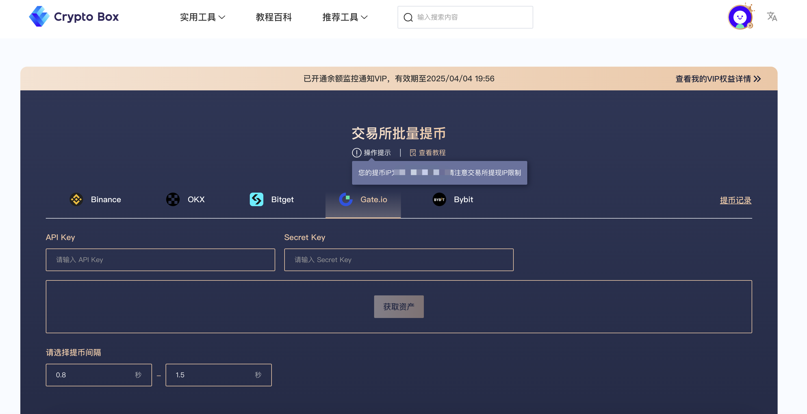

# Create Tokens with One Click

### Introduction

Over the past year, the TON token has demonstrated an impressive performance, skyrocketing from around $2.5 at the beginning of the year to nearly $8 at its peak, thanks in large part to its backing by the Telegram app, which provided a natural advantage in user adoption. However, due to market adjustments and issues surrounding Telegram's founder, the token's performance has recently weakened.

**Deep Integration with Telegram**: TON is tightly integrated with Telegram, allowing users to conduct on-chain transactions directly through Telegram wallet bots (e.g., @wallet), significantly lowering the barrier to entry.\
**Multiple Smart Contract Languages**: Supports FunC (TON's native language), Tact (a simplified smart contract language), and Solidity (via an EVM-compatible layer), catering to diverse developer needs.\
**TON Foundation Support**: The TON Foundation continuously funds high-quality ecosystem projects, driving developer growth.

These strengths have been instrumental in sustaining the ecosystem's expansion.

This article will guide you on how to use **CPBox** to issue a token on the TON blockchain with just one click.

### Token Creation

**Visit the CPBox website**: [https://www.cpbox.io/cn](https://www.cpbox.io/cn), navigate to **Tools** > **TON Chain** > **TON One-Click Token Issuance**.

<figure><figcaption></figcaption></figure>

**Connect your wallet**: Click the "Connect Wallet" button.

* If using a **TON Wallet**, scan the QR code to connect.
  * Note: You must use **TonSpace** within the TON Wallet.
* For this guide, we’ll use **Tonkeeper**.
  * Click **Browser Extension** to connect.

<figure><figcaption></figcaption></figure>

**Fill in token details**:

* **Token Name**: The name of your token.
* **Token Symbol**: The token’s ticker (can be the same as the name).
* **Decimals**: Default is **9**. This affects the maximum supply.
  * With decimals set to 9, the maximum supply cannot exceed **10 billion**.
  * If set to 8, the cap is **100 billion**, and so on.
* **Supply Amount**: The total number of tokens to issue.
* **Logo**: Upload your token’s icon.
* **Description**: Mandatory field—describe your token.

<figure><figcaption></figcaption></figure>

**Confirm and submit**:

* A confirmation pop-up will appear. Click **Confirm**.
* Note: CPBox charges a **5 TON** service fee for token creation.

<figure><figcaption></figcaption></figure>

**Token creation complete**:

* Once done, you’ll receive your token’s **contract address**.

<figure><figcaption></figcaption></figure>

**Verify your token**:

* Visit [Tonviewer](https://tonviewer.com/) to check your token’s details.

<figure><figcaption></figcaption></figure>

Congratulations! Your TON token has been successfully created.

For adding liquidity pools and enabling DEX trading, refer to this article:&#x20;


[ton-liu-dong-xing-chi-chuang-jian-dedust-jiao-cheng.md](../ton-lian-gong-ju/ton-liu-dong-xing-chi-chuang-jian-dedust-jiao-cheng.md)


(Note: The last line references an unspecified article—replace it with the actual link if available.)

### **Learn More About CPBOX**

Explore features: [https://docs.cpbox.io](https://docs.cpbox.io/)

Suggestions or custom needs?&#x20;

Contact us:[https://www.cpbox.io/cn/](https://www.cpbox.io/cn/)

***

### **Join Our Community**

**Telegram Group**: [https://t.me/cpboxio](https://t.me/cpboxio)

**Twitter**: [https://twitter.com/Web3CryptoBox](https://twitter.com/Web3CryptoBox) | [https://x.com/cpboxio](https://x.com/cpboxio)

**YouTube**: [https://youtube.com/channel/UCDcg1zMH4CHTfuwUpGSU-wA](https://youtube.com/channel/UCDcg1zMH4CHTfuwUpGSU-wA)
