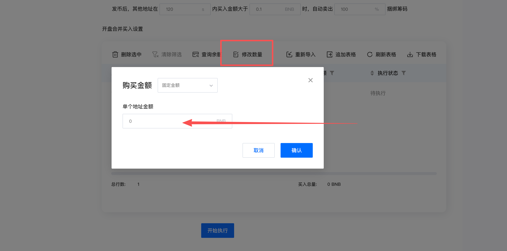
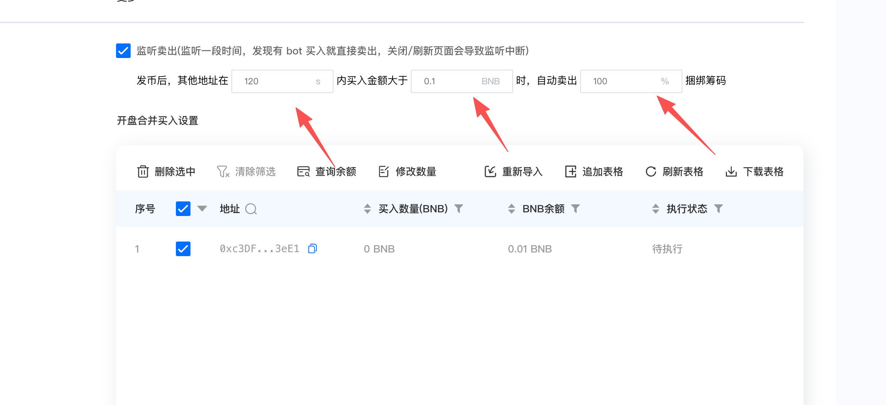

## Preface

With the warming up of the primary market and the continuous promotion of Fourmeme by He Yi and CZ, Chinese meme tokens have become the mainstream gameplay on the BSC chain. More and more DEVs are launching MEME tokens on Fourmeme. However, many newcomers don't know how to successfully launch on Fourmeme. CPBOX will use the Fourmeme bundle buy-in and monitoring sell-out function as an example to explain the gameplay to everyone.

### Feature Demonstration

We use CPBOX's Fourmeme opening bundle buy-in function. You can visit <https://www.cpbox.io/cn/> and click on Practical Tools, BSC Chain Fourmeme [Opening Bundle Buy-in](https://www.cpbox.io/cn/fourmeme/publish). Note that using CPBOX for opening bundle buy-in incurs fees.

#### Fee Details

* Create token: 0.02 BNB (one bundle address)
* First five bundle addresses: each 0.02 BNB
* Subsequent bundle buy-in addresses: each 0.003 BNB

#### Fill in Token Information

Fill in the corresponding token information:

* Token avatar
* Token name and symbol
* Token description
<figure><figcaption></figcaption></figure>

#### Import Private Key

After filling in the token information, import the private keys of the addresses that need to bundle buy-in.

If only bundling one address, just fill in one address.

**Note:** If bundling too many addresses or buying too many chips, it will show excessive front-row bundle chips on memedex, and P Xiaojiang will have a high probability of not getting on board.

Choose the number of chips each address buys, random buy-in or fixed amount buy-in.

<figure><figcaption></figcaption></figure>

#### Monitoring Sell-Out

The monitoring sell-out function is mainly for the following two scenarios:

* After Fourmeme token issuance, there are often many sniper bots. If encountering a big sniper bot, it will immediately buy 4-500 knives worth of chips. Using monitoring sell-out can sell faster than the bots and earn some profit in advance.
* Use monitoring sell-out for developer chip washing. After token creation is successful, developers need to clear their bundled buy-in chips, showing that the developer has cleared the warehouse (only after clearing will P Xiaojiang get on board). This function can be used to have other addresses buy corresponding chips to complete the developer chip handover.

After checking this function, fill in the monitoring time, trigger sell-out amount, and sell-out chip ratio.

<figure><figcaption></figcaption></figure>

After filling in, select to click on token issuance, and you can successfully create a token on Fourmeme.

## Summary

Welcome everyone to experience CPBOX's Fourmeme bundle buy-in and monitoring sell-out function, which allows you to get started with Fourmeme gameplay faster. After successful token issuance, you can use the BSC chain's market cap management function to operate the token.

If you have a lot of demand for bundle buy-in, you can contact TG: @Aileen955 to get daily or monthly package prices.

### Contact Us

If you want to learn more about other uses and functions of CPBOX products,

You can click [https://docs.cpbox.io/](https://docs.cpbox.io/) to view

Or if you have good suggestions or want to help with development needs,

You can find us through the contact information at the bottom of the homepage [https://www.cpbox.io/cn/](https://www.cpbox.io/cn/)

You can also contact us through the social media below

***

### Other Social Media

TG Group: <https://t.me/cpboxio>

Twitter: <https://twitter.com/Web3CryptoBox> | <https://x.com/cpboxio>

Youtube: [youtube.com/channel/UCDcg1zMH4CHTfuwUpGSU-](https://docs.cpbox.io/zh/solana-gong-ju/solana-yi-jian-fa-bi.html)
