# ERC20 Token Deployment Tutorial

### Do it yourself - Step-by-step guide to deploy EVM contract code through Remix

#### What is a Standard ERC20 Token?

A standard ERC20 token refers to a token contract with **no additional functionality** or mechanisms. After token creation, permissions are dropped by default, so there are no special permissions - it's a pure, clean, and standard contract.

Following the steps below, you can create a standard contract token on any supported blockchain.

* Note: You cannot deploy tokens without a wallet installed. We'll use MetaMask wallet for demonstration, please install the MetaMask wallet extension first.

The following deployment instructions use Sepolia testnet as an example:

#### Deployment Preparation

MetaMask

If MetaMask doesn't have the network where you want to deploy tokens, you can go to [cpbox.io MetaMask helper](https://www.cpbox.io/metamask/helper) to search for the corresponding mainnet and add it to MetaMask. For the addition process, refer to the [Tutorial].

The address needs a balance to pay for gas fees when deploying tokens.

If deploying on a testnet, you can get test tokens from the corresponding chain's faucet, then switch MetaMask to the corresponding test network. You can check the testnet faucet addresses for corresponding chains through [https://www.cpbox.io/metamask/helper](https://www.cpbox.io/metamask/helper) and add the testnet to MetaMask.

#### Deployment Process

We use [Remix](https://remix.ethereum.org/) for contract deployment.

<figure>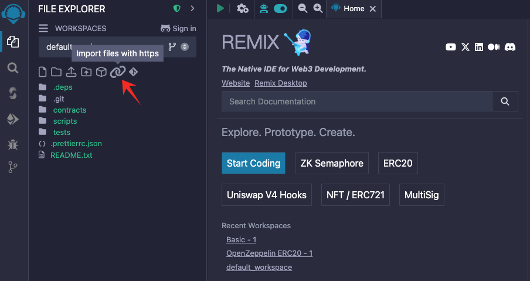<figcaption>
Remix Import Code
</figcaption></figure>

Here we import contract code directly from a URL link.

<figure>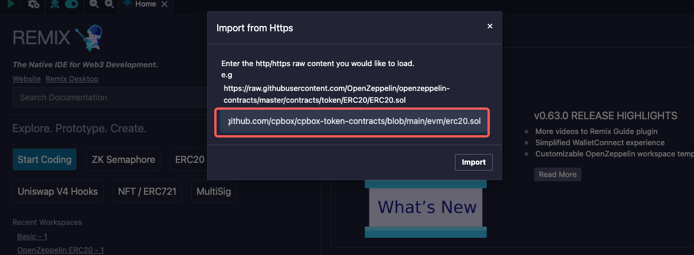<figcaption>
Import Code via Link
</figcaption></figure>

The link is: https://github.com/cpbox/cpbox-token-contracts/blob/main/evm/erc20.sol

CPBOX has already provided ready-to-deploy code on GitHub. Just fill in the corresponding URL to import the contract code.

Sometimes the network isn't great and you might not be able to import. I couldn't import it just now.

<figure>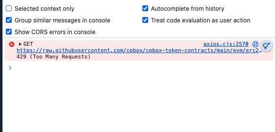<figcaption>
Import Error
</figcaption></figure>

In this case, simply open the file on github.com, then create a new erc20.sol file and copy the file contents into it. Remix will show a security prompt.

<figure>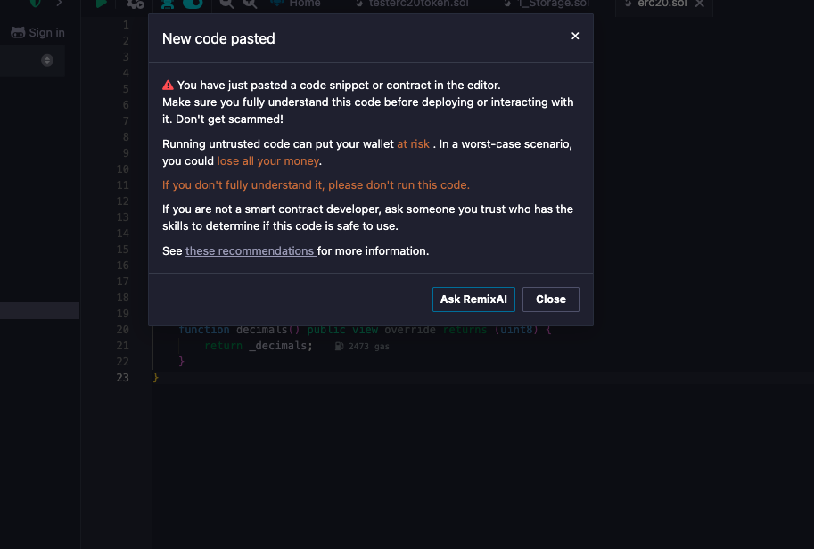<figcaption>
Security Warning
</figcaption></figure>

This means to be careful about security and not copy code with malware. After copying, compare it with the source code on github.com - if they match, you can be confident. After successfully importing, find the erc20.sol file and save it to compile.

<figure>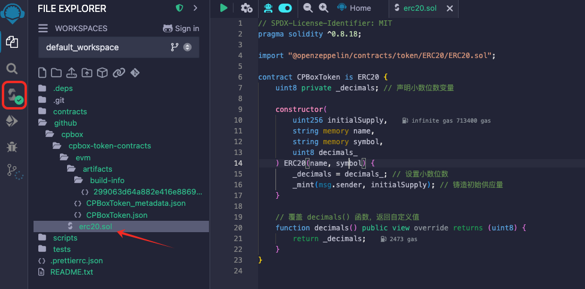<figcaption>
Compile
</figcaption></figure>

When compiling, select the parameters.

<figure>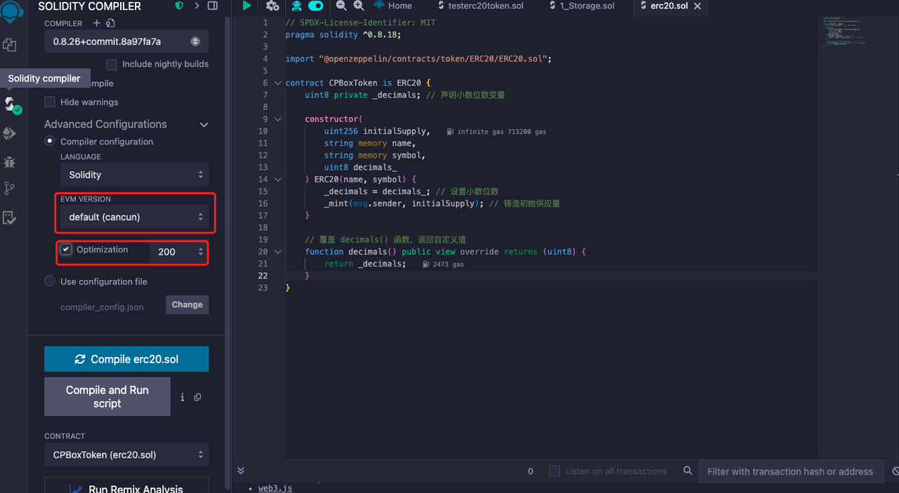<figcaption>
Compilation Parameters
</figcaption></figure>

Different EVM versions involve some EVM updates. Generally, choose the default, here we select the default Cancun. Optimization can generally be checked - this will optimize the compiled code and save significant gas fees during deployment in most cases.

If compilation is successful, you'll see a green checkmark on the third button on the left. Next, prepare to connect your wallet for contract deployment.

<figure>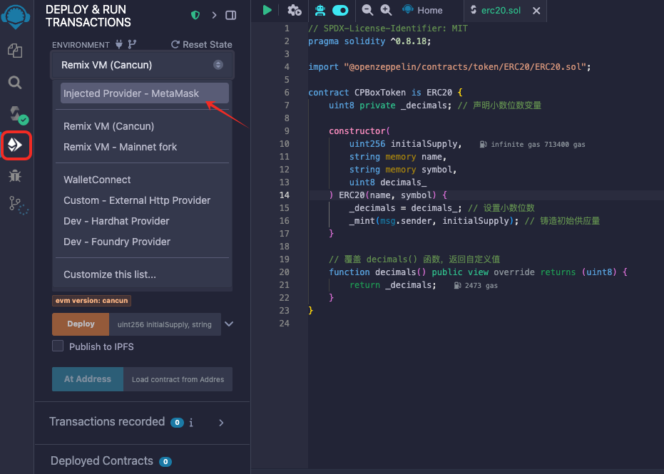<figcaption>
Connect Wallet
</figcaption></figure>

Use the red-boxed button to switch to the contract deployment panel. In the dropdown, select connect to MetaMask. This will trigger a wallet popup - click connect to connect the wallet.

<figure>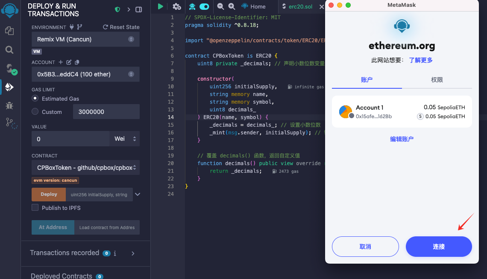<figcaption>
Deploy Contract
</figcaption></figure>

After successful connection, you can see the current chain, connected wallet address, and wallet balance.

<figure>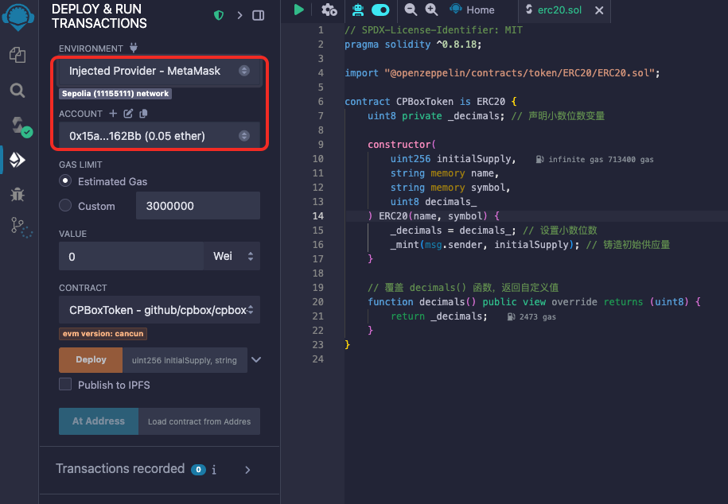<figcaption>
View Wallet Address and Balance
</figcaption></figure>

Now start deploying the contract. First, fill in the corresponding parameters based on the token information you want to deploy.

Suppose our total token supply is 10,000 with 18 decimals. Then the initialSupply here needs to be 10000000000000000000000 = 10000 * 10^18 (10,000 multiplied by 10 to the 18th power).

<figure>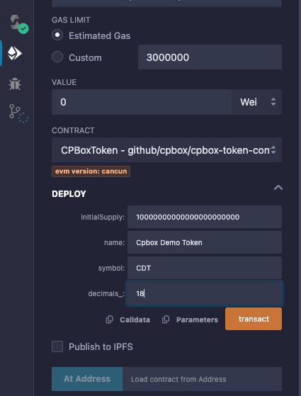<figcaption>
Contract Parameters
</figcaption></figure>

Click transact to trigger the wallet, view the estimated gas consumption, and click confirm to deploy the contract.

<figure>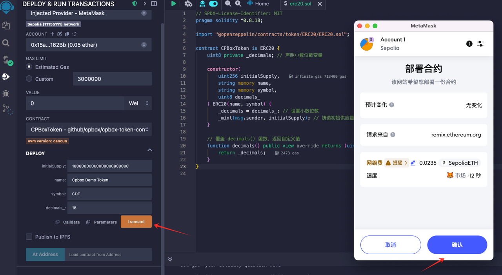<figcaption>
Deploy Contract
</figcaption></figure>

You can see the transaction status in the control panel. The deployment is successful after the transaction is confirmed.

<figure>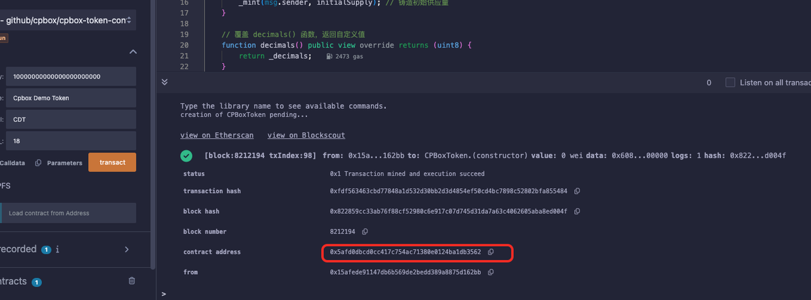<figcaption>
View Transaction Results
</figcaption></figure>

Here is the just-deployed contract address, which can be viewed through a block explorer: [https://sepolia.etherscan.io/address/0x5afd0dbcd0cc417c754ac71380e0124ba1db3562#code](https://sepolia.etherscan.io/address/0x5afd0dbcd0cc417c754ac71380e0124ba1db3562#code)

Open the wallet's token panel, click add token, add the just-deployed token contract address, and you can see the token information and current address token balance.

<figure>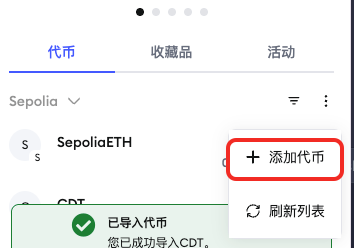<figcaption>
Add Token
</figcaption></figure>

<figure>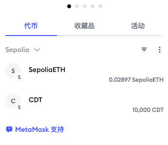<figcaption>
View Balance
</figcaption></figure>

#### Appendix:

Remix address: [https://remix.ethereum.org/](https://remix.ethereum.org/)

Token contract source code: [https://github.com/cpbox/cpbox-token-contracts/blob/main/evm/erc20.sol](https://github.com/cpbox/cpbox-token-contracts/blob/main/evm/erc20.sol)

CPBOX also provides more complex tools and features. If you need customization, you can join our TG group to contact us: [https://t.me/cpboxio](https://t.me/cpboxio)

If you have good suggestions, we welcome discussion: [https://www.cpbox.io/en/suggest](https://www.cpbox.io/en/suggest)
