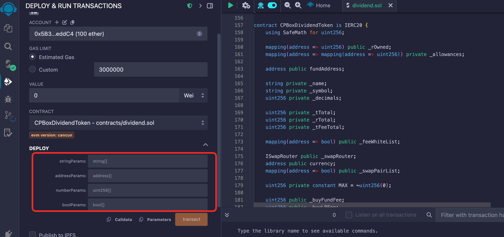

# Creating Dividend Tokens

#### What are dividend tokens?

Dividend tokens refer to tokens that distribute the native token (the **token you issue**) to holders. Users deduct a certain amount of tokens from each transaction according to the dividend tax rate and distribute them to all token holders. The rewards that each holder can receive are related to the number of tokens they own. The larger the holding, the more rewards they receive.

#### Use Cases

Through regular dividends (such as protocol revenue, transaction fees, etc.), encourage users to hold tokens for the long term rather than short-term selling, stabilizing token prices. Combined with mechanisms like token burning and providing liquidity rewards, achieve flexible token operations.

#### Contract Deployment

Open [remix](https://remix.ethereum.org/), create a new file and paste the contract source code, or directly link to the contract source code address. For operation procedures, refer to:

Contract source code: [https://github.com/cpbox/cpbox-token-contracts/blob/main/evm/dividend.sol](https://github.com/cpbox/cpbox-token-contracts/blob/main/evm/dividend.sol)

**Parameter Description**

<figure><figcaption><p>Creating Dividend Tokens</p></figcaption></figure>

Here's a sample set of parameters with explanations on how to modify them for your needs:

* First stringParams parameter: `["CPBoxTestToken", "CPBLP"]`
* Second addressParams parameter:

`["0x1234567890123456789012345678901234567890","0x0987654321098765432109876543210987654321","0x1111111111111111111111111111111111111111"]`

* Third numberParams parameter: `["18","1000000000000000000","200","100","100","50","200","100","100","50","3"]`
* Fourth boolParams parameter: `[true]`

Parameter explanation:

```java
// String parameter array
string[] memory stringParams = [
    "CPBoxTestToken",  // Token name, please change to your own token name
    "CPB"              // Token symbol, please change to your own token symbol
];

// Address parameter array
address[] memory addressParams = [
    0x1234567890123456789012345678901234567890,  // fundAddress: Fund address
    0x0987654321098765432109876543210987654321,  // currency: Trading pair token address
    0x1111111111111111111111111111111111111111   // swapRouter: Trading router contract address
];

// Numeric parameter array
uint256[] memory numberParams = [
    18,                    // decimals: Token precision
    1000000000000000000,   // totalSupply: Total token supply
    200,                   // buyFundFee: Buy fund fee rate (2%)
    100,                   // buyLPFee: Buy LP fee rate (1%)
    100,                   // buyReflectFee: Buy dividend tax rate (1%)
    50,                    // buyBurnFee: Buy burn fee rate (0.5%)
    200,                   // sellFundFee: Sell fund fee rate (2%)
    100,                   // sellLPFee: Sell LP fee rate (1%)
    100,                   // sellReflectFee: Sell dividend tax rate (1%)
    50,                    // sellBurnFee: Sell burn fee rate (0.5%)
    3                      // airdropNumbs: Airdrop quantity
];

// Boolean parameter array
bool[] memory boolParams = [
    true    // enableAirdrop: Airdrop switch
];
```

(Buy/Sell) Fee Rate Explanation:

* Fund fee rate: Each buy/sell transaction will deduct the corresponding proportion of native tokens and send them to your `marketing wallet` address
* LP fee rate: Each buy/sell transaction will deduct the corresponding proportion of tokens and send them to the `liquidity pool`
* Dividend fee rate: Each buy/sell transaction will deduct the corresponding proportion of native tokens and distribute them to all `token holder addresses`
* Burn fee rate: Each buy/sell transaction will deduct the corresponding proportion of tokens and send them to the `black hole address` to achieve burning

**Important Notes**

* Total buy tax rate cannot exceed 25% (buy marketing tax + buy tax + dividend tax + buy burn < 2500)
* Total sell tax rate cannot exceed 25% (sell marketing tax + sell tax + sell dividend + sell burn < 2500)
* When adding liquidity for the first time on Pancake, you must create a V2 pool, not a V3 pool. V3 does not support any mechanisms, so you can only do it on V2, please note
* After contract creation, permissions are discarded by default, and there are no whitelist, blacklist, anti-bot, trading switch functions
* If the black hole address holds tokens, it will also participate in dividends

If you want to learn more about other uses and features of the CPBOX product

You can click [https://docs.cpbox.io/](https://docs.cpbox.io/?_s=docs)

Or if you have good suggestions or need development help

You can find us through the contact information at the bottom of the homepage [https://www.cpbox.io/](https://www.cpbox.io/en/?_s=docs)

***

【Other Social Media】

TG Community: [https://t.me/cpboxio](https://t.me/cpboxio)

Twitter: [https://twitter.com/Web3CryptoBox](https://twitter.com/Web3CryptoBox)

Youtube: [https://youtube.com/channel/UCDcg1zMH4CHTfuwUpGSU-wA](https://youtube.com/channel/UCDcg1zMH4CHTfuwUpGSU-wA)