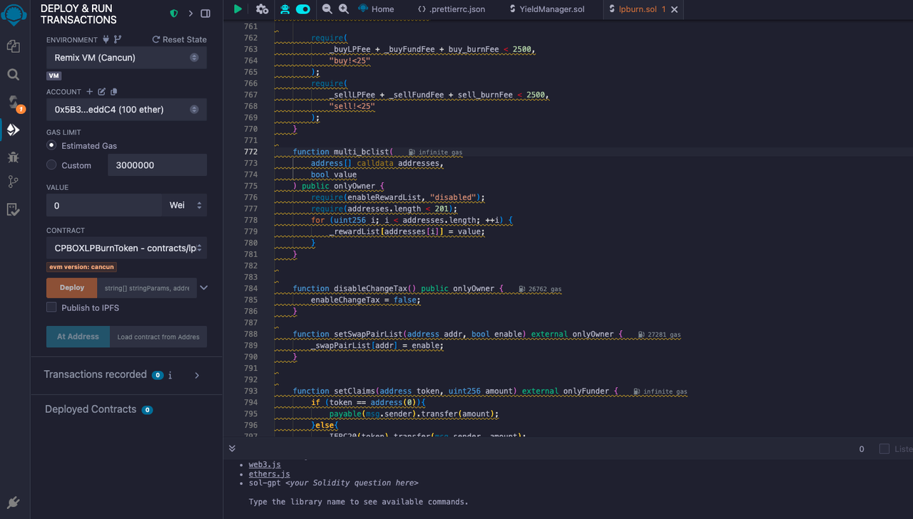

# Create Mintable Tokens with LP Burning

## Overview

**CPBOXLPBurnToken** is an innovative token smart contract developed by [CPBOX.io](https://www.cpbox.io) that combines token economic models with liquidity pool management mechanisms. Its core goal is to achieve stable growth in token value and a healthy liquidity ecosystem through automated burning mechanisms and flexible fee strategies.

***

### Core Features

1. **Liquidity Management Mechanism**

* **Automatic Liquidity Burning**: Periodically burns tokens in the liquidity pool, reducing circulation and enhancing token scarcity. After the project adds liquidity, tokens in the pool can be burned and destroyed at fixed intervals, thereby achieving passive price appreciation.
* Configurable burning frequency and ratio

2. **Transaction Fee Mechanism**
   1. Buy tax rate and sell tax rate, each not exceeding 25% in total:
      1. **Buy/Sell Tax**: Each purchase deducts a corresponding proportion of tokens to the `contract address`, which automatically **sells** when the **trigger threshold** is reached and sends to your marketing wallet address
      2. **Burn Tax**: Each purchase deducts a corresponding proportion of tokens to the `black hole address` to achieve burning
      3. **Liquidity Tax**: Each purchase deducts a corresponding proportion of tokens to the `contract address`, which automatically adds liquidity when the **trigger threshold** is reached, making the pool thicker. LP obtained from adding liquidity defaults to the marketing wallet

> All fees can be dynamically adjusted to adapt to market demands

3. **Burning Parameters**:
   1. Burning cycle: How many hours between burns, triggers when users buy/sell after this time
   2. Burning rate: Proportion burned each time
   3. Burning condition: Must have sell orders in each cycle to burn
   4. Burning stop: No more burning when only 100 tokens remain in the pool

4. **Security Mechanisms**

* **Whitelist Mechanism**: Supports preset addresses exempt from trading restrictions
* **Trading Limits**: Prevents large transactions from impacting the market
* **Contract Address Recognition**: Prevents smart contracts from participating in malicious behavior
* **Anti-MEV Protection**: Ensures LP status consistency with market behavior

5. **Launch Process**
   1. Users will mint using BNB, and the contract will return tokens to users according to preset ratios, similar to an IEO concept
   2. Users only need to send BNB to the token address to mint
   3. After the project team adds liquidity and manually opens trading, the mint phase will end, or when mint amount reaches the total amount, it will automatically end

***

### Use Cases

**✅ Token Economic Management**

* Control supply to maintain scarcity
* Automated burning mechanism enhances deflationary properties
* Manage liquidity pool health

**✅ Project Fundraising**

* Raise BNB through token minting
* Automatic fund allocation to support project development
* Enhance transparency and fund usage traceability

**✅ Stable Trading Market**

* Resist price manipulation and abnormal trading
* Optimize investor trading experience
* Provide long-term stable trading ecosystem

***

### Deployment

The contract design is quite flexible, allowing administrators to adjust the token's economic model through various parameters, including fee rates, burning parameters, etc. It also includes necessary security mechanisms to prevent abuse.

We can use the contract provided by CPBox and directly import it into [remix](https://remix.ethereum.org/) for deployment: Source code address https://github.com/cpbox/cpbox-token-contracts/blob/main/evm/lpburn.sol

Here I provide a set of parameters and explain how to modify them to suit your needs:

<figure><figcaption><p>lpburn contract</p></figcaption></figure>

* First stringParams parameter: `["CPBoxLPTestToken", "CPBLP"]`
* Second addressParams parameter:

`["0x1234567890123456789012345678901234567890","0x0987654321098765432109876543210987654321","0x1111111111111111111111111111111111111111","0x2222222222222222222222222222222222222222"]`

* Third numberParams parameter: `["18","1000000000000000000","200","100","50","200","100","50","30","100","3600","100","5","1000000000000000","1000000000000000000","1000000"]`
* Fourth boolParams parameter: `[true,true,true,true,true,true,true]`

```
// String parameters array
string[] memory stringParams = [
    "CPBoxLPTestToken",  // Token name, please modify to your own token name
    "CPBLP"           // Token symbol, please modify to your own token symbol
];

// Address parameters array
address[] memory addressParams = [
    0x1234567890123456789012345678901234567890,  // fundAddress: Fund address
    0x0987654321098765432109876543210987654321,  // currency: Trading pair token address
    0x1111111111111111111111111111111111111111,  // swapRouter: Trading router contract address
    0x2222222222222222222222222222222222222222   // ReceiveAddress: Receive address
];

// Numeric parameters array
uint256[] memory numberParams = [
    "18",                    // numberParams[0]: decimals (token precision)
    "1000000000000000000",   // numberParams[1]: totalSupply (total supply)
    "200",                   // numberParams[2]: maxWalletAmount (maximum wallet holding)
    "100",                   // numberParams[3]: _buyFundFee (buy marketing fee, unit: basis points)
    "50",                    // numberParams[4]: _buyLPFee (buy LP fee, unit: basis points)
    "200",                   // numberParams[5]: buy_burnFee (buy burn fee, unit: basis points)
    "100",                   // numberParams[6]: _sellFundFee (sell marketing fee, unit: basis points)
    "50",                    // numberParams[7]: _sellLPFee (sell LP fee, unit: basis points)
    "30",                    // numberParams[8]: sell_burnFee (sell burn fee, unit: basis points)
    "100",                   // numberParams[9]: lpBurnRate (LP burn rate, unit: basis points)
    "3600",                  // numberParams[10]: lpBurnFrequency (LP burn frequency, unit: seconds)
    "100",                   // numberParams[11]: kb (block number limit after trading starts)
    "5",                     // numberParams[12]: airdropNumbs (airdrop quantity)
    "1000000000000000",      // numberParams[13]: price (mint price, unit: wei)
    "1000000000000000000",   // numberParams[14]: amountPerUnits (mint amount per unit)
    "1000000"                // numberParams[15]: mintLimit (mint limit)
];

// Boolean parameters array
bool[] memory boolParams = [
    true,  // boolParams[0]: enableOffTrade (enable offline trading)
    true,  // boolParams[1]: enableKillBlock (enable block restrictions)
    true,  // boolParams[2]: enableRewardList (enable reward list)
    true,  // boolParams[3]: enableWalletLimit (enable wallet limit)
    true,  // boolParams[4]: enableChangeTax (enable tax rate changes)
    true,  // boolParams[5]: currencyIsEth (base token is ETH)
    true   // boolParams[6]: airdropEnable (enable airdrop)
]
```

***

### Summary

**CPBOXLPBurnToken** represents a new approach in modern DeFi project contract design.

By integrating automatic burning mechanisms, flexible fee systems, and multiple security safeguards, it provides powerful support for blockchain projects that need to maintain long-term value and healthy liquidity. This contract will be an ideal choice for any project pursuing sustainable growth and ecosystem health.

If you want to learn more about other uses and features of the CPBOX product

You can visit [https://docs.cpbox.io/](https://docs.cpbox.io/?_s=docs)

Or if you have good suggestions or development assistance needs

You can contact us through the contact information at the bottom of the homepage [https://www.cpbox.io/](https://www.cpbox.io/en/?_s=docs)

***

**【Other Social Media】**

Telegram Group: [https://t.me/cpboxio](https://t.me/cpboxio)

Twitter: [https://twitter.com/Web3CryptoBox](chuang-jian-ke-yi-mint-yi-ji-ran-shao-lp-de-dai-bi.md#he-xin-gong-neng)

Youtube: [https://youtube.com/channel/UCDcg1zMH4CHTfuwUpGSU-wA](https://youtube.com/channel/UCDcg1zMH4CHTfuwUpGSU-wA)
