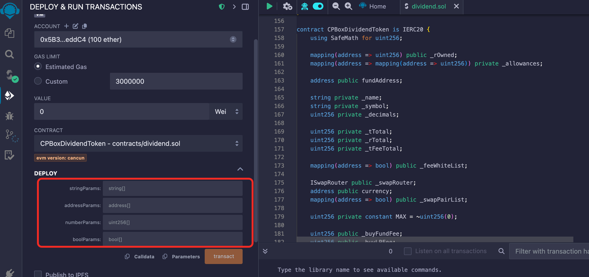

# Create LP Dividend Token

#### What is a dividend token?

LP dividend refers to users being able to receive additional token dividends after adding liquidity on decentralized exchanges (such as Pancake), in addition to liquidity rewards. These token dividends are distributed directly to LP addresses. The specific tokens to be distributed as dividends can be selected when creating the contract, typically mainstream tokens such as wBNB, USDT, USDC, Doge, etc.

#### Contract Deployment

Open [remix](https://remix.ethereum.org/), create a new file and paste the contract source code, or directly link to the contract source code address. For operation procedures, refer to:

Contract source code: [https://github.com/cpbox/cpbox-token-contracts/blob/main/evm/lpdividend.sol](https://github.com/cpbox/cpbox-token-contracts/blob/main/evm/lpdividend.sol)

**Parameter Description**

<figure><figcaption><p>LP Dividend Token</p></figcaption></figure>

Here's a sample parameter set with explanations on how to modify it for your needs:

* First stringParams parameter: `["CPBoxToken", "CPB"]`
* Second addressParams parameter:

`["0x1234567890123456789012345678901234567890","0x0987654321098765432109876543210987654321","0x1111111111111111111111111111111111111111","0x2222222222222222222222222222222222222222","0x3333333333333333333333333333333333333333"]`

* Third numberParams parameter: `["18","1000000000000000000","1000000000000","200","100","100","50","200","100","100","50","10","3"]`
* Fourth boolParams parameter: `[true,true,true,true,true,true,true]`

Parameter explanation:

```java
// String parameter array
string[] memory stringParams = [
    "CPBoxToken",  // Token name, please modify to your own token symbol
    "CPB"          // Token symbol, please modify to your own token symbol
];

// Address parameter array
address[] memory addressParams = [
    0x1234567890123456789012345678901234567890,  // fundAddress: Marketing address
    0x0987654321098765432109876543210987654321,  // currency: Trading pair token address
    0x1111111111111111111111111111111111111111,  // swapRouter: Trading router contract address
    0x2222222222222222222222222222222222222222,  // receiveAddress: Receiving address   
    0x3333333333333333333333333333333333333333,  // rewardToken: Dividend token
];

// Numeric parameter array
uint256[] memory numberParams = [
    18,                    // decimals: Token precision
    1000000000000000000,   // totalSupply: Total token supply
    1000000000000,         // maxWalletAmount: Maximum token amount per address
    200,                   // buyFundFee: Buy fund fee rate (2%)
    100,                   // buyLPFee: Buy LP fee rate (1%)
    100,                   // buyReflectFee: Buy dividend tax rate (1%)
    50,                    // buyBurnFee: Buy burn fee rate (0.5%)
    200,                   // sellFundFee: Sell fund fee rate (2%)
    100,                   // sellLPFee: Sell LP fee rate (1%)
    100,                   // sellReflectFee: Sell dividend tax rate (1%)
    50,                    // sellBurnFee: Sell burn fee rate (0.5%)
    10,                    // kb: Anti-sync block count
    3                      // airdropNumbs: Airdrop quantity
];

// Boolean parameter array
bool[] memory boolParams = [
    true,    // enableOffTrade: Manually enable trading
    true,    // enableKillBlock: Anti-sync blocks
    true,    // enableRewardList: Whitelist
    true,    // enableWalletLimit: Enable wallet quantity limit
    true,    // enableChangeTax: Allow tax rate modification
    true,    // currencyIsEth: Use BNB as trading pair
    true     // airdropEnable: Airdrop switch   
];
```

(Buy/Sell) Fee Rate Explanation:

* Fund Fee Rate: Each buy/sell transaction deducts the corresponding proportion of tokens to the `contract address`. When the **trigger threshold** is reached, it will automatically **sell** and convert to `USDT` (depending on the pool type, whatever token is in the base pool goes to the marketing wallet) and send to your marketing wallet address
* LP Fee Rate: Each buy/sell transaction deducts the corresponding proportion of tokens to the `contract address`. When the **trigger threshold** is reached, it will automatically add liquidity, making the pool thicker. The LP obtained from adding to the pool defaults to the marketing wallet
* Dividend Fee Rate: Each buy/sell transaction deducts the corresponding proportion of tokens to the `contract address`. When the **trigger threshold** is reached, it will automatically **sell** to `USDT` (depending on your dividend token) and distribute to users holding LP
* Burn Fee Rate: Each buy/sell transaction deducts the corresponding proportion of tokens to the `black hole address`, achieving the purpose of burning

> Total buy tax rate cannot exceed 25% (buyFundFee + buyLPFee + buyReflectFee + buyBurnFee < 2500). Total sell tax rate cannot exceed 25% (sellFundFee + sellLPFee + sellReflectFee + sellBurnFee < 2500)

**Important Notes**

* **Others' LP addresses must trade to be activated**
  * If a user's LP is not obtained by adding their own pool, but transferred from others, then this address must trade once (one buy and one sell) before it can be activated to receive dividends. Otherwise, the contract cannot recognize the address and there will be no dividends
* **Why are there still no dividends after many trades?**
  * Don't use whitelist addresses for trading. Trading with issuing addresses or marketing wallet addresses is useless
  * Don't just buy; there must be sell orders to receive dividends. Without sell orders, dividends cannot be distributed
* **Are there still dividends after locking the pool?**
  * The person who locked the pool has no dividends, but others who didn't lock still participate in dividends without affecting each other. Additionally, locked pool addresses can be excluded from dividends through the console.
* **Add/Remove pool transaction fee issues**
  * By default, adding/removing pools doesn't charge transaction fees, but certain prerequisites must be met:
    * If using USDT as the base pool, users adding pools must maintain the same `direction` as the initial pool addition. "Direction" refers to which comes first between USDT and tokens. If directions are inconsistent, adding pools will still charge transaction fees
    * If using BNB as the base pool, users must use wBNB to add pools with consistent direction to avoid transaction fees

If you want to learn more about other uses and features of the CPBOX product

You can visit [https://docs.cpbox.io/](https://docs.cpbox.io/)

Or if you have good suggestions or development assistance needs

You can contact us through the contact information at the bottom of the homepage [https://www.cpbox.io/cn/](https://www.cpbox.io/cn/)

***

【Other Social Media】

TG Community Group: [https://t.me/cpboxio](https://t.me/cpboxio)

Twitter: [https://twitter.com/Web3CryptoBox](https://twitter.com/Web3CryptoBox)

Youtube: [https://youtube.com/channel/UCDcg1zMH4CHTfuwUpGSU-wA](https://youtube.com/channel/UCDcg1zMH4CHTfuwUpGSU-wA)
