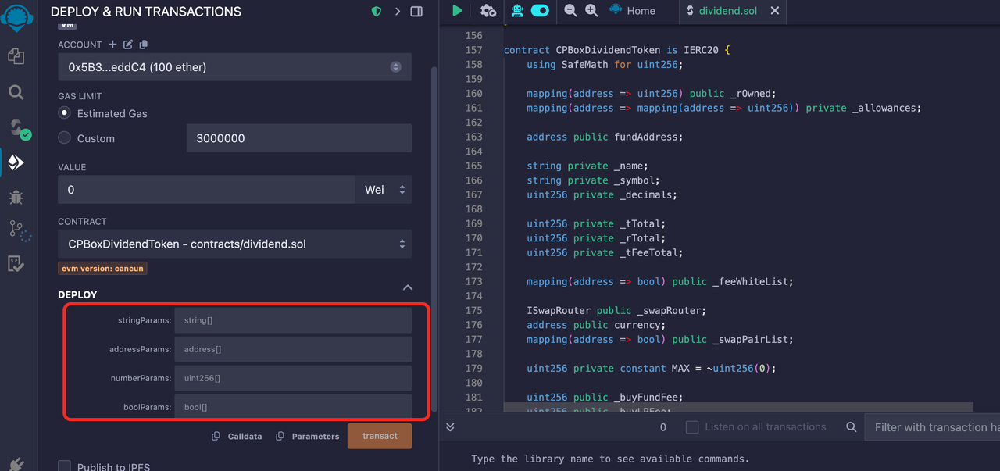

# Deploy LP Mining Referral Tokens

In response to recent user inquiries about how to create a token with an LP pool that rewards users who are referred to add to the pool, CPBox has analyzed the contract code in the repository to help users understand the entire pool and contract content, while enabling them to deploy similar tokens to meet their specific needs.

1. First, this is an ERC20 Token that supports basic token transfers and balance queries. We need to set the token's name, symbol, and decimal parameters during deployment.
2. Transaction fee mechanism
   1. Buy tax rate and sell tax rate, each not exceeding 25% of the total
      1. **Buy/Sell Tax**: Each purchase will deduct the corresponding proportion of tokens and send them to the `contract address`. When the **trigger threshold** is reached, it will automatically **sell** and send to your marketing wallet address.
      2. **Burn Tax**: Each purchase will deduct the corresponding proportion of tokens and send them to the `black hole address` to achieve burning.
      3. **Liquidity Tax**: Each purchase will deduct the corresponding proportion of tokens and send them to the `contract address`. When the **trigger threshold** is reached, it will automatically add liquidity to make the pool thicker. The LP obtained from adding to the pool defaults to the marketing wallet.
3. Supports whitelist mechanism, whitelist addresses can be exempted from fees
4. Liquidity Mining
   1. **Mining Supply Ratio**: The proportion of tokens produced by mining out of the total token supply. For example, if the total token supply is 100,000,000 and mining produces 50,000,000, then this ratio should be 50%. When creating the contract, 50,000,000 tokens will directly enter the mining contract, and no one can withdraw them.
   2. **Daily Mining Rewards**: Fixed daily output of tokens, just enter the amount directly.
5. Invitation Reward Mechanism
   1. Supports multi-level invitation reward system, can set different reward ratios for different levels:
      * **Invitation Levels**: How many sub-levels can there be, currently up to 16 levels can be set
      * First level amount, second level amount, third level amount, remaining level amount, the sum of all should be 100%

This is a quite complete token contract, especially suitable for:

* Liquidity mining projects
* Projects with invitation reward mechanisms
* Projects requiring complex fee structures
* Projects requiring airdrop functionality

The contract design is quite flexible, administrators can adjust the token's economic model through various parameters, including rates, reward mechanisms, etc. It also includes necessary security mechanisms to prevent abuse. We can use the contract provided by CPBox and directly import it into [remix](https://remix.ethereum.org/) for deployment:

Source code address: https://github.com/cpbox/cpbox-token-contracts/blob/main/evm/lpmine.sol

<figure><figcaption><p>Liquidity Mining Code</p></figcaption></figure>

Here I provide a set of parameters and explain how to modify them to suit your own parameters:

* First stringParams parameter: `["CPBoxTestToken", "CPBLP"]`
* Second addressParams parameter:

`["0x1234567890123456789012345678901234567890","0x0987654321098765432109876543210987654321","0x1111111111111111111111111111111111111111","0x2222222222222222222222222222222222222222"]`

* Third numberParams parameter: `["18","1000000000000000000","200","100","50","200","100","50","30","100000000000000000","100000000000000000","100000000000000000","10","50","30","10","2","10","3","1000000000000000"]`
* Fourth boolParams parameter: `[true,true,true,true,true,true]`

Analysis:

```
// String parameter array
string[] memory stringParams = [
    "CPBoxTestToken",  // Token name, please modify to your own token symbol
    "CPBLP"           // Token symbol, please modify to your own token symbol
];

// Address parameter array
address[] memory addressParams = [
    0x1234567890123456789012345678901234567890,  // fundAddress: Fund address
    0x0987654321098765432109876543210987654321,  // currency: Trading pair token address
    0x1111111111111111111111111111111111111111,  // swapRouter: Trading router contract address
    0x2222222222222222222222222222222222222222   // ReceiveAddress: Receive address
];

// Numeric parameter array
uint256[] memory numberParams = [
    18,                     // decimals: Token precision
    1000000000000000000,   // totalSupply: Token total supply
    200,                   // buyFundFee: Buy fund fee rate (2%)
    100,                   // buyLPFee: Buy LP fee rate (1%)
    50,                    // buy_burnFee: Buy burn fee rate (0.5%)
    200,                   // sellFundFee: Sell fund fee rate (2%)
    100,                   // sellLPFee: Sell LP fee rate (1%)
    50,                    // sell_burnFee: Sell burn fee rate (0.5%)
    30,                    // mineRate: Mining ratio (30%)
    100000000000000000,    // LPRewardCondition: LP reward condition
    100000000000000000,    // minLPHoldAmount: Minimum LP holding amount
    100000000000000000,    // minInvitorHoldAmount: Minimum inviter token holding amount
    10,                    // generations: Invitation level count
    50,                    // fristRate: First level invitation reward ratio (50%)
    30,                    // secondRate: Second level invitation reward ratio (30%)
    10,                    // thirdRate: Third level invitation reward ratio (10%)
    2,                     // leftRate: Remaining level invitation reward ratio (2%)
    10,                    // kb: Anti-sync block count
    3,                     // airdropNumbs: Airdrop quantity
    1000000000000000       // _minTransAmount: Minimum transfer amount
];

// Boolean parameter array
bool[] memory boolParams = [
    true,    // enableOffTrade: Manually enable trading
    true,    // enableKillBlock: Anti-sync blocks
    true,    // enableRewardList: Whitelist
    true,    // enableChangeTax: Allow tax rate modification
    true,    // currencyIsEth: Whether to use ETH as trading pair
    true     // airdropEnable: Airdrop switch
];
```

If you want to learn more about CPBOX and its other uses and features

You can click [https://docs.cpbox.io/](https://docs.cpbox.io/en/?_s=docs)

Or if you have good suggestions or development assistance needs

You can contact us through the contact information at the bottom of the homepage [https://www.cpbox.io/](https://www.cpbox.io/en/?_s=docs)

***

【Other Social Media】

TG Group: [https://t.me/cpboxio](https://t.me/cpboxio)

Twitter: [https://twitter.com/Web3CryptoBox](https://twitter.com/Web3CryptoBox)

YouTube: [https://youtube.com/channel/UCDcg1zMH4CHTfuwUpGSU-wA](https://youtube.com/channel/UCDcg1zMH4CHTfuwUpGSU-wA)
