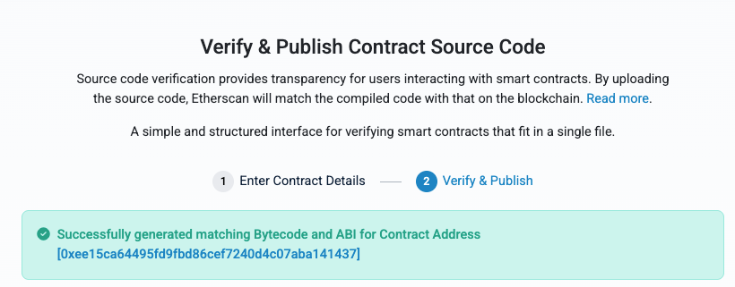
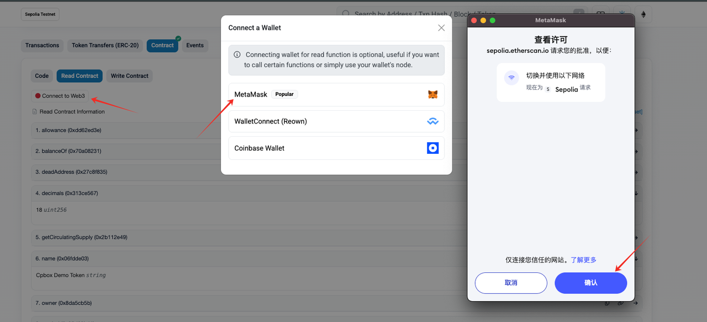

# Open Source Contract Code

## Why Open-Source Contract Code

In the [EVM One-Click Token Issuance Case](evm-yi-jian-fa-bi-an-li/biao-zhun-erc20-dai-bi-bu-shu.md), we introduced the deployment of many types of token contracts. By default, token contracts deployed through [remix](https://remix.ethereum.org/) are not open-sourced. Open the corresponding blockchain explorer, enter the contract address, click Contract, and you can see whether the contract is open-sourced.

<figure><figcaption><p>Contract code on scan</p></figcaption></figure>

As shown in the image above, this is a non-open-sourced contract where the contract content is all hexadecimal data. There's also a [Verify and Publish] button that will guide you through the contract open-sourcing process, which we'll explain in detail later.

What are the benefits of open-sourcing contracts?

#### **Enhanced Transparency and Credibility**

* Users, developers, and auditors can directly view and verify whether the contract logic is secure and whether it functions as described by the project team, reducing the possibility of black-box operations and increasing community trust in the project.
* Security experts or community developers can check for vulnerabilities, backdoors, excessive permissions, and other risks, making it easier to discover logic flaws or potential attack vectors (such as reentrancy, privilege abuse).
* For non-open-sourced token contracts, most trading platforms or third-party security check platforms (such as Ave.ai/gmgn/goPlus, etc.) will mark them as risky contracts. Risk labels affect ordinary users' trust in tokens, thereby impacting token trading.

#### **Improved Interaction Experience**

* After contracts are open-sourced and verified, blockchain explorers can display contract function names and parameters, allowing users to interact directly with contracts through the UI without needing third-party tools (such as Remix or custom scripts).

#### **Facilitates Third-Party Integration**

* Wallets, DeFi platforms, DEXs, analytics platforms, etc., are more willing to integrate publicly transparent contracts because of their high readability and controllable risks.
* Increases the likelihood of tokens being tracked, traded, and listed.

## How to Open-Source Contracts

There are many ways to open-source contract code: through blockchain explorers, through Remix after deployment, and if you have a local contract development environment, you can also use forge-related commands for contract open-sourcing. Let's describe how to operate each method:

### **Through Blockchain Explorer**

As we've seen earlier, for non-open-sourced contracts, blockchain explorers have corresponding entry points to guide users through contract open-sourcing. This method is relatively simple and suitable for novice users. Following the step-by-step process below, you can quickly achieve contract open-sourcing.

<figure><figcaption><p>Open-source code</p></figcaption></figure>

After entering the contract open-sourcing page, the contract address is automatically filled in. Since our example has only a single contract file, we select single file, then fill in the corresponding contract compiler version and open-source license according to the contract code.

<figure><figcaption><p>Select compiler version</p></figcaption></figure>

We can see these two parameters during deployment:

<figure><figcaption><p>Compilation version</p></figcaption></figure>

Click continue to enter the next page:

<figure><figcaption><p>Contract open-sourcing</p></figcaption></figure>

First, we copy the contract code in, then because the contract is relatively simple, note that the optimization and Runs parameters are selected in Remix:

<figure><figcaption><p>Remix compilation optimization options</p></figcaption></figure>

<figure><figcaption><p>Contract configuration</p></figcaption></figure>

Click verify and publish, and you'll see this prompt:

<figure><figcaption><p>Contract open-sourcing prompt</p></figcaption></figure>

Now enter the contract address in the blockchain explorer, and you'll find the contract has been verified and you can see the contract source code:

<figure><figcaption></figcaption></figure>

#### **Contract Interaction**

Another benefit of contract open-sourcing is that you can call contract methods through the blockchain explorer. Methods are divided into two categories: read operations and write operations. Read operations generally don't require wallet connection and can directly call contract methods by inputting parameters. For example, if we want to see token-related information:

<figure><figcaption><p>Contract read-only calls</p></figcaption></figure>

The other category is write operations, which usually require wallet connection. First click [Connect to Web3] to connect your wallet:

<figure><figcaption><p>Contract write calls</p></figcaption></figure>

For example, here I can connect my wallet to perform a token transfer operation:

<figure><figcaption><p>Transfer test</p></figcaption></figure>

### **Open-Sourcing Contracts Through Remix**

After deploying contracts on Remix, you can also open-source contracts through Remix. First, enter the plugins panel and enable the contract verification plugin:

<figure><figcaption><p>Remix verification</p></figcaption></figure>

After enabling it, enter the contract verification plugin management page through the left panel:

<figure><figcaption><p>Remix verification</p></figcaption></figure>

The red box shows the platforms we want to verify on, meaning after verification is complete, contract code can be viewed on these platforms. For mainstream blockchain explorers (like Etherscan), you need to apply for an API key for configuration. After completing the configuration, you can check the API key. API key application address: https://etherscan.io/apidashboard. The applied API key can be used for both mainnet and testnet.

<figure><figcaption><p>Remix scan API key</p></figcaption></figure>

After filling it in, return to the initial panel, and you can see Etherscan is now in a checked state. Click verify to start verification.

### **Other Open-Sourcing Methods**

Besides the two methods above, you can also open-source contract code through development tools. Using Foundry as an example, assuming we've deployed a contract, execute the following command to open-source the contract:

```typescript
forge verify-contract 0x123...abc MyContract \
    --chain mainnet \
    --verifier etherscan \
    --etherscan-api-key YOUR_ETHERSCAN_KEY \
    --compiler-version v0.8.23+commit.f704f362
```

* Parameter explanation

```javascript
<CONTRACT_ADDRESS>        Contract deployment address        0x123...abc
<CONTRACT_NAME>        Contract name (consistent with Solidity file)        MyContract
--chain        Chain ID (like mainnet, goerli, polygon)        mainnet
--verifier        Verification service (usually etherscan)        etherscan
--verifier-url        Verification API URL (optional, default Etherscan)    https://api.etherscan.io/api
--etherscan-api-key        Etherscan API Key        YourApiKey
--compiler-version        Solidity compiler version        v0.8.23+commit.f704f362
--optimizer-runs        Optimizer run count (default 200)        200
--constructor-args        Constructor arguments (ABI encoded)        0x000...123
The above introduces several methods for open-sourcing contract code.
```

If you want to learn more about web3 knowledge, you can click [https://docs.cpbox.io/](https://docs.cpbox.io/en/?_s=docs) to view

Or if you have good suggestions or development needs

You can contact us through the contact information at the bottom of the homepage [https://www.cpbox.io/](https://www.cpbox.io/en/?_s=docs)

***

【Other Social Media】

TG Discussion Group: [https://t.me/cpboxio](https://t.me/cpboxio)

Twitter: [https://twitter.com/Web3CryptoBox](https://twitter.com/Web3CryptoBox)

Youtube: [https://youtube.com/channel/UCDcg1zMH4CHTfuwUpGSU-wA](https://youtube.com/channel/UCDcg1zMH4CHTfuwUpGSU-wA)
