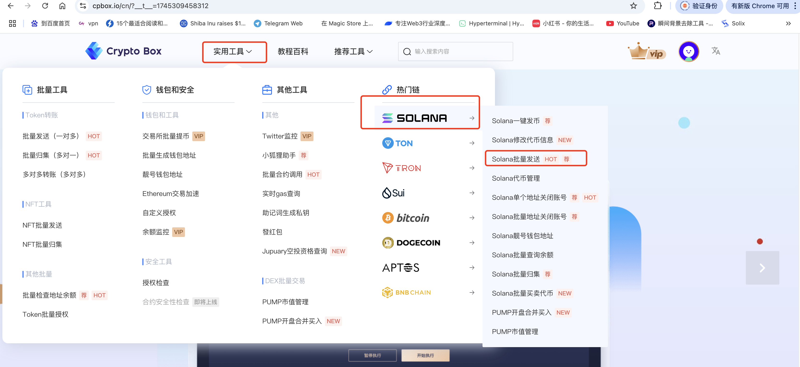
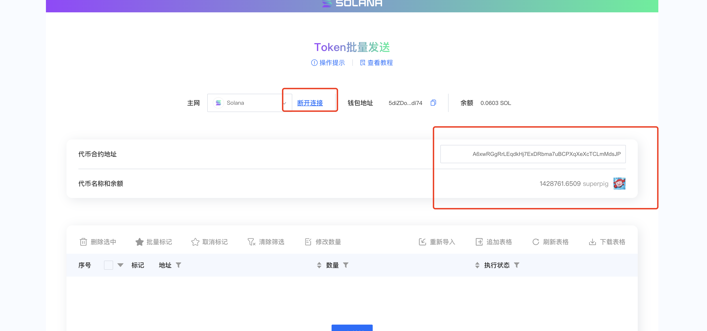
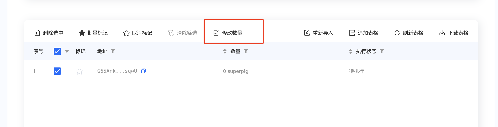
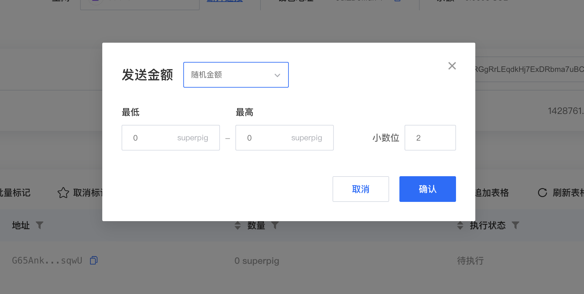
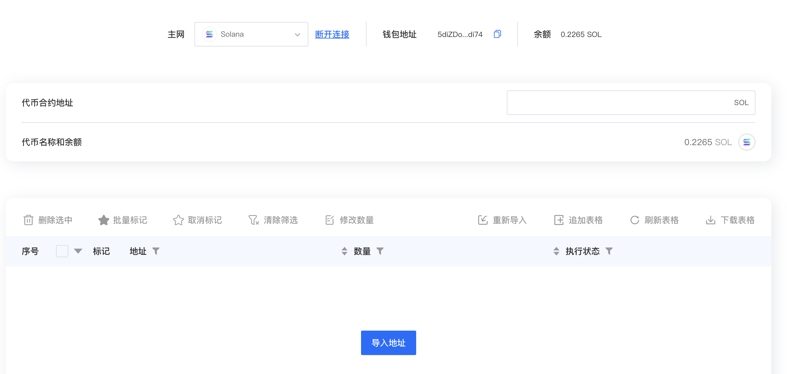

# Bulk Transfers & Airdrops

### **Feature Overview**

CPBox's Bulk Token Sender enables efficient mass transfers from a single wallet to multiple addresses, featuring:

* **Multi-chain support**: All EVM-compatible chains + [Solana](https://www.cpbox.io/en/solana/batch/send), [Sui](https://www.cpbox.io/en/sui/batch-send-token), [Tron](https://www.cpbox.io/en/tron/batch-send-token), Ton, Aptos, Cosmos
* **Customizable parameters**: Node selection, gas fee adjustment, transfer interval control
* **Enterprise-grade efficiency**: Optimized for large-scale airdrops and community rewards

**Target Users**

* **Airdrop farmers**: Execute multi-wallet interactions for eligibility
* **Community managers**: Distribute tokens for promotions and events

***

### **Solana (MEME Tokens)**

Visit [CPBox.io](https://www.cpbox.io/) → **Utility Tools** → **Bulk Sender**

<figure><figcaption>
CPBox Main Menu
</figcaption></figure>

**Step 1: Connect Wallet** (holding tokens to distribute)

<figure><figcaption>
Wallet Connection
</figcaption></figure>

**Step 2: Enter Token Contract Address** → System automatically displays token balance

**Step 3: Import Recipient Addresses**: Manual input or CSV file upload

<figure><figcaption>
Wallet Import Interface
</figcaption></figure>

**Step 4: Set Transfer Amounts**: Choose between fixed value or random range

<figure><figcaption>
Amount Configuration
</figcaption></figure>

**Step 5: Execute Transfer**

***

### **Solana Mainnet**

**Step 1: Select Solana Mainnet**

<figure><figcaption>
Network Selection
</figcaption></figure>

**Step 2-6: Repeat the above process**

Adjust SOL amounts as needed for your specific requirements.

***

### **Learn More About CPBOX** 

Explore all features: [https://docs.cpbox.io](https://docs.cpbox.io/)

Have suggestions or custom development needs?

Contact us: [https://www.cpbox.io/en/](https://www.cpbox.io/en/)

***

### **Join Our Community** 

**Telegram Group**: [https://t.me/cpboxio](https://t.me/cpboxio)

**Twitter**: [https://twitter.com/Web3CryptoBox](https://twitter.com/Web3CryptoBox) | [https://x.com/cpboxio](https://x.com/cpboxio)

**YouTube**: [https://youtube.com/channel/UCDcg1zMH4CHTfuwUpGSU-wA](https://youtube.com/channel/UCDcg1zMH4CHTfuwUpGSU-wA)
