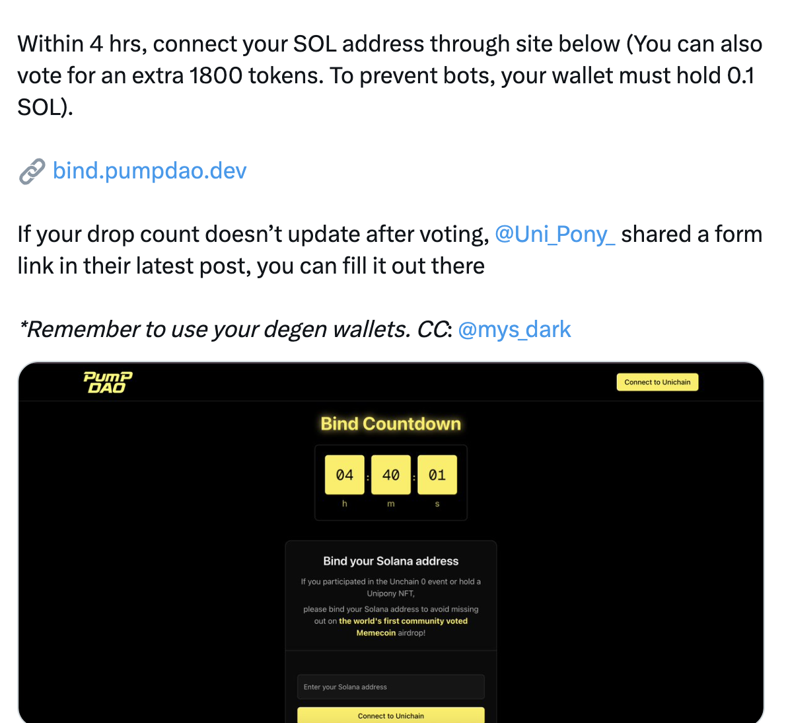
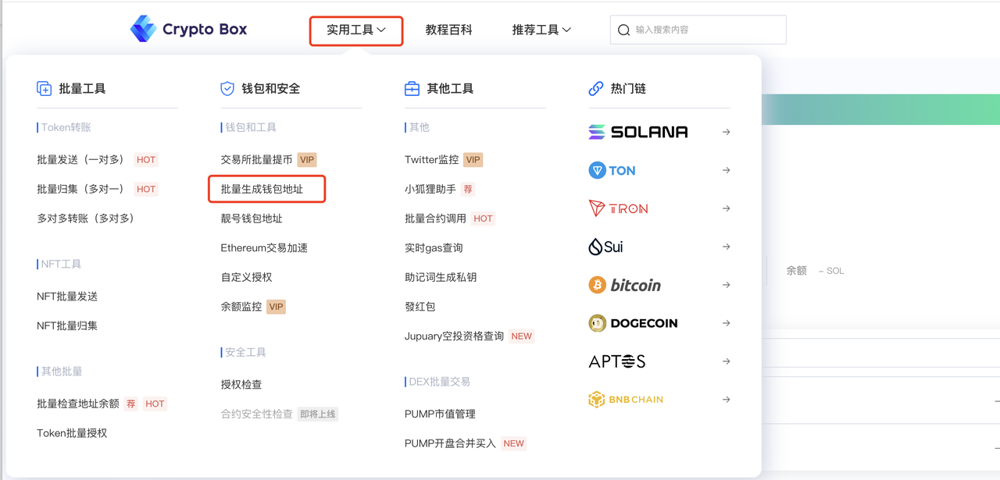
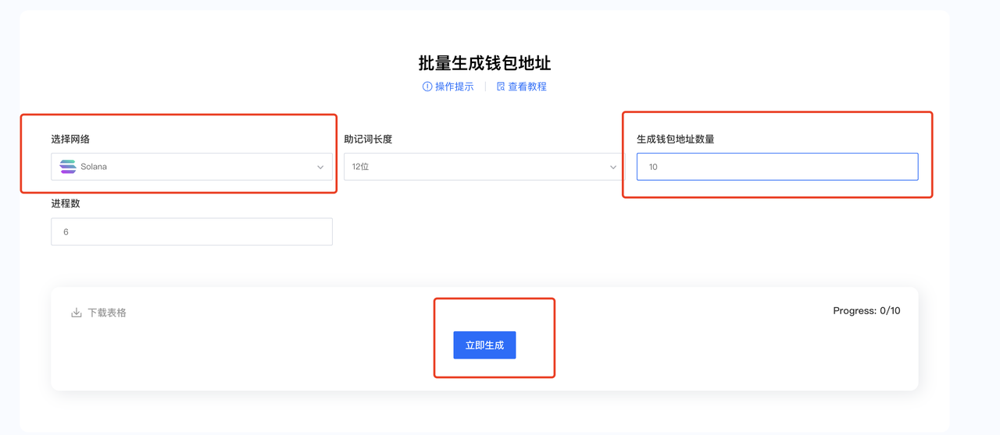
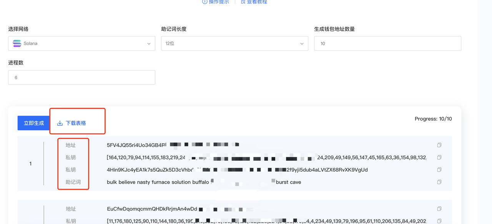

# Batch Create Solana Wallets

### **Introduction**

The Solana blockchain has been experiencing remarkable growth recently, driven primarily by the surge in popularity of meme coins. This momentum has catalyzed a wave of new project launches on Solana, creating numerous airdrop opportunities for users.

To maximize your potential returns from airdrop campaigns across multiple accounts, you'll need an efficient method to **batch-generate Solana wallet addresses**. Consider the recent **PumpDao voting event** as an example—simply holding **0.1 SOL** in your wallet and participating in the vote qualified you for an airdrop. To optimize your opportunities, using multiple wallets is a natural strategy.

<figure><figcaption></figcaption></figure>

***

### **How to Batch-Create Solana Wallets Using CPBOX**

**Step-by-Step Guide:**

1. Visit the [**CPBOX official website**](https://www.cpbox.io/)

<figure><figcaption></figcaption></figure>

2. Navigate to **"Utility Tools"** → **"Batch Generate Wallet Addresses"**

3. Select **Solana** as the blockchain network

4. Enter the **number of wallets** you want to create

5. Click **"Generate"**—the system will instantly create the wallets

<figure><figcaption></figcaption></figure>

6. **Download** the results as a spreadsheet for easy management

<figure><figcaption></figcaption></figure>

### **Important Security & Safety Notes**

🔒 **Security First:**

* All wallets are **generated locally** on your device—CPBOX **never** accesses or stores your private data
* For maximum security:
  * **Disconnect from the internet** during wallet generation
  * Use **incognito/private browsing mode**

⚠️ **Avoid Creating Excessive Wallets:**

* Modern projects implement **anti-Sybil detection measures** (IP tracking, behavioral pattern analysis)
* Creating too many wallets from a single source may trigger security flags and result in disqualification

***

### **Learn More About CPBOX**

Explore our comprehensive features: [https://docs.cpbox.io](https://docs.cpbox.io/)

Have suggestions or custom requirements?

Contact us: [https://www.cpbox.io/](https://www.cpbox.io/en/)

***

### **Join Our Community**

**Telegram Group**: [https://t.me/cpboxio](https://t.me/cpboxio)

**Twitter**: [https://twitter.com/Web3CryptoBox](https://twitter.com/Web3CryptoBox) | [https://x.com/cpboxio](https://x.com/cpboxio)

**YouTube**: [https://youtube.com/channel/UCDcg1zMH4CHTfuwUpGSU-wA](https://youtube.com/channel/UCDcg1zMH4CHTfuwUpGSU-wA)
