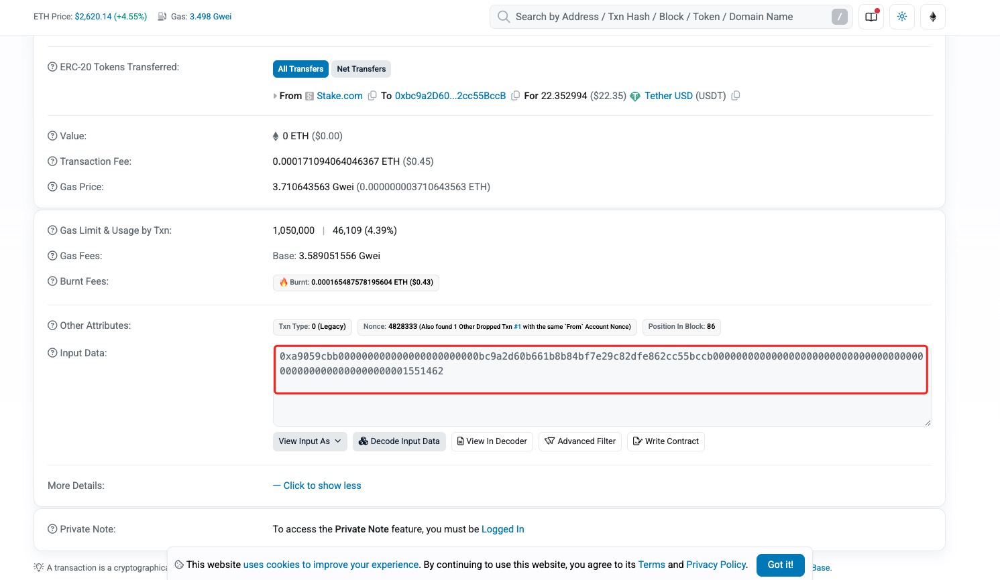

# Bulk Contract Interactions

### Feature **Overview**

Our **Batch Contract Call Blockchain Tool** provides efficient multi-address operations, enabling you to:

* **Batch mint tokens** from multiple wallet addresses
* **Execute NFT batch minting** operations
* **Perform multi-transaction swaps** simultaneously
* **Manage complex DeFi positions** across different addresses

***

### **Step-by-Step Guide**

**1. Access the Tool**

* Open the **Utility Tools** section: [https://www.cpbox.io](https://www.cpbox.io/en/?_s=docs)
* Select the **"Batch Contract Call"** function

**2. Network Configuration**

* Choose your target blockchain network (Ethereum, BSC, etc.)
* Use the default **RPC node** or configure a custom connection for optimal performance
* Ensure correct network settings for transaction reliability

**3. Contract Setup**

* Enter the **smart contract address** you wish to interact with
* Verify the contract on blockchain explorers (e.g., Etherscan, BSCscan)
* Connect your wallet to fetch necessary contract details

**4. Transaction Configuration**

* Copy the **hex-encoded Input Data** from the explorer
<figure><figcaption>
Example：Hex Encoded Input Data
</figcaption></figure>
* Set an appropriate **execution interval** to avoid network congestion
* Configure **Gas settings** based on network conditions and transaction priority

**5. Wallet Management**

* Import wallet private keys via **manual input** or **file upload**
* Organize multiple addresses for batch processing
* Double-check all loaded wallets before proceeding

**6. Execute Operations**

* Review all parameters before confirmation
* Click **"Start Execution"** to begin batch processing
* Monitor transaction status in real-time

For **custom parameters or advanced configurations**, contact our support team for personalized guidance.

***

#### **Important Notes**

* **Always verify contract addresses and transaction parameters before execution.**
* **Follow proper security measures when handling private keys.**

***

### **Contact Us**

Contact Us

If you want to learn more about other uses and features of CPBOX products

You can visit [https://docs.cpbox.io/](https://docs.cpbox.io/) to learn more

Or if you have good suggestions or development needs

You can find us through the contact information at the bottom of the homepage [https://www.cpbox.io/](https://www.cpbox.io/en/?_s=docs)

You can also contact us through the social media below

***

### Other Social Media

TG Group: [https://t.me/cpboxio](https://t.me/cpboxio)

Twitter: [https://twitter.com/Web3CryptoBox](https://twitter.com/Web3CryptoBox) | [https://x.com/cpboxio](https://x.com/cpboxio)

Youtube: [https://youtube.com/channel/UCDcg1zMH4CHTfuwUpGSU-wA](https://youtube.com/channel/UCDcg1zMH4CHTfuwUpGSU-wA)
