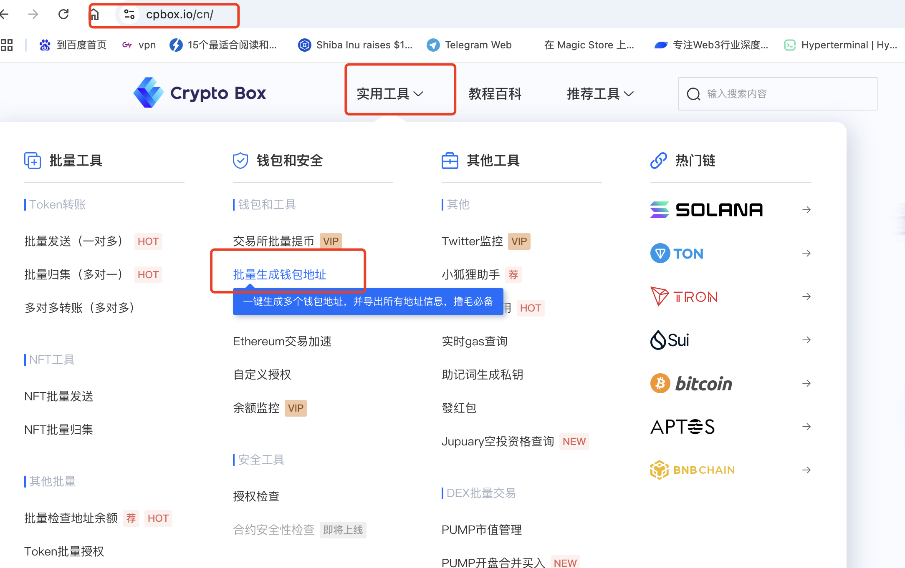
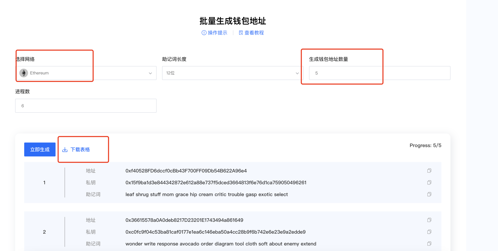
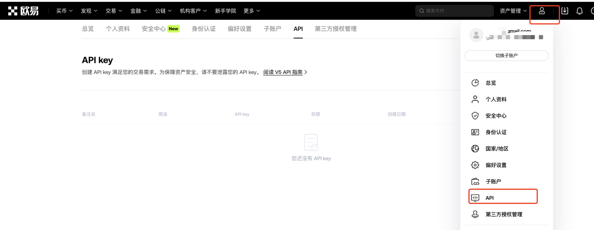
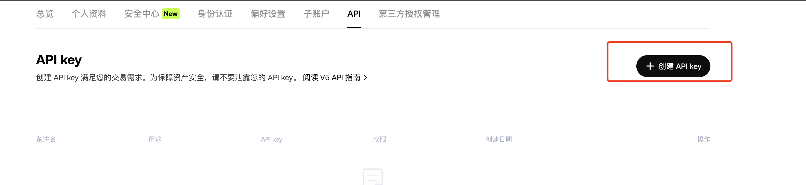
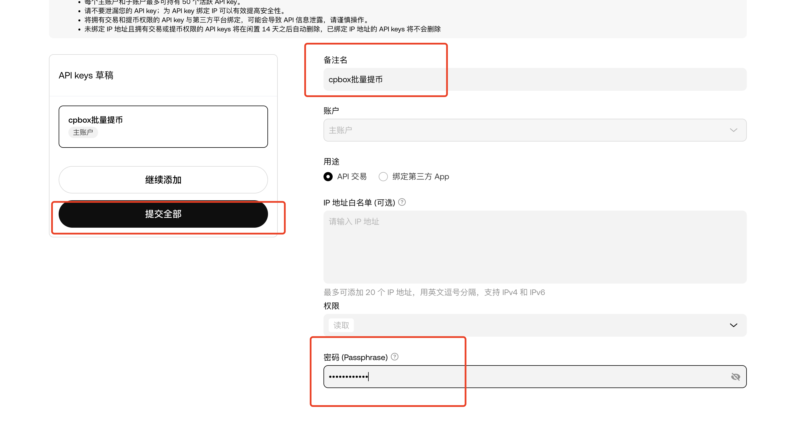
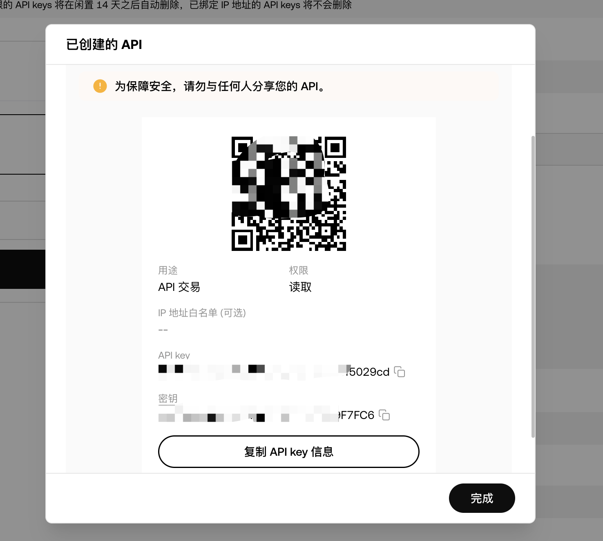
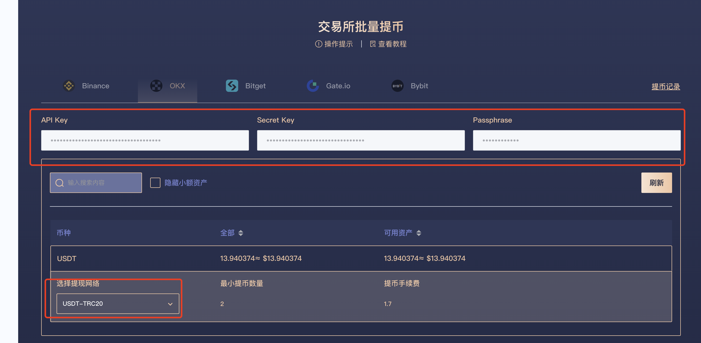
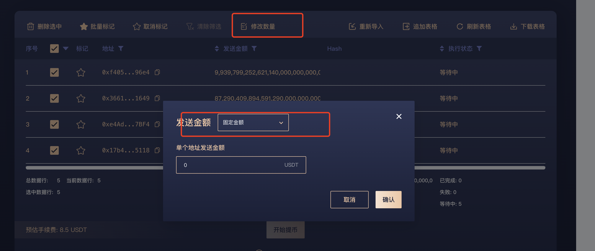
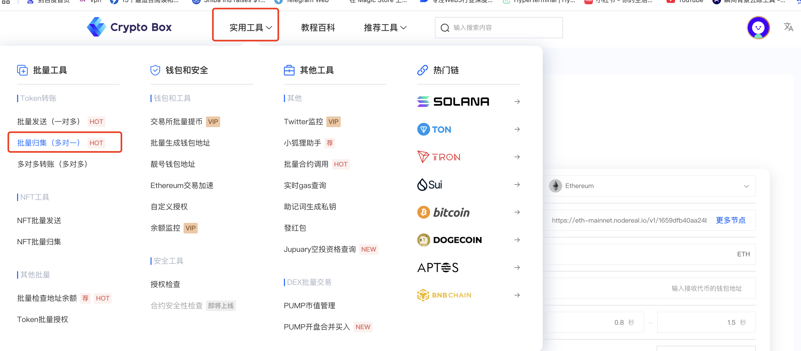
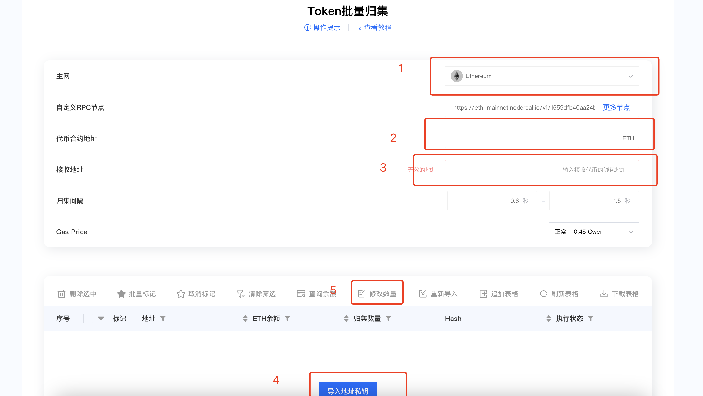

# Essential Batch Tools for Multi-Account Airdrop Farming

In today's crypto landscape where airdrops, mining, and interaction incentives thrive, "farming rewards" has become a key strategy for many users. However, as project teams enhance their risk controls, single-account farming yields limited returns, while manually switching between multiple accounts is time-consuming and risky—potentially leading to account bans.

**How to efficiently manage multiple accounts for batch operations?** This guide introduces essential tools for multi-account farming, covering wallet management, automation scripts, RPC node optimization, and more—helping you boost efficiency while staying compliant. Whether you're an airdrop hunter, DeFi miner, or blockchain gamer, these tools will supercharge your workflow!

## **Batch Wallet Generation**

* Navigate to **"Utility Tools" → "Batch Generate Wallet Addresses"**

<figure><figcaption></figcaption></figure>

* Select the desired blockchain network
* Enter the number of wallets to create
* Click **"Generate"**—the system will produce wallets with **mnemonics and private keys**

⚠ **Important Notes:**

* All wallets are generated **locally on your device**—CPBOX **cannot access** your wallet data.
* For maximum security:
  * **Disconnect from the internet** during generation
  * Use **incognito mode**

<figure><figcaption>
Batch Generate Wallet Addresses
</figcaption></figure>

***

### Exchange Batch Withdrawals - Anti-Sybil Wallet Strategy

#### **Exchange Batch Withdrawals (Anti-Sybil Strategy)**

For non-zero-cost airdrops, you'll need to fund multiple wallets while avoiding detection. **Batch withdrawals from exchanges** help mask your activity since exchanges use whitelisted addresses, making it harder for projects to track you.

**Step-by-Step (OKX Example)**

Go to **Profile → API Management**

<figure><figcaption>
OKX Exchange API
</figcaption></figure>

Click **"Create API Key"**

<figure><figcaption>
OKX API Generation
</figcaption></figure>

Fill in details and confirm

<figure><figcaption>
OKX API
</figcaption></figure>

Copy the generated **API Key & Secret**

<figure><figcaption>
OKX API
</figcaption></figure>

Return to **CPBOX Batch Withdrawal**, input your API credentials

Click asset query, then you can see the asset quantities in the exchange,

Then click on the network you need to withdraw

<figure><figcaption>
CPBOX Exchange Withdrawal
</figcaption></figure>

Select assets and network (e.g., USDT)

Choose **fixed or random amounts** per wallet

<figure><figcaption>
CPBOX Exchange Withdrawal
</figcaption></figure>

Execute withdrawals

**Security Reminders:**

* CPBOX **never stores** API keys/secrets
* **Delete exchange API keys** after use
* Beware of clipboard hijacking (malware can steal copied data)
* Use **incognito mode** when generating APIs

***

#### **Batch Asset Consolidation**

Aggregate scattered tokens across wallets via **"Utility Tools → Batch Consolidation"**:

<figure><figcaption>
CPBOX Batch Consolidation
</figcaption></figure>

* Select blockchain & token contract
* Input **destination wallet address**
* Import private keys of source wallets
* Set transfer amounts (fixed/percentage)

<figure><figcaption>
Token Batch Consolidation
</figcaption></figure>

***

### **Learn More About CPBOX**

Explore features: [https://docs.cpbox.io](https://docs.cpbox.io/)

Suggestions or custom needs?

Contact us: [https://www.cpbox.io/](https://www.cpbox.io/en/?_s=docs)

### **Join Our Community**

**Telegram Group**: [https://t.me/cpboxio](https://t.me/cpboxio)

**Twitter**: [https://twitter.com/Web3CryptoBox](https://twitter.com/Web3CryptoBox) | [https://x.com/cpboxio](https://x.com/cpboxio)

**YouTube**: [https://youtube.com/channel/UCDcg1zMH4CHTfuwUpGSU-wA](https://youtube.com/channel/UCDcg1zMH4CHTfuwUpGSU-wA)
