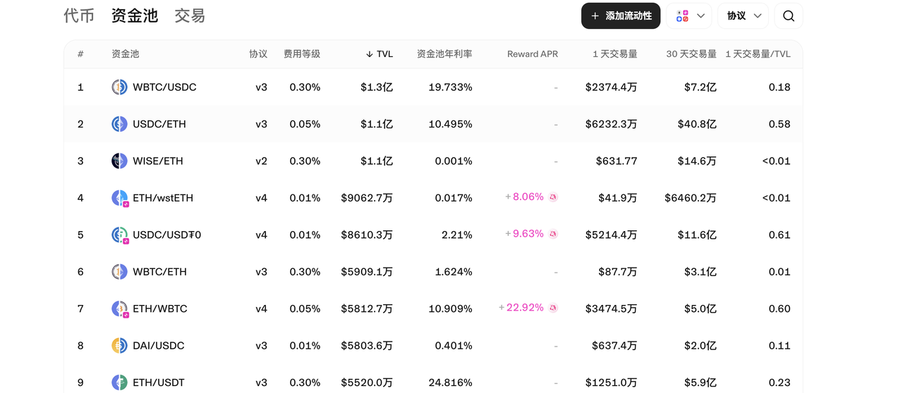

# Understanding Liquidity Pools, AMMs, and Liquidity Mining

Whether you're new to crypto or a seasoned trader, you've probably heard terms like **"adding liquidity"** or **"removing liquidity"** in group chats. But what do they actually mean? Today, we’ll break down **Liquidity Pools (LP)** in a way that even a crypto newbie can understand.

_(I bet a pack of spicy strips you’ll get it by the end!)_

***

###  **What is a Market Maker?**

Market makers (**MMs**) originated in traditional stock and commodity exchanges. Back then, retail traders couldn’t directly buy or sell stocks—they had to rely on market makers who provided **bid/ask prices** to facilitate trades.

Since pricing was done manually, spreads (the difference between buy and sell prices) were huge, and MMs profited from this gap.

With the rise of **computerized trading**, manual market-making faded, but the core concept remains:

✅ **Provide liquidity** (ensure assets can be bought/sold easily)

✅ **Reduce price spreads** (narrow the gap between buy/sell orders)

✅ **Stabilize markets** (especially in low-liquidity or volatile conditions)

***

#### **Example: How Market Makers Work**

Let’s say **gold futures** are trading at **$2,600 per contract**.

* You sell **2 contracts at $2,600**, but instead of a real buyer, a **market maker** takes your order.
* Later, someone buys **2 contracts at 2,600.05∗∗—theMMsellsthemyourcontractsandpocketsthe∗∗2,600.05∗∗—theMMsellsthemyourcontractsandpocketsthe∗∗0.05 spread per unit ($1 total profit)**.

This happens **millions of times per day** across markets.

**Bonus Insight:**

In low-volatility markets, MMs sometimes **manipulate prices slightly** to trigger stop-losses and create liquidity. If you’ve ever been "hunted" by sudden price spikes/drops, that’s likely an MM bot at work.

***

<figure><figcaption></figcaption></figure>

### **What is a Liquidity Pool (LP)?**

In **centralized exchanges (CEX)** like Binance or OKX, market makers ensure smooth trading. But in **decentralized exchanges (DEXs)**, there’s no middleman—so how do trades happen?

#### **CEX vs. DEX Analogy**

* **CEX = Supermarket** → You buy/sell directly with the exchange.
* **DEX = Farmers’ Market** → You trade peer-to-peer, but need a way to match buyers/sellers.

**Solution?** **Automated Market Makers (AMMs)**—a system where **smart contracts replace human market makers**.

#### **How AMMs Work**

Users **deposit crypto into a shared pool (LP)**. Traders then swap tokens directly with the pool, **not other users**.

**Example:**

Imagine a **DEX as a farmers’ market with a shared shelf (LP)**.

* To list your token, you must **lock equal-value assets** (e.g., 100ofyourtoken+100ofyourtoken+100 of USDT).
* This ensures **fair pricing** and prevents scams.

\

***

## **How Token Prices Move in AMMs**

Most AMMs (like Uniswap) use the **x × y = k formula**:

* **x** = Token A supply in the pool
* **y** = Token B supply (e.g., USDT)
* **k** = Constant product (must stay the same)

#### **Price Change Example**

1. You create **Token A** and want it priced at **$1**.
2. You deposit **100 Token A + 100 USDT** into the LP.
   * **Initial price = 1 USDT per Token A**.
3. Someone buys **10 Token A**:
   * Pool now has **90 Token A + 110 USDT**.
   * **New price = 110 / 90 = $1.22** (a 22% increase!).
4. Another **10 Token A** are bought:
   * Pool now has **80 Token A + 122.2 USDT**.
   * **New price = 122.2 / 80 = $1.525**.

This shows how **small trades in low-liquidity pools cause huge price swings**!

\

***

<figure><figcaption></figcaption></figure>

### **Liquidity Mining (Bonus Concept)**

To stabilize prices, **projects incentivize users to add liquidity**:

* You **stake your tokens in the LP**.
* In return, you earn **trading fees or rewards** (hence "mining").

**Why?**

* More liquidity → **smaller price impact per trade**.
* Projects avoid **extreme volatility** from low liquidity.

***

### **Final Thoughts**

Now you understand:

🔹 **Market Makers (MMs)** = Traditional liquidity providers.

🔹 **Liquidity Pools (LPs)** = Smart contract-based AMM systems.

🔹 **Liquidity Mining** = Earning rewards for staking in LPs.

With this knowledge, you’ll **navigate DeFi like a pro**—whether you're trading or launching your own token!

***

### **Learn More About CPBOX**

Explore features: [https://docs.cpbox.io](https://docs.cpbox.io/)

Suggestions or custom needs?&#x20;

Contact us:[https://www.cpbox.io/cn/](https://www.cpbox.io/cn/)

### **Join Our Community**

**Telegram Group**: [https://t.me/cpboxio](https://t.me/cpboxio)

**Twitter**: [https://twitter.com/Web3CryptoBox](https://twitter.com/Web3CryptoBox) | [https://x.com/cpboxio](https://x.com/cpboxio)

**YouTube**: [https://youtube.com/channel/UCDcg1zMH4CHTfuwUpGSU-wA](https://youtube.com/channel/UCDcg1zMH4CHTfuwUpGSU-wA)
