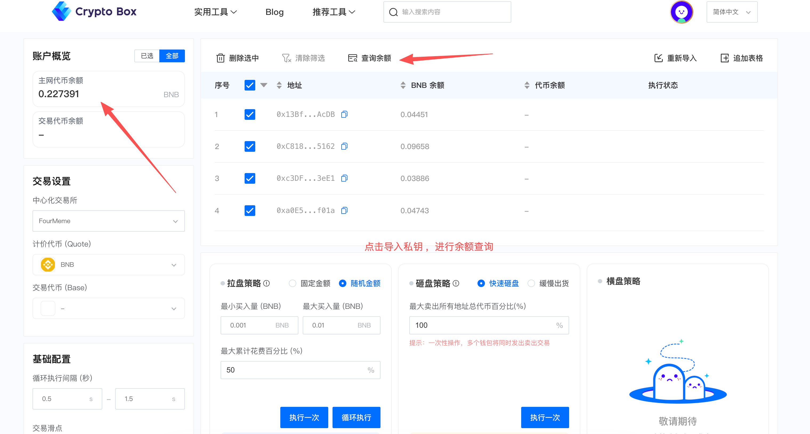
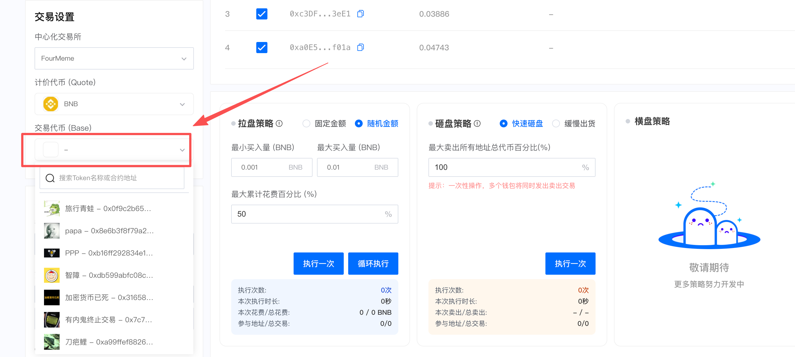
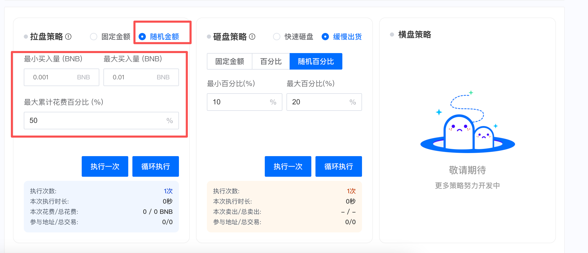
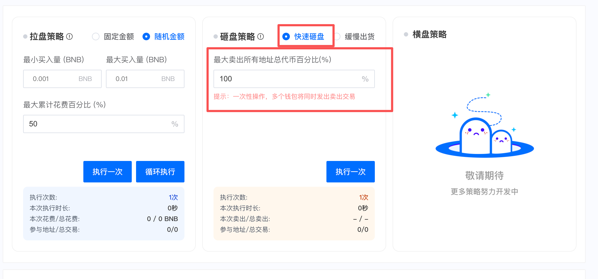
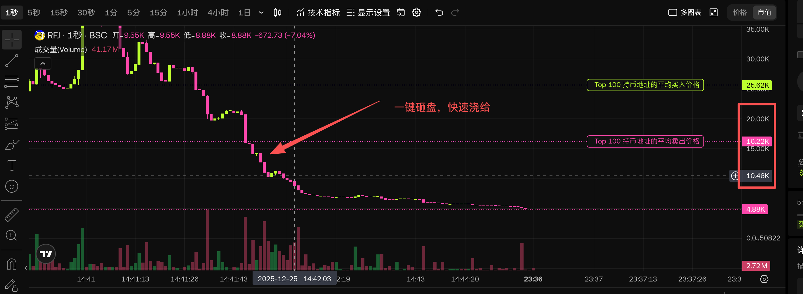
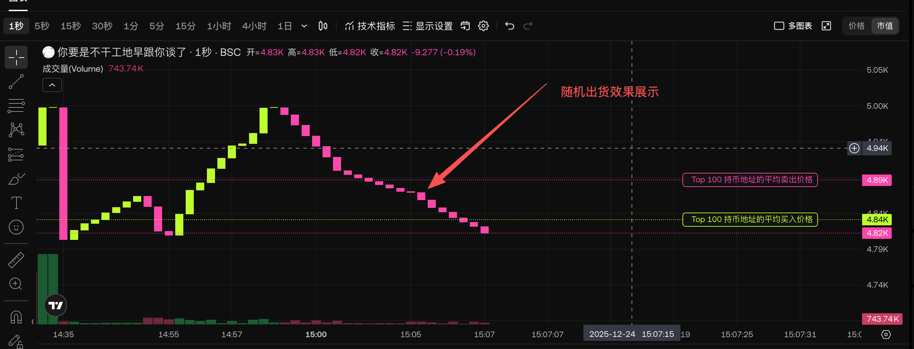
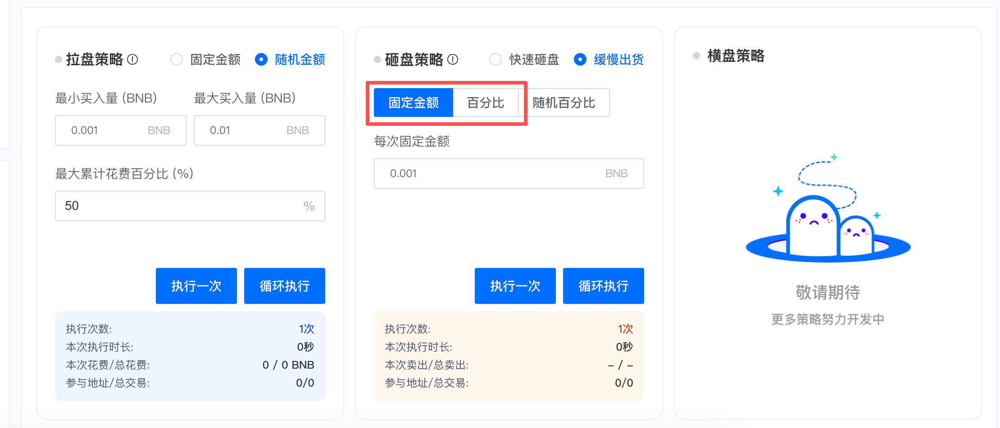

## Foreword

With the popularity of the BSC chain, more and more meme players are heading to Four.meme to launch coins. If you want to create a startup project, you will definitely need some related tools for substantial management. To address this issue, CPBOX has newly launched the Four.meme Market Cap Management Tool.

Considering that market cap manipulation itself involves transaction fee wear (charged by Four.meme), to avoid adding other additional fees, this feature is offered in the form of VIP monthly subscription. If you want to experience this tool, you can contact TG: @Aileen955 to get free usage!

## Import Private Key

<figure><figcaption></figcaption></figure>

Notes:

* For market cap management, all buy and sell operations are executed in wallet order sequentially. Users can sort by BNB balance above.
* Buy logic: Assuming 100 wallets each with 0.1 BNB. If pumping requires 1 BNB, it will buy out one wallet first and then the next, simulating natural growth of holding addresses.
* Sell logic: Assuming 100 wallets each with 0.1 BNB. If dumping sells 1 BNB, it will sell out one wallet first and then the next, simulating natural reduction of holding addresses. One-click dump means multiple wallets shipping simultaneously.

## Select Manipulation Token

Select the token you want to manipulate. Currently only supports FOUR.MEME

<figure><figcaption></figcaption></figure>

## Practical Operations

### Random Pump

Select the token you want. If you want to pump during the current time period, you can choose random amount pump.

<figure><figcaption></figcaption></figure>

* Enter the range for random buy amounts, minimum buy amount and maximum buy amount, e.g., 0.1～1BNB
* Select the maximum cumulative spend amount. If all wallet addresses have 10 BNB in pump chips, after selecting 50%, it will automatically stop the pump strategy when purchases exceed 5 BNB.
* Execute once: Indicates performing the buy strategy only once.
* Loop execute: After clicking, it will keep performing buy operations. Can be stopped manually.

<figure><figcaption></figcaption></figure>

### Fixed Amount Pump

Select the token you want. If you want to pump during the current time period, you can choose fixed amount pump, which can be paired with fixed amount sell for volume brushing.

* Enter the fixed buy amount, after selecting, each buy will be the same amount.
* Select the maximum cumulative spend amount. If all wallet addresses have 10 BNB in pump chips, after selecting 50%, it will automatically stop the pump strategy when purchases exceed 5 BNB.
* Execute once: Indicates performing the buy strategy only once.
* Loop execute: After clicking, it will keep performing buy operations. Can be stopped manually.

<figure><figcaption></figcaption></figure>

## Quick Dump

Select the manipulation token, quickly sell off the chips in hand, multiple addresses shipping simultaneously. Commonly known as "watering".

<figure><figcaption></figcaption></figure>

Operation process:

* Select the percentage of the total tokens in all addresses to sell.
* After clicking execute, wait for successful execution. If the chip amount is large, there will be significant volatility.

<figure><figcaption></figcaption></figcaption></figure>

### Slow Random Distribution

Select your manipulation token. If you want to distribute or wash away others' chips during the current time period, you can choose slow distribution.

Common scenarios:

* During the pump phase, if the market heat is high, choose to slowly sell off chips and exit.
* During the chip collection phase, if there are too many retail holders, pumping might be harvested by others, you can choose to distribute and wash chips, washing away the retails.

<figure><figcaption></figcaption></figure>

Operation process:

* Enter the range for random sell amounts, minimum sell percentage and maximum sell percentage, e.g., 1%～5%
* Execute once: Indicates performing the random distribution operation only once.
* Loop execute: After clicking, it will keep performing buy operations. Can be stopped manually.

<figure><figcaption></figcaption></figure>

### Fixed Amount Distribution

Select your manipulation token. If you want to distribute or brush trading volume during the current time period.

Common scenarios:

* During the pump phase, if the market heat is high, choose to slowly sell off chips and exit.
* Pair with fixed amount pump for volume brushing behavior.

<figure><figcaption></figcaption></figure>

### Customized Services

We deeply understand that each user's needs are different. If you need more personalized BSC market cap manipulation strategies, we sincerely welcome you to contact our professional team. We will wholeheartedly provide you with one-on-one consultation services, tailoring the best solutions according to your specific business scenarios. Your satisfaction is our unremitting pursuit, looking forward to creating greater value for you.

***

### Contact Us

If you want to learn more about other uses and functions of CPBOX products

You can click [ https://docs.cpbox.io/](https://docs.cpbox.io/) to view

Or if you have some good suggestions or want to help with development needs

You can find us through the contact information at the bottom of the homepage [ https://www.cpbox.io/cn/ ](https://www.cpbox.io/cn/)

You can also contact us through the social media below

***

### Other Social Media

TG Group: <https://t.me/cpboxio>

Twitter: <https://twitter.com/Web3CryptoBox> | <https://x.com/cpboxio>

Youtube: <https://youtube.com/channel/UCDcg1zMH4CHTfuwUpGSU-wA>
