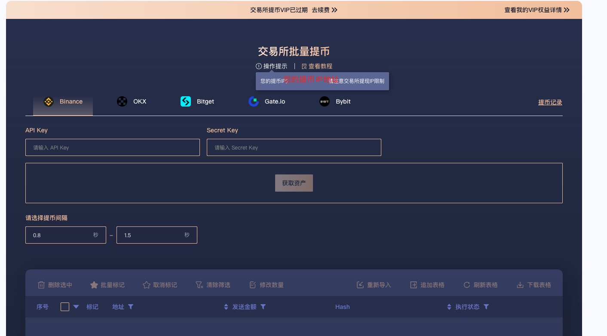

# Bulk Exchange Withdrawals

### Functional Overview

In the cryptocurrency ecosystem, exchange wallet addresses are often whitelisted by project teams, making bulk withdrawals from exchanges to multiple wallets a critical step in airdrop strategies. Traditional withdrawal processes require repeated verification code inputs, which are time-consuming and tedious. CPBOX's \[Batch Exchange Withdrawals] feature is specifically designed to solve this problem, currently supporting five major exchanges: Binance, OKEx, Bitget, Gate.io, and Bybit, enabling you to efficiently withdraw funds to on-chain addresses in bulk. If you need support for other exchanges, please contact our customer service for customization.

### Supported Exchanges

CPBOX currently supports batch withdrawals for the following five exchanges:

1. [**Binance（币安）**](https://binance.com/)
2. [**OKEx**](https://okx.com/)
3. [**Bitget**](https://www.bitget.com/)
4. [**Gate.io**](https://www.gate.io/)
5. [**Bybit**](https://www.bybit.com/)

### General Workflow

Regardless of which exchange you use, the batch withdrawal process consists of two main parts:

1. Creating an API key with withdrawal permissions on the respective exchange
2. Configuring batch withdrawal parameters and executing operations on the CPBOX platform

### Example: OKEx

#### **Part 1: Creating an API Key**

1. Log in to the OKEx website
2. Navigate to "My Account" > "API Management"
3. Click "Create API"
4. Set an API name and permissions (ensure withdrawal permissions are enabled)
5. Add IP whitelist (obtained from CPBOX)
6. Complete verification and save the API Key and Secret Key

<figure><figcaption>
你的IP
</figcaption></figure>

#### **Part 2: CPBOX Batch Withdrawal Setup**

1. Log in to CPBOX and select "[Batch Exchange Withdrawals](https://www.cpbox.io/en/exchange/withdraw?_s=docs)"
2. Choose "OKEx" as the exchange
3. Enter API key information
4. Fetch and select the asset and network
5. Import recipient addresses
6. Set withdrawal parameters
7. Confirm and submit

### Batch Withdrawal Tips

* **API Key Security**: Create dedicated API keys with only necessary withdrawal permissions, and delete them after use
* **Batch Processing**: For large withdrawals, split into smaller batches to mitigate risks
* **Address Verification**: Double-check address formats before submitting withdrawals
* **Network Selection**: Ensure the correct blockchain network is selected to avoid asset loss
* **Time Intervals**: Set reasonable intervals based on exchange limits
* **Withdrawal Limits**: Be aware of daily withdrawal limits and plan accordingly

With CPBOX's batch withdrawal feature, you can focus on crypto asset strategy rather than tedious withdrawal processes.

### Key Advantages

CPBOX's Batch Exchange Withdrawals feature provides significant convenience for multi-wallet management, offering:

* **Multi-Exchange Support**: Covers five major exchanges to meet diverse needs
* **Efficiency**: Saves substantial time compared to manual withdrawals
* **Flexible Configuration**: Customize withdrawal amounts, intervals, and other parameters
* **Bulk Management**: Supports batch address imports for large-scale operations
* **User-Friendly**: Intuitive interface with clear workflows

***

### **Contact Us**

Contact Us

If you want to learn more about other uses and features of CPBOX products

You can visit [https://docs.cpbox.io/](https://docs.cpbox.io/?_s=docs) to learn more

Or if you have good suggestions or development needs

You can find us through the contact information at the bottom of the homepage [https://www.cpbox.io/](https://www.cpbox.io/en/?_s=docs)

You can also contact us through the social media below

***

### Other Social Media

TG Group: [https://t.me/cpboxio](https://t.me/cpboxio)

Twitter: [https://twitter.com/Web3CryptoBox](https://twitter.com/Web3CryptoBox) | [https://x.com/cpboxio](https://x.com/cpboxio)

Youtube: [https://youtube.com/channel/UCDcg1zMH4CHTfuwUpGSU-wA](https://youtube.com/channel/UCDcg1zMH4CHTfuwUpGSU-wA)
