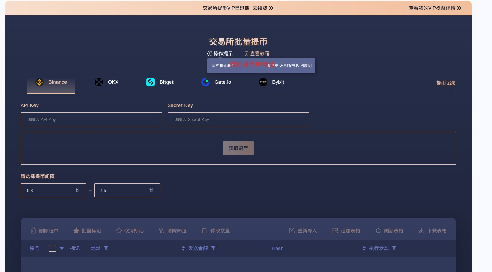
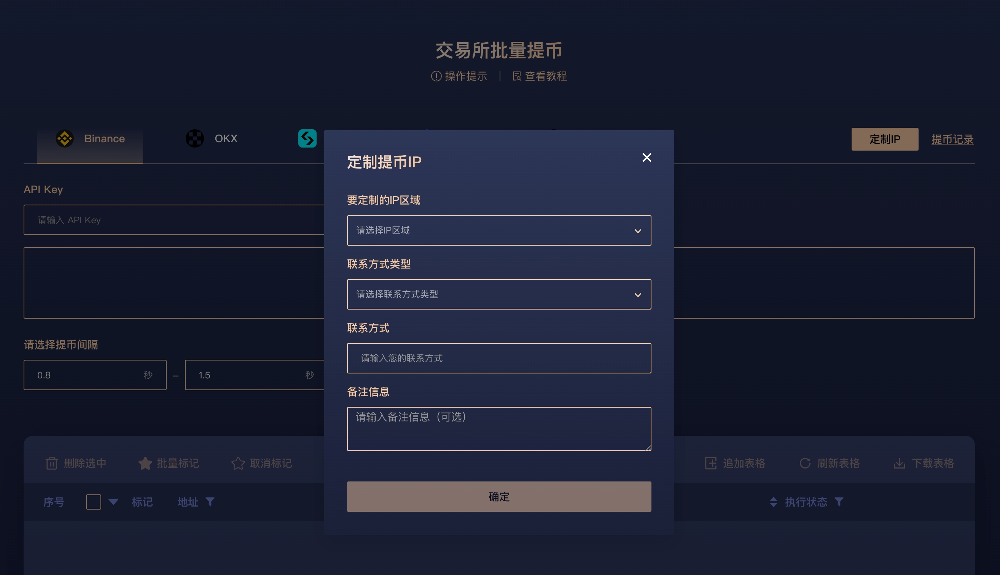

***

## description: Securely and conveniently withdraw your digital assets to any blockchain wallet address

# Exchange Batch Withdrawal

### Feature Overview

In the cryptocurrency ecosystem, exchange wallet addresses are often whitelisted by project parties, making batch withdrawal from exchanges to multiple wallets a key part of airdrop strategies. The traditional withdrawal process requires repeatedly entering verification codes, which is time-consuming and cumbersome. CPBOX's [Exchange Batch Withdrawal](https://www.cpbox.io/cn/exchange/withdraw?_s=docs) feature is designed to solve this problem, currently supporting five major exchanges: Binance, OKEx, Bitget, Gate.io, and Bybit, allowing you to efficiently batch withdraw to on-chain addresses. If you have needs for other exchanges, you can also contact customer service for customization.

### Supported Exchanges

CPBOX currently supports batch withdrawal for the following five major exchanges:

1. **[Binance](https://binance.com/)**
2. **[OKEx](https://okx.com/)**
3. **[Bitget](https://www.bitget.com/)**
4. **[Gate.io](https://www.gate.io/)**
5. **[Bybit](https://www.bybit.com/)**

### General Operation Process

Regardless of which exchange you use, the basic process for batch withdrawal includes two main parts:

1. Create an API key in the respective exchange and set withdrawal permissions
2. Configure batch withdrawal parameters on the CPBOX platform and execute the operation

### Example with OKEx

#### Part One: Creating an API Key

1. Log in to the OKEx official website
2. Go to "My Account" > "API Management"
3. Click "Create New API"
4. Set the API name and permissions (ensure withdrawal permissions are included)
5. Add IP whitelist (obtain from CPBOX)

<figure><figcaption>
Your IP
</figcaption></figure>

1. Complete verification and save the API Key and Secret Key

#### Part Two: CPBOX Batch Withdrawal Settings

1. Log in to CPBOX, select "[Exchange Batch Withdrawal](https://www.cpbox.io/cn/exchange/withdraw?_s=docs)"
2. Select "OKEx" exchange
3. Enter API key information
4. Obtain and select assets and networks
5. Import receiving addresses
6. Set withdrawal parameters
7. Confirm and submit

### General Tips for Batch Withdrawal

1. **API Key Security**: Create a dedicated API with only necessary withdrawal permissions, delete it promptly after use
2. **Batch Operations**: For large withdrawals, it is recommended to proceed in batches to reduce risk
3. **Address Verification**: Carefully check the address format before withdrawal
4. **Network Selection**: Ensure the correct blockchain network is selected to avoid asset loss
5. **Time Intervals**: Set withdrawal intervals reasonably according to exchange restrictions
6. **Withdrawal Limits**: Understand each exchange's daily withdrawal limits and plan accordingly

## Custom IP Feature

Major exchanges, to ensure account and fund security, usually set an **IP Whitelist** for **API Withdrawal**: Only requests from specified IPs are accepted.

CPBOX's Exchange Batch Withdrawal accesses exchanges through custom IPs, and you will see the **Current Withdrawal Exit IP** on the page (used to configure the whitelist in the exchange backend). By default, the exit IP is bound to the **Data Center**; different users have different needs for **Compliance, Latency, Exchange Policies**, and a single region may not satisfy everyone, hence the need for custom IPs.

| Scenario | Description |
| :------- | :---------- |
| Exchange Policies and Regional Restrictions | Some exchanges have different API or withdrawal policies for specific regions, requiring the exit IP to fall within acceptable areas. |
| Compliance and Risk Control Requirements | Teams or institutions have clear requirements for data egress and access sources, needing consistency with business locations or agreed regions. |
| Network and Stability | Desire for the exit to be closer to the target exchange or common routes to reduce anomalies or latency (subject to actual support). |
| Multi-Account / Multi-Strategy Isolation | Different sub-businesses want to use different IP exits for easier IP management in exchanges. |

* The custom entry **is only displayed for users with Exchange Batch Withdrawal VIP permissions** (account needs to activate corresponding VIP capabilities).
* For non-VIP users, the "Custom IP" button **is not displayed** in the interface; if needed, please learn about VIP activation methods first.

<figure><figcaption>
Batch Withdrawal
</figcaption></figure>

### How to Use Custom IP

1. **Enter** the in-site **Exchange Batch Withdrawal** page.
2. In the exchange selection area **top right** (on mobile, it may be below the title line), click the **"Custom IP"** button to open the **"Custom Withdrawal IP"** popup.
3. Fill in and submit according to the form:
4. After clicking the "Submit" button, the system will instantly rely on intelligent algorithms and efficient underlying systems for dynamic IP address allocation. Most custom needs will be automatically completed by the system for IP configuration and adaptation, without manual intervention, efficient and worry-free;
5. If your needs involve special complex scenarios (such as high-security dedicated IP pools, fine-grained deployments across multiple regions, etc.), our dedicated technical consultants will proactively contact you through your provided contact information to confirm details and provide customized configuration support;

<figure><figcaption>
Custom IP
</figcaption></figure>

### Advantages Summary

CPBOX's Exchange Batch Withdrawal feature provides great convenience for multi-wallet users, with main advantages including:

1. **Multi-Exchange Support**: Covers five major exchanges to meet different user needs
2. **Efficient and Convenient**: Greatly saves time and effort compared to traditional withdrawal methods
3. **Flexible Configuration**: Customizable withdrawal amounts, time intervals, etc.
4. **Batch Management**: Supports batch import of addresses, suitable for large-scale withdrawal needs
5. **User-Friendly**: Simple and clear interface, easy-to-understand process

Through CPBOX's batch withdrawal feature, you can focus more on cryptocurrency strategy deployment without wasting time on cumbersome withdrawal operations.

***

### Contact Us

If you want to learn more about other uses and features of CPBOX products

You can click [https://docs.cpbox.io/](https://docs.cpbox.io/?_s=docs) to view

Or if you have good suggestions or want to help with development needs

You can find us through the contact information at the bottom of the homepage [https://www.cpbox.io/](https://www.cpbox.io/cn/?_s=docs)

You can also contact us through the social media below

***

### Other Social Media

TG Group: <https://t.me/cpboxio>

Twitter: <https://twitter.com/Web3CryptoBox> | <https://x.com/cpboxio>

Youtube: <https://youtube.com/channel/UCDcg1zMH4CHTfuwUpGSU-wA>
