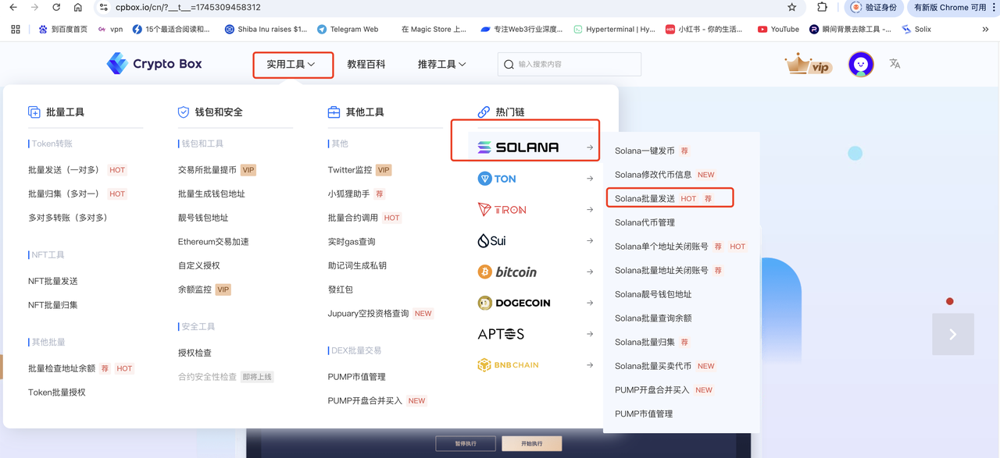
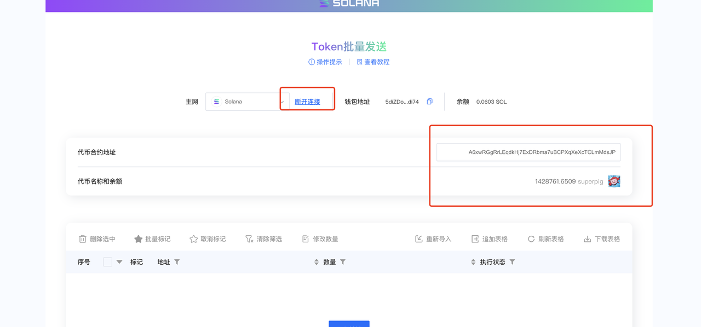
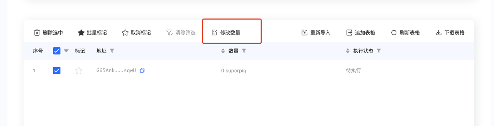
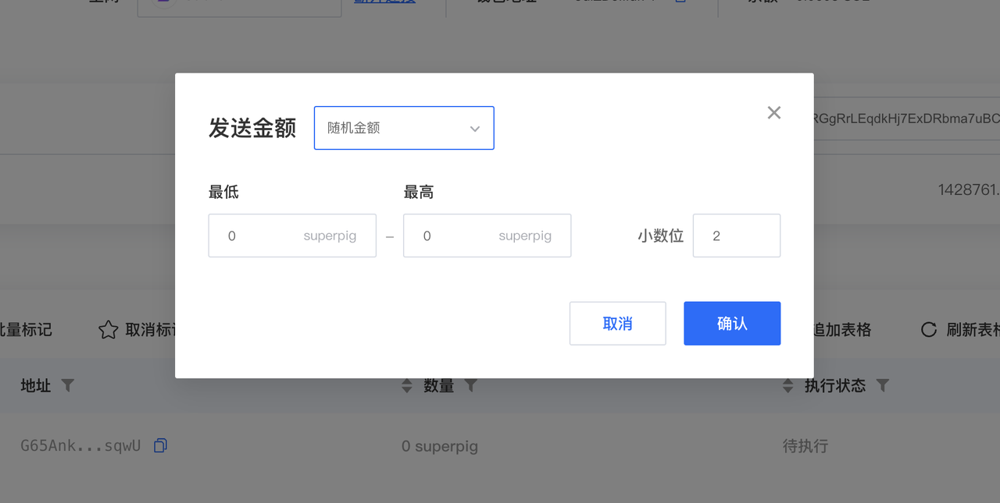
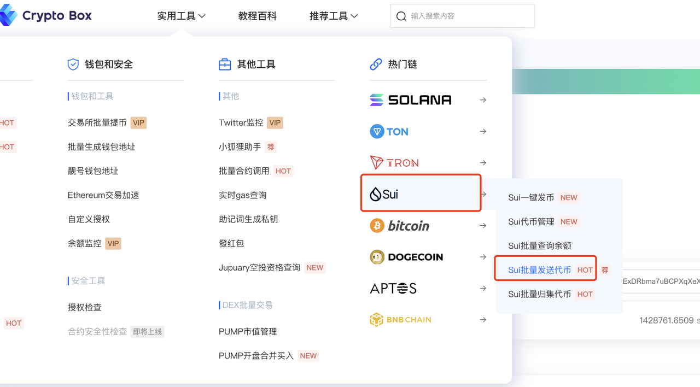
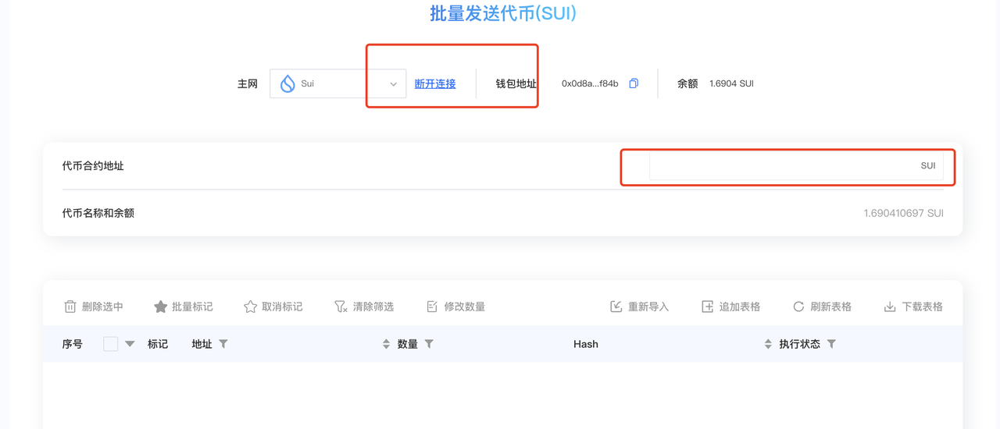
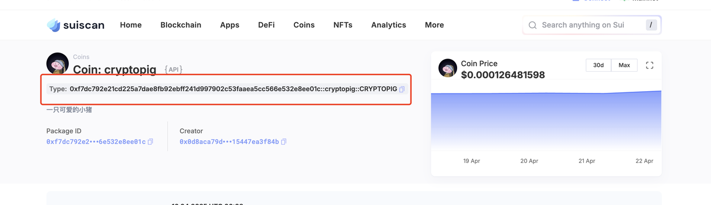

# Meme Community Airdrop Success Story

### Preface

In the world of cryptocurrency and blockchain, MEME culture is not only a form of entertainment but also a powerful force for community cohesion. An active MEME community often relies on carefully planned operational activities, and **airdrop benefits** are one of the effective means to incentivize user participation and expand influence. However, as community size grows, how to efficiently and accurately distribute tokens or NFTs to a large number of users becomes a challenge for many project teams and community operators.

This article will deeply explore **how MEME communities can enhance user engagement through airdrop activities** and focus on the application of **batch sending tools** to help operators save time, reduce operational costs, and avoid the tedium and errors of manual processing. Whether for startup projects or mature communities, the proper use of automation tools can make airdrop benefit distribution more efficient, thereby improving community activity and promoting long-term ecosystem development.

This article will demonstrate how to perform batch sending airdrops of meme tokens during the early stages of a project through Solana and Sui chains.

***

### Solana Chain

Visit the CPBOX official website [https://www.cpbox.io](https://www.cpbox.io), click on the Solana chain's batch sending feature under utility tools to enter the page.

<figure><figcaption>
CPBOX Menu
</figcaption></figure>

After entering the page, click connect wallet (this wallet should contain the tokens you want to send)

Enter the meme token contract address below, and the token quantity in your wallet will be automatically displayed.

<figure><figcaption>
Wallet Balance
</figcaption></figure>

Then import the collected token addresses that need to receive airdrops below.

After importing, click the modify quantity button. Here we only imported one wallet address, but if there are many addresses, you can upload a file to import them.

<figure><figcaption>
Wallet Import
</figcaption></figure>

Here you can choose to send random amounts or fixed amounts. Just enter the range of random amounts you want to send.

<figure><figcaption></figcaption></figure>

***

### Sui Chain

Actually, airdrop sending on Sui chain is not much different from Sol chain sending.

Select batch send tokens in the Sui chain to enter the page.

<figure><figcaption></figcaption></figure>

After entering the page, it's the same as before - connect your wallet and then enter the token contract address.

<figure><figcaption>
Batch Send SUI
</figcaption></figure>

**Please note** that for Sui chain, you need to enter the type address of the contract.

If you don't know how to find it, you can go to **Suiscan**, enter the corresponding token address, and you can view this type.

<figure><figcaption>
View SUI Token Type
</figcaption></figure>

The rest of the airdrop sending process is the same as the Sol chain above.

Click import addresses, then select modify quantity, choose random sending or fixed quantity sending.

***

### Contact Us

If you want to learn more about other uses and features of CPBOX

You can visit [https://docs.cpbox.io/](https://docs.cpbox.io/en/?_s=docs)

Or if you have some good suggestions or development needs for assistance

You can find us through the contact information at the bottom of the homepage [https://www.cpbox.io/](https://www.cpbox.io/en/?_s=docs)

***

【Other Social Media】

TG Community: [https://t.me/cpboxio](https://t.me/cpboxio)

Twitter: [https://twitter.com/Web3CryptoBox](https://twitter.com/Web3CryptoBox)

Youtube: [https://youtube.com/channel/UCDcg1zMH4CHTfuwUpGSU-wA](https://youtube.com/channel/UCDcg1zMH4CHTfuwUpGSU-wA)
