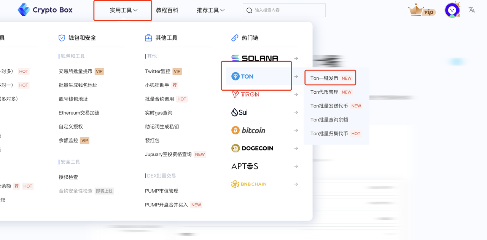

# Pump Launch Bundle Trading



### **Preface**

Pump.fun, a popular memecoin launch platform on Solana and Ethereum, has attracted numerous projects due to its low barriers and liquidity mechanisms. However, it has also become a "hunting ground" for snipers. This article provides an in-depth analysis of strategies to counter snipe attacks when launching tokens on Pump.fun, helping project owners and investors protect their interests.

**What is Sniping?**\
Sniping refers to the practice where newly launched tokens are rapidly bought in large quantities by certain investors (often bots or professional traders) upon listing, leveraging technical or informational advantages. This causes a sharp price surge in a short time, followed by potential high-price sell-offs for profit. Also known as "launch sniping," this behavior is prevalent on Pump.fun due to the platform's lack of restrictions, making nearly every new token vulnerable

### **Pump Launch Bundled Buy – Target Audience**

Due to Pump.fun's mechanics, an increasing number of "scientists" (advanced users) exploit automated bots (such as MEV bots) and high-Gas strategies to front-run purchases. To address this issue, we developed the **Pump Launch Bundled Buy** feature for the following users:

* **Project owners & participants** on Solana who want to secure a certain amount of tokens before launch.
* **Pump.fun traders** who wish to avoid being sniped by others.

***

### **Feature Demo**

Here, we demonstrate **CryptoBox’s Pump Launch Bundled Buy** feature.

Visit [**https://www.cpbox.io/cn/**](https://www.cpbox.io/cn/), go to **Utility Tools**, and select **Pump Launch Bundled Buy**.

<figure><figcaption></figcaption></figure>

*   _Note: Using CPBox for bundled buys incurs fees._

    * **Token Creation:** 0.05 SOL
    * **Vanity Address (Custom Name):** 0.1 SOL
    * **Bundled Buy Addresses:** 0.01 SOL per address

&#x20;If using **3 addresses** for bundled buying, the total cost would be **0.05 + (3 × 0.01) = 0.08 SOL**.

<figure><figcaption></figcaption></figure>

After entering the page, fill in the basic token details, then scroll down.

**Key Notes:**

* **Max 17 addresses** can be bundled per buy.
* **Jito Fee Explanation:**
  * Jito bundles transactions into an atomic **Bundle**, meaning all transactions either succeed or fail together, preventing front-running.
  * **Higher Jito fees increase success rates.**
  * If the bundled buy involves many addresses or large amounts, **adjusting the Jito fee higher is recommended** in case of launch failures.

<figure><figcaption></figcaption></figure>

**Import Private Key Addresses**

* The system displays each address’s SOL balance.
* Ensure each wallet has **> (Buy Amount + 0.01 SOL)** for fees.
* After confirming, click **"Modify Quantity."**

<figure><figcaption></figcaption></figure>

**Set Buy Amount**

* Choose between **fixed or random amounts**.
* For this demo, we select **fixed (0.01 SOL per address).**

<figure><figcaption></figcaption></figure>

**Final Confirmation & Signing**

* A pop-up shows the fee breakdown.
* Confirm and sign the transaction.

<figure><figcaption></figcaption></figure>

**Token Creation Success**

* After launch, you’ll receive the **token contract address**.
* Enter it on Pump.fun to view your token’s page.

<figure><figcaption></figcaption></figure>

### **Post-Launch Observations**

Upon checking Pump.fun, you’ll notice the token price **immediately spikes**—this is a snipe attack.

* **In this demo, we only spent 0.02 SOL across two addresses**, leaving the majority of liquidity untouched.
* Pump.fun’s **initial liquidity pool is 85 SOL**.
  * If **half the liquidity (42.5+ SOL) is bought at launch**, sniping becomes irrelevant—any bot buys would **help pump the price**, allowing you to sell and profit.
  * In our case, we only bought **0.03% of the pool (two small wallets)**, visible in the transaction history.

<figure><figcaption></figcaption></figure>

***

### **FAQ**

#### **1. Does Pump.fun require manual liquidity pooling?**

* **No.** Purchases automatically form a **bonding curve liquidity pool**; no manual LP addition is needed.

#### **2. What are the requirements for listing on Raydium?**

* When the **Pump.fun bonding curve pool reaches 85 SOL**, Pump.fun automatically creates a **Raydium AMM liquidity pool** and burns the LP tokens.

#### **3. What is Pump.fun’s default token launch price?**

* The **initial price is 0.000000028 SOL per token.**

***

### **Learn More About CPBOX** 

Explore features: [https://docs.cpbox.io](https://docs.cpbox.io/)

Suggestions or custom needs?

Contact us:[https://www.cpbox.io/cn/](https://www.cpbox.io/cn/)

***

### **Join Our Community** 

**Telegram Group**: [https://t.me/cpboxio](https://t.me/cpboxio)

**Twitter**: [https://twitter.com/Web3CryptoBox](https://twitter.com/Web3CryptoBox) | [https://x.com/cpboxio](https://x.com/cpboxio)

**YouTube**: [https://youtube.com/channel/UCDcg1zMH4CHTfuwUpGSU-wA](https://youtube.com/channel/UCDcg1zMH4CHTfuwUpGSU-wA)
