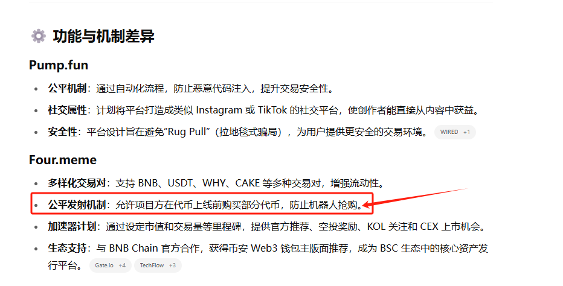
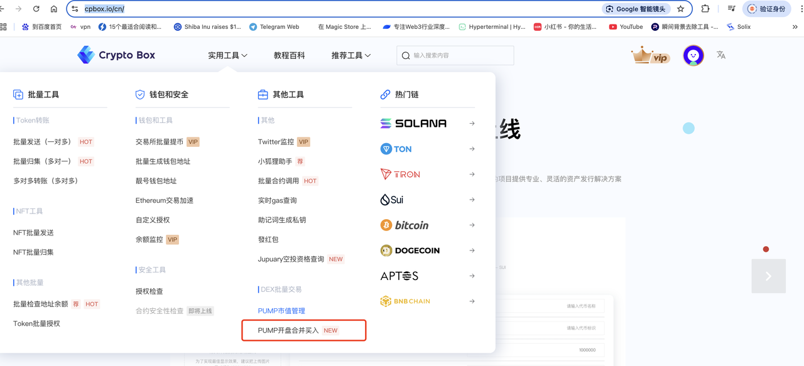
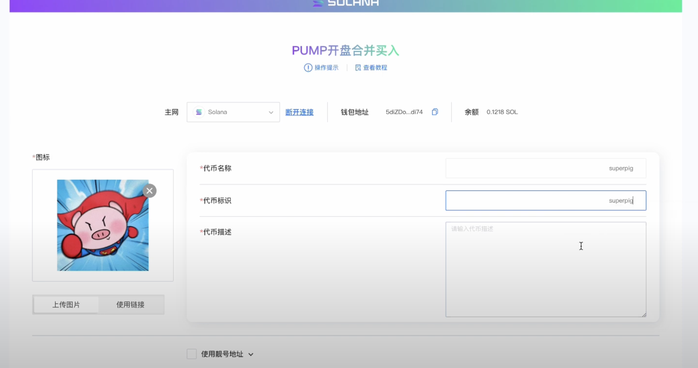
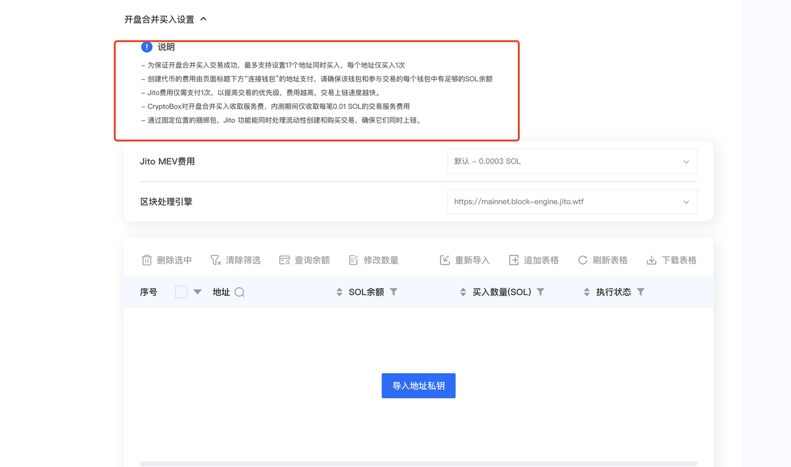
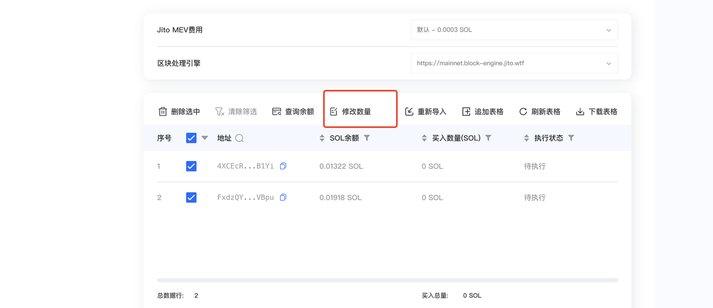
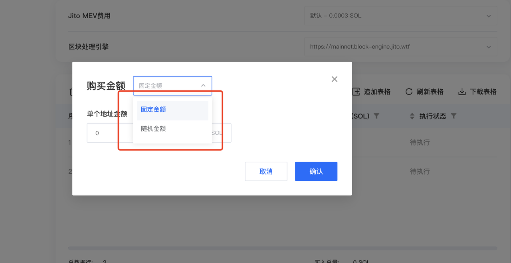
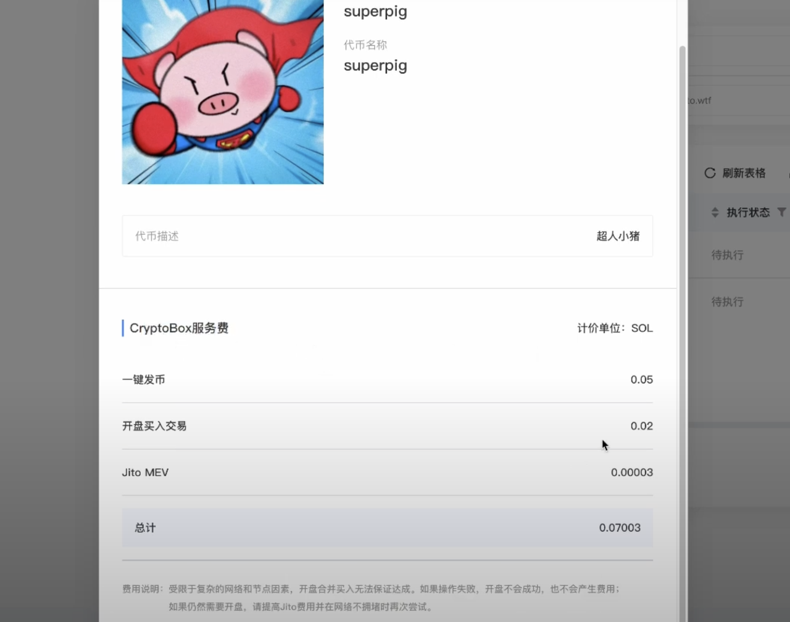
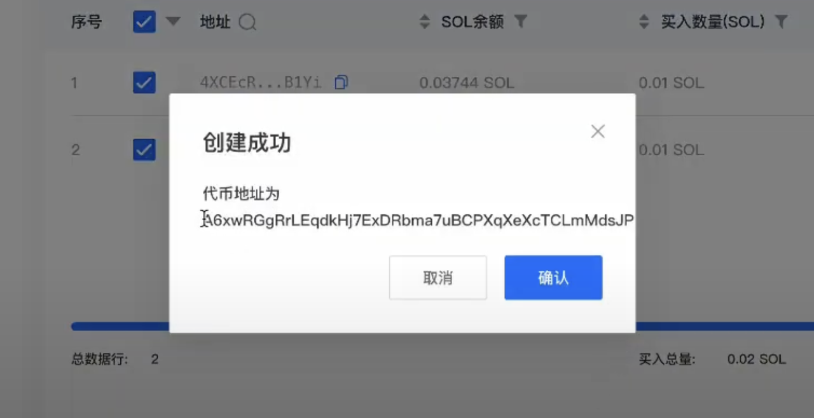
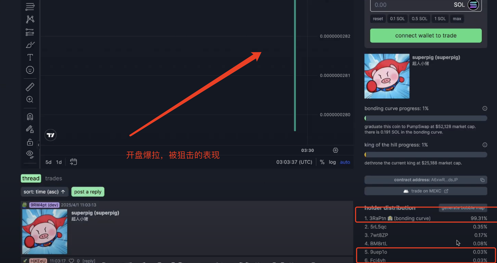

# Pump Launch Bundle Trading



### **Introduction**

Pump.fun, a popular memecoin launch platform on both Solana and Ethereum, has attracted numerous projects due to its low barriers to entry and robust liquidity mechanisms. However, the platform has also become a prime target for snipers. This guide provides an in-depth analysis of effective strategies to counter snipe attacks when launching tokens on Pump.fun, helping project owners and investors protect their interests.

**What is Sniping?**
Sniping refers to the practice where automated bots or professional traders rapidly purchase newly launched tokens in large quantities immediately upon listing, leveraging technical or informational advantages. This causes sharp price surges in a short timeframe, followed by high-price sell-offs for profit. Also known as "launch sniping," this behavior is particularly prevalent on Pump.fun due to the platform's permissionless nature, making virtually every new token vulnerable to such attacks.

<figure><figcaption></figcaption></figure>

### **Pump Launch Bundled Buy – Target Audience**

Due to Pump.fun's mechanics, an increasing number of "scientists" (sophisticated users) exploit automated bots (such as MEV bots) and high-gas strategies to front-run token purchases. To address this challenge, we developed the **Pump Launch Bundled Buy** feature specifically for:

* **Project owners & participants** on Solana who want to secure token allocations before public launch
* **Pump.fun traders** who wish to protect themselves from being sniped by other participants

***

### **Feature Demo**

Below is a demonstration of **CryptoBox's Pump Launch Bundled Buy** feature.

Visit [**https://www.cpbox.io/**](https://www.cpbox.io/en/?_s=docs), navigate to **Utility Tools**, and select **Pump Launch Bundled Buy**.

<figure><figcaption></figcaption></figure>

*   _Note: Using CPBox for bundled purchases incurs the following fees:_

    * **Token Creation:** 0.05 SOL
    * **Vanity Address (Custom Name):** 0.1 SOL
    * **Bundled Buy Addresses:** 0.01 SOL per address

If using **3 addresses** for bundled buying, the total cost would be **0.05 + (3 × 0.01) = 0.08 SOL**.

<figure><figcaption></figcaption></figure>

After accessing the page, fill in the basic token information, then scroll down to continue.

**Important Notes:**

* **Maximum 17 addresses** can be bundled per transaction
* **Jito Fee Explanation:**
  * Jito bundles transactions into an atomic **Bundle**, ensuring all transactions either succeed or fail together, preventing front-running attacks
  * **Higher Jito fees significantly increase success rates**
  * When bundled purchases involve many addresses or large amounts, **we recommend increasing the Jito fee** to prevent launch failures

<figure><figcaption></figcaption></figure>

**Import Private Key Addresses**

* The system displays each address's current SOL balance
* Ensure each wallet contains **more than (Buy Amount + 0.01 SOL)** to cover transaction fees
* After verification, click **"Modify Quantity"**

<figure><figcaption></figcaption></figure>

**Set Purchase Amount**

* Choose between **fixed or randomized amounts**
* For this demonstration, we'll select **fixed amount (0.01 SOL per address)**

<figure><figcaption></figcaption></figure>

**Final Confirmation & Transaction Signing**

* A popup displays the complete fee breakdown
* Review and confirm, then sign the transaction

<figure><figcaption></figcaption></figure>

**Successful Token Creation**

* Upon successful launch, you'll receive the **token contract address**
* Enter this address on Pump.fun to view your token's dedicated page

<figure><figcaption></figcaption></figure>

### **Post-Launch Analysis**

Upon checking Pump.fun, you'll observe that the token price **immediately spikes**—this demonstrates a snipe attack in action.

* **In this demonstration, we invested only 0.02 SOL across two addresses**, leaving the majority of available liquidity untouched
* Pump.fun's **initial liquidity pool contains 85 SOL**
  * If **approximately half the liquidity (42.5+ SOL) is purchased at launch**, sniping becomes counterproductive—any bot purchases would **help drive the price higher**, allowing you to sell at a profit
  * In our example, we purchased only **0.03% of the total pool (through two small wallets)**, which is visible in the transaction history

<figure><figcaption></figcaption></figure>

***

### **Frequently Asked Questions**

#### **1. Does Pump.fun require manual liquidity pool creation?**

* **No.** All purchases automatically contribute to a **bonding curve liquidity pool**; no manual LP token creation is required.

#### **2. What are the requirements for Raydium listing?**

* When the **Pump.fun bonding curve pool reaches 85 SOL in volume**, Pump.fun automatically creates a **Raydium AMM liquidity pool** and permanently burns the LP tokens.

#### **3. What is Pump.fun's default token launch price?**

* The **initial price is set at 0.000000028 SOL per token.**

***

### **Learn More About CPBOX** 

Explore our complete feature set: [https://docs.cpbox.io](https://docs.cpbox.io/?_s=docs)

Have suggestions or custom requirements?

Contact us: [https://www.cpbox.io/](https://www.cpbox.io/en/?_s=docs)

***

### **Join Our Community** 

**Telegram Group**: [https://t.me/cpboxio](https://t.me/cpboxio)

**Twitter**: [https://twitter.com/Web3CryptoBox](https://twitter.com/Web3CryptoBox) | [https://x.com/cpboxio](https://x.com/cpboxio)

**YouTube**: [https://youtube.com/channel/UCDcg1zMH4CHTfuwUpGSU-wA](https://youtube.com/channel/UCDcg1zMH4CHTfuwUpGSU-wA)
