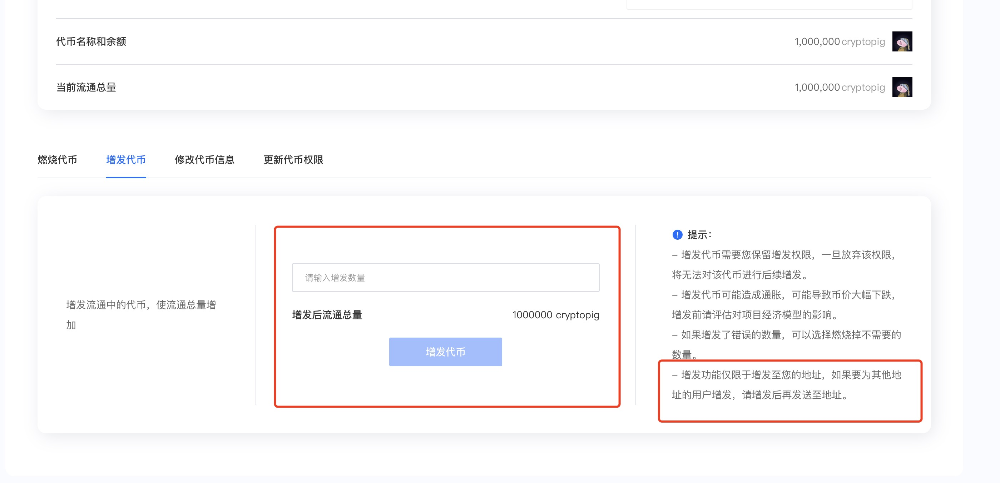
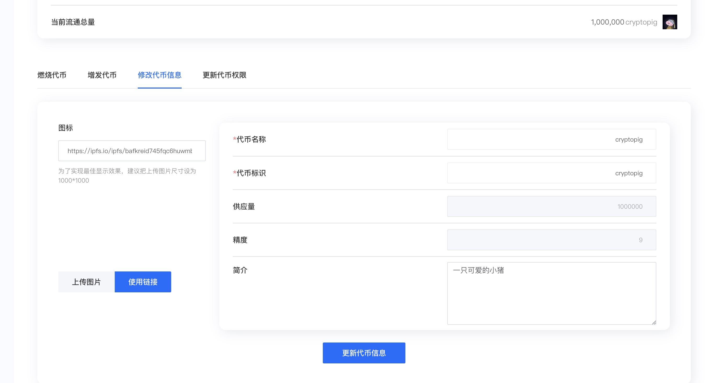

# Modify Token Permissions

After creating a token on Sui, you will have **three key permissions**:

1. **Minting Rights** (Token Issuance) – Allows increasing token supply.
2. **Metadata Update Rights** – Enables modifying token name, logo, etc.
3. **Token Burning Rights** – Destroys tokens permanently.
4. **Permission Discard Function** – Irreversibly renounces control over token modifications and operations.

### **Why Discard Permissions?**

Some **CEX wallets** flag tokens with active minting/burning capabilities as potential **"honeypot scams"**—even if liquidity exists, exchanges may still issue risk warnings. Most platforms evaluate tokens based on:

* Contract code audits
* Liquidity conditions
* Active permissions

***

### **Burning Tokens**

1. Open the **management console**: [CPBOX Token Manager](https://www.cpbox.io/cn/sui/token/manage#permission)
2. Connect your wallet (you should be familiar with this step).
3. Select your token address (auto-detected from your wallet).
4. Enter the amount to burn → Confirm → Sign the transaction.
5. **Refresh your wallet after \~1 minute** to see the updated balance.

<figure><figcaption></figcaption></figure>

### **Minting New Tokens**

* Enter the desired amount (e.g., 100M tokens) → Confirm.
* **Verify minting/destruction** by checking your wallet balance before/after.

<figure><figcaption></figcaption></figure>

_Note: Minted tokens are sent to **your wallet address**. For airdrops, use Sui’s batch-send tool:_&#x20;


[sui-pi-liang-fa-song-kong-tou-fa-song.md](../lian-gong-ju/sui-gong-ju/sui-pi-liang-fa-song-kong-tou-fa-song.md)


***

#### **Strategic Implications**

* **Minting (Inflation)**:
  * Funds ecosystem growth by increasing liquidity.
  * Example: Tether (USDT) minting signals incoming capital, often bullish.
* **Burning (Deflation)**:
  * Enhances scarcity; builds long-term holder confidence.
  * Example: BNB’s quarterly burns create positive price expectations.

_⚠️ Both actions can be **bullish or bearish**—context matters!_

### **Updating Token Metadata**

* Self-explanatory: Modify token details (name/logo).
* Changes take effect in **\~10 minutes** (faster on SuiWallet vs. Suiet).

<figure><figcaption></figcaption></figure>

### **Permission Discard (Critical!)**

* **One-click irreversible action**—proceed with caution!
* **Keep permissions if:**
  * Your project has **real utility** and long-term plans.
  * CEX listings for Sui tokens are still lenient on permissions.
* **Discard permissions if:**
  * Building a **meme community** (prevents bad actors from exploiting minting rights).

<figure><figcaption></figcaption></figure>

**Final Note:**

* **Serious projects** → Retain control for flexibility.
* **Meme tokens** → Discard permissions to build trust.

***

### **Learn More About CPBOX** 

Explore features: [https://docs.cpbox.io](https://docs.cpbox.io/)

Suggestions or custom needs?

Contact us:[https://www.cpbox.io/cn/](https://www.cpbox.io/cn/)

***

### **Join Our Community** 

**Telegram Group**: [https://t.me/cpboxio](https://t.me/cpboxio)

**Twitter**: [https://twitter.com/Web3CryptoBox](https://twitter.com/Web3CryptoBox) | [https://x.com/cpboxio](https://x.com/cpboxio)

**YouTube**: [https://youtube.com/channel/UCDcg1zMH4CHTfuwUpGSU-wA](https://youtube.com/channel/UCDcg1zMH4CHTfuwUpGSU-wA)
