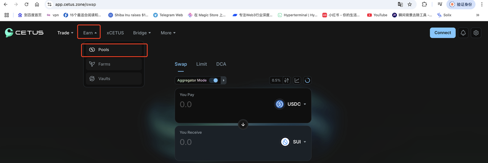
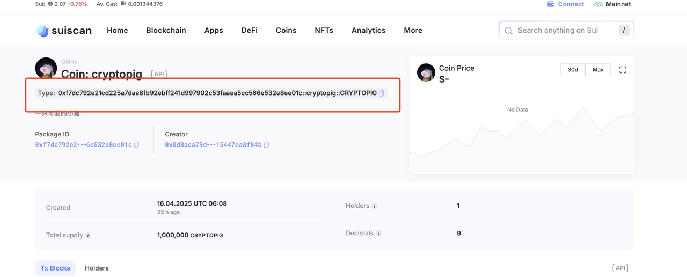

# Add Liquidity to Pools



### **Why Your Token Needs Liquidity**

After creating a token on Sui, you can't trade it immediately—unlike platforms like Pump.fun that offer built-in trading. On Sui, **you must manually create a liquidity pool** on a DEX. Here are the top Sui DEX options:

* **Cetus**: The largest decentralized exchange (DEX) on Sui.
* **Turbos**: A zero-slippage perpetual and spot trading platform.
* **BlueMove**: Supports both NFT and token trading (Aptos/Sui).

This guide focuses on **Cetus**, the most widely used DEX.

***

### **Why Add Liquidity?**

1. **Enable Trading**: Without a pool, your token is just blockchain data—no one can buy or sell it.
2. **Stabilize Prices**: Automated Market Maker (AMM) algorithms (e.g., `x*y=k`) balance price fluctuations. Larger pools = less price impact per trade.

**Who Provides Liquidity?**

* **Projects**: Inject initial funds (e.g., 10K SUI + 10M tokens) to bootstrap trading.
* **Users**: Earn 0.3% fee shares by staking in pools.

***

### **Step-by-Step: Creating a Pool on Cetus**

#### **1. Connect Your Wallet**

* Use the **same wallet** that holds your token (you'll deposit tokens into the pool).

<figure><figcaption></figcaption></figure>

**2. Navigate to Pool Creation**

* Click **Earn** → **Pools** → **Create New Pool**.

<figure><figcaption></figcaption></figure>

<figure><figcaption></figcaption></figure>

**3. Set Up the Trading Pair**

* **Token Selection**: Paste your token's **full contract address** (include the `::` suffix from SuiScan's "Type" field).

<figure><figcaption></figcaption></figure>

* **Quote Token**: Default is SUI (or choose USDC).

<figure><figcaption></figcaption></figure>

**4. Configure Slippage**

* **Stablecoins**: 0.01–0.05% (low volatility).
* **Meme Tokens**: 0.25–1% (high volatility, ensures trades execute).

<figure><figcaption></figcaption></figure>

**5. Set Initial Price & Range**

* **Price**: E.g., `1 Token = 0.0001 SUI` (1 SUI buys 10K tokens).

<figure><figcaption></figcaption></figure>

* **Range**: Select **Full Range** for unlimited trading.

**6. Deposit Liquidity**

* Example: Add **4 SUI** + **40K Tokens** (auto-calculated).
* Sign the transaction → Pool is live!

<figure><figcaption></figcaption></figure>

***

### **Trading & Managing Liquidity**

* **Test Trading**: Go to **Swap** to buy/sell your token (note: small pools have high slippage).

<figure><figcaption></figcaption></figure>

### **Add/Remove Liquidity**:

* **Add**: Increases depth (reduces slippage) but doesn't raise token price.

<figure><figcaption></figcaption></figure>

* **Remove**: Withdraw funds (risks price crashes if done abruptly).

<figure><figcaption></figcaption></figure>

**When to Remove Liquidity?**

* **Legitimate**: Protocol upgrades, security fixes, or project sunsetting.
* **Risks**: Sudden removals can trigger **rug pull** accusations or token collapse.

***

#### **Advanced: Liquidity Staking**

* **Traditional Staking**: Locks tokens (no trading).
* **Liquidity Staking**:
  1. Deposit tokens into a pool → get **LP Tokens**.
  2. Stake LP Tokens to earn:
     * **Trading fees** (0.3% per swap).
     * **Bonus rewards** (e.g., project incentives).

***

**Key Takeaways**

* Liquidity pools turn tokens into **tradable assets**.
* Cetus simplifies pool creation but requires manual setup.
* **DYOR**: Balance liquidity depth with decentralization.

_For LP Token mechanics, read:


Understanding Liquidity Pools, AMMs, and Liquidity Mining


***

### **Learn More About CPBOX**

Explore features: [https://docs.cpbox.io](https://docs.cpbox.io/)

Suggestions or custom needs?&#x20;

Contact us:[https://www.cpbox.io/cn/](https://www.cpbox.io/cn/)

***

### **Join Our Community**

**Telegram Group**: [https://t.me/cpboxio](https://t.me/cpboxio)

**Twitter**: [https://twitter.com/Web3CryptoBox](https://twitter.com/Web3CryptoBox) | [https://x.com/cpboxio](https://x.com/cpboxio)

**YouTube**: [https://youtube.com/channel/UCDcg1zMH4CHTfuwUpGSU-wA](https://youtube.com/channel/UCDcg1zMH4CHTfuwUpGSU-wA)
