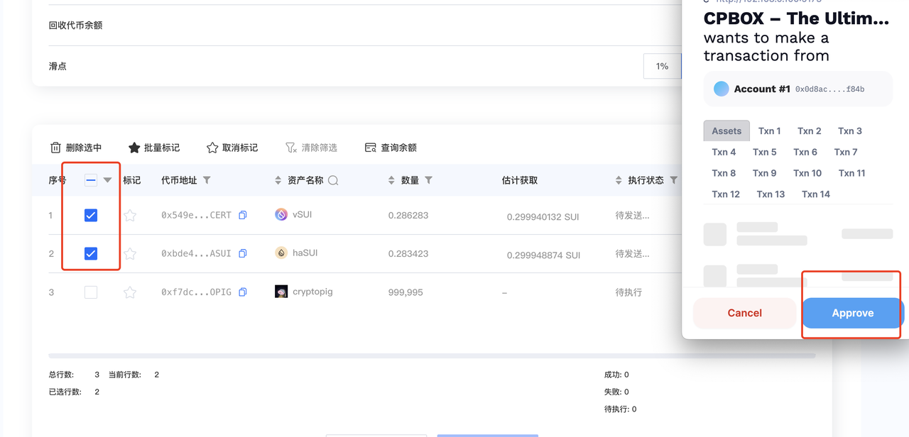

# Sui Bulk Swap

## Introduction

Every year, the Sui Foundation provides subsidies to certain projects within the Sui ecosystem. As a result, DeFi protocols on the Sui chain generate much higher revenue compared to other public chains. Additionally, the price of the Sui token is relatively stable, attracting many users to the Sui chain.

As a DeFi user on Sui, you may often find yourself receiving rewards in many different tokens. Converting all of them into SUI or another specific token can be very cumbersome, as each swap requires a separate signature.

To address this issue, CPBOX has launched a bulk swap feature for Sui chain users.

## Feature Demonstration

First, go to the Sui Bulk Swap page.

After connecting your wallet, the system will automatically detect and display the Sui chain tokens in your wallet.

<figure><figcaption></figcaption></figure>

Target Token: The token you want to swap to. By default, the page is set to convert to SUI.

If you want to change the target token, you can find the desired token address in the list below, copy it, and paste it into the input box.

Target Token Balance: Displays the current balance of the target token in your wallet.

<figure><figcaption></figcaption></figure>

Click "Check Balance" to see the estimated amount of tokens you will receive.

**Note:** This step is optional. You can also proceed directly to execution. The estimated amount will be displayed before the transaction is executed.

After selecting the tokens you want to swap,

Click "Start Execution" and sign the transaction in your wallet to complete the swap.

<figure><figcaption></figcaption></figure>

You can check the swap status on the blockchain explorer

or return to your wallet to view the results.

<figure><figcaption></figcaption></figure>

## Fee Details

The current fee for the Sui bulk swap feature is 0.5 SUI per transaction. If you swap more than 5 types of tokens, an additional 0.1 SUI is charged for each extra token.

As this feature is newly launched, there is a limited-time 70% discount. The actual fee is 0.15 + 0.03\*n SUI (for example, if you swap 8 types of tokens, n = 8-5 = 3).

## Summary

**Thank you to all users for your trust and support in CPBOX!**

If you encounter any issues while using the Sui bulk transfer feature or any other features,

you can contact us through the contact information at the bottom of the homepage <https://www.cpbox.io/cn/>

or reach out to us via the social media channels below.

***

### Other Social Media

TG Group: <https://t.me/cpboxio>

Discord: <https://discord.com/invite/XMwMMfHufN>

Twitter: <https://twitter.com/Web3CryptoBox>

Youtube: <https://youtube.com/channel/UCDcg1zMH4CHTfuwUpGSU-wA>
