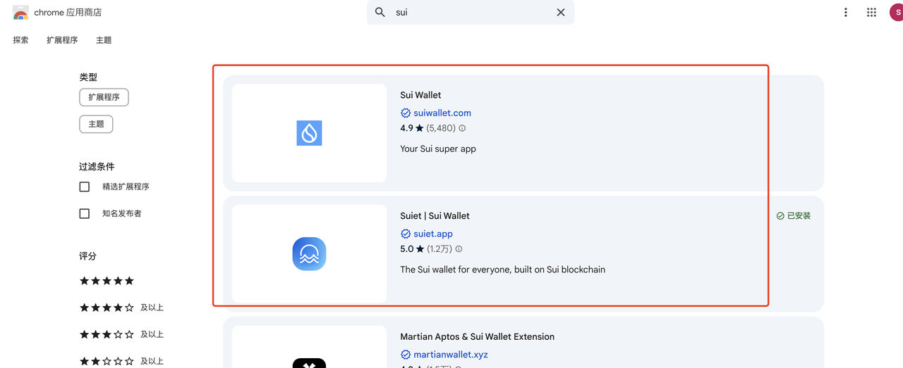

# Launch Sui Tokens with One Click



### **Introduction**

As blockchain technology rapidly evolves, **Sui** has emerged as a next-generation, high-performance Layer 1 blockchain that provides an ideal platform for digital asset creation. Built on the **secure Move programming language** with **horizontal scalability**, Sui offers unparalleled advantages for token deployment.

However, Move's unique architecture can feel unfamiliar to developers accustomed to other blockchain ecosystems, creating a barrier to entry. To democratize access and accelerate development, we've created the **"One-Click Token Launch"** feature—empowering developers, project teams, and everyday users to quickly create and manage custom tokens on the Sui network without any coding knowledge.

### **Why Build on Sui Instead of Other Blockchains?**

When compared to established blockchains like Ethereum, Solana, or BNB Chain, **Sui delivers superior performance, minimal gas fees, and enterprise-grade security** through its Move language foundation.

You might wonder: _"Why not just use Pump.fun on Solana instead?"_

Here's the strategic difference:

#### **Sui: Built for Serious Projects**
* **Enterprise-grade security** with Move language reducing smart contract vulnerabilities
* **Complete control** over liquidity pools (LP) and token permissions—no platform dependencies
* **Cost-effective operations** with consistently low gas fees
* **Maximum flexibility** for custom tokenomics and functionality
* **Professional positioning** in the market

#### **Solana: Optimized for Memecoins**
* **Meme-focused ecosystem** with speculation-driven culture
* **Platform dependency** for most token launches
* **Limited customization** for serious business use cases

#### **Market Perception Matters**
* **Solana = Memecoins & speculation** (regardless of technical capabilities)
* **Sui = Institutional credibility** with backing from a16z, Coinbase, and major VCs
* **Developer-centric ecosystem** with regular hackathons and technical innovation focus
* **Projects on Sui appear more credible and technically sophisticated**

**Bottom line**: Choose Sui for long-term value creation and complex tokenomics. Choose Solana for quick meme launches.

### **Complete Token Launch Tutorial**

#### **Step 1: Wallet Setup**

**Requirements:**
* Install a **Sui-compatible wallet** (**Sui Wallet** or **Suiet Wallet** recommended)
* Hold at least **20 SUI** for deployment and gas fees
* **Download**: [Sui Wallet Chrome Extension](https://chromewebstore.google.com/search/sui?hl=zh-CN\&utm_source=ext_sidebar)

**Access the Platform**: [CPBOX Token Launch](https://www.cpbox.io/en/sui/token/publish?_s=docs)

<figure><figcaption></figcaption></figure>

#### **Step 2: Token Configuration**

Click **"Connect Wallet"** and configure your token parameters:

**Essential Settings:**
* **Total Supply**: Default 1,000,000 tokens (fully customizable)
* **Decimals**: Default **9** (Note: This affects maximum supply—decimals=9 allows up to 10B tokens)
* **Token Logo**: Upload your project's visual identity
* **Description**: Craft compelling project narrative

<figure><figcaption></figcaption></figure>

**Deployment Cost**: **15 SUI** (industry-leading pricing—competitors charge 20+ SUI)

<figure><figcaption></figcaption></figure>

#### **Step 3: Deploy & Verify**

1. **Review** all transaction details carefully
2. **Sign** the deployment transaction through your wallet
3. **Wait** for blockchain confirmation (typically 2-5 seconds)

<figure><figcaption></figcaption></figure>

**Success!** Your token is now deployed with a unique contract address.

**Verification Steps:**
* Check your token on [Suiscan Explorer](https://suiscan.xyz/)
* Verify token appears in your wallet's asset list
* Save your contract address for future reference

<figure><figcaption></figcaption></figure>

**🎉 Congratulations! Your Sui token is live!**

---

#### **Critical Next Step: Enable Trading**

**Important**: Your token exists but isn't tradable yet. To enable trading, you must:

1. **Create Liquidity Pools** (e.g., SUI/YourToken trading pairs)
2. **List on DEX Platforms** (Turbos, Cetus, FlowX)
3. **Configure Trading Parameters**

**📖 Complete Guide Available:**


SUI Add Liquidity


---

### **Explore CPBOX Ecosystem** 

**📚 Documentation**: [https://docs.cpbox.io](https://docs.cpbox.io/)

**💡 Custom Solutions & Partnership Inquiries**:
Contact us: [https://www.cpbox.io/](https://www.cpbox.io/en/?_s=docs)

---

### **Join Our Growing Community** 

**💬 Telegram**: [https://t.me/cpboxio](https://t.me/cpboxio)

**🐦 Twitter**: [https://twitter.com/Web3CryptoBox](https://twitter.com/Web3CryptoBox) | [https://x.com/cpboxio](https://x.com/cpboxio)

**📺 YouTube**: [https://youtube.com/channel/UCDcg1zMH4CHTfuwUpGSU-wA](https://youtube.com/channel/UCDcg1zMH4CHTfuwUpGSU-wA)
