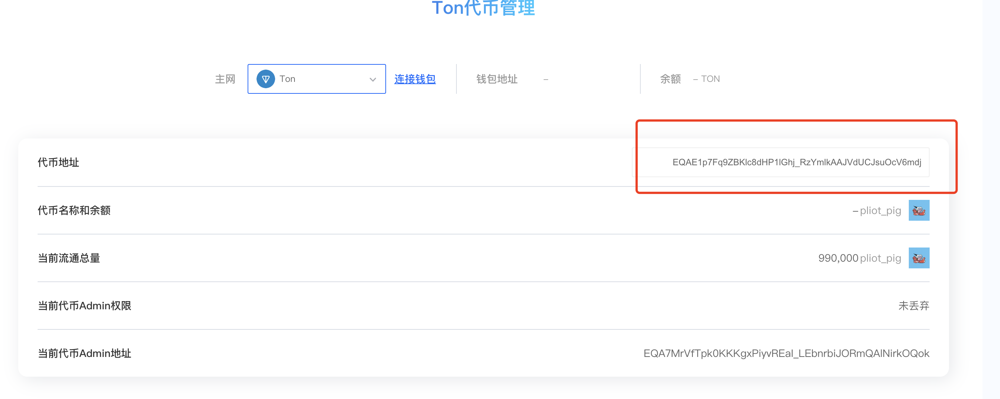
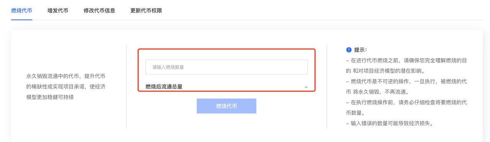
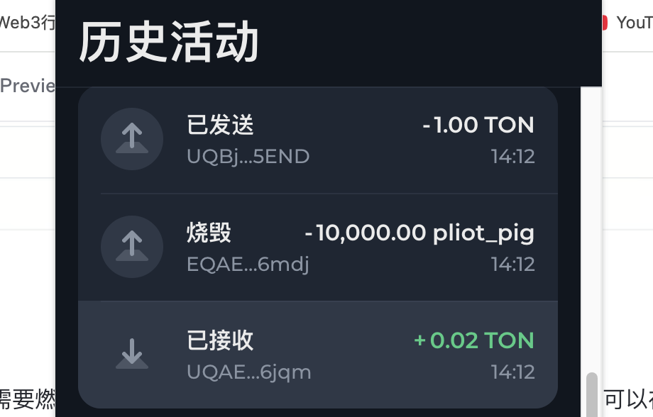
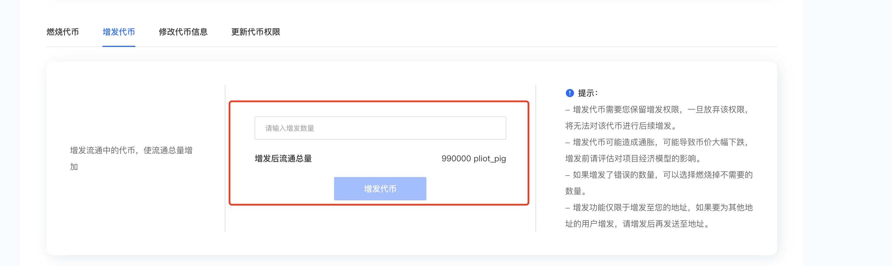
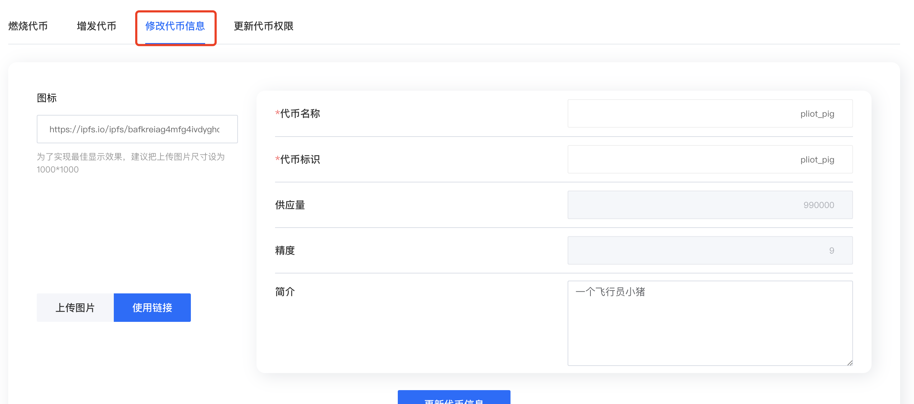

# TON Token Management

### Introduction

After creating tokens on the TON chain, there are 3 permissions: minting permission, information update permission, token burning permission, and **permission renouncement** functionality

* **Minting Permission:** Can mint and create tokens, increasing the token supply
* **Information Update Permission:** Can modify token name, logo, etc.
* **Token Burning:** Burn tokens
* **Permission Renouncement:** Renounce token information modification permissions and token operation permissions

Below I will demonstrate how to manage our tokens

First, enter our CPBOX official website, click on the menu to use tools, and select Token Management in the TON chain

<figure><figcaption></figcaption></figure>

After entering the page, input the token contract address we just created. After entering the contract address, the information below will automatically display.

<figure><figcaption></figcaption></figure>

### Token Burning

Click below to input the amount of tokens you need to burn, then click burn tokens to complete. Wait five minutes and you can confirm through the token quantity change in your wallet

<figure><figcaption></figcaption></figure>

As a demonstration here, we burned 10,000 tokens. After clicking burn and completing, you can see it in your wallet

<figure><figcaption></figcaption></figure>

### Token Minting

Input the amount of tokens you need to mint, click confirm and wait five minutes. You can confirm whether the operation was successful by checking the token quantity change in your wallet

<figure><figcaption></figcaption></figure>

### Token Information Modification

Token information modification is similar to token creation. You just need to fill in the corresponding token information. Wait five minutes, then you can check on tonviewer to see if the token information has changed successfully

<figure><figcaption></figcaption></figure>

### Permission Renouncement

Just click confirm to renounce permissions!! Note that this operation cannot be reversed, so you need to think carefully about whether to give up permissions. Malicious use of minting permissions and information update permissions will damage the long-term development of the project, which is why this feature exists

***

### Contact Us

If you want to learn more about other uses and features of CPBOX products

You can click [https://docs.cpbox.io/](https://docs.cpbox.io/) to view

Or if you have some good suggestions or development needs for help

You can find us through the contact information at the bottom of the homepage [https://www.cpbox.io/cn/](https://www.cpbox.io/cn/)

You can also contact us through the social media below

***

### Other Social Media

TG Group: [https://t.me/cpboxio](https://t.me/cpboxio)

Twitter: [https://twitter.com/Web3CryptoBox](https://twitter.com/Web3CryptoBox) | [https://x.com/cpboxio](https://x.com/cpboxio)

Youtube: [https://youtube.com/channel/UCDcg1zMH4CHTfuwUpGSU-wA](https://youtube.com/channel/UCDcg1zMH4CHTfuwUpGSU-wA)
