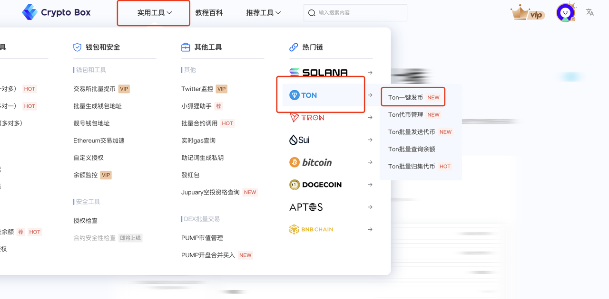
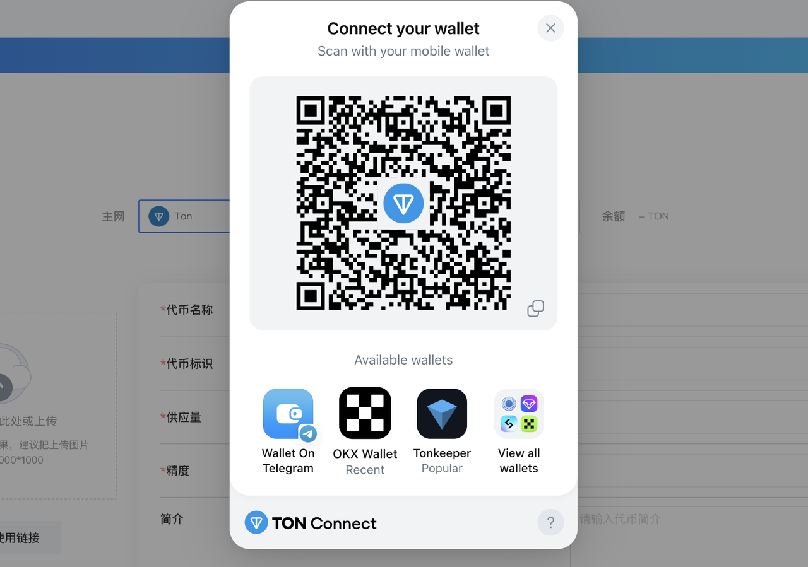
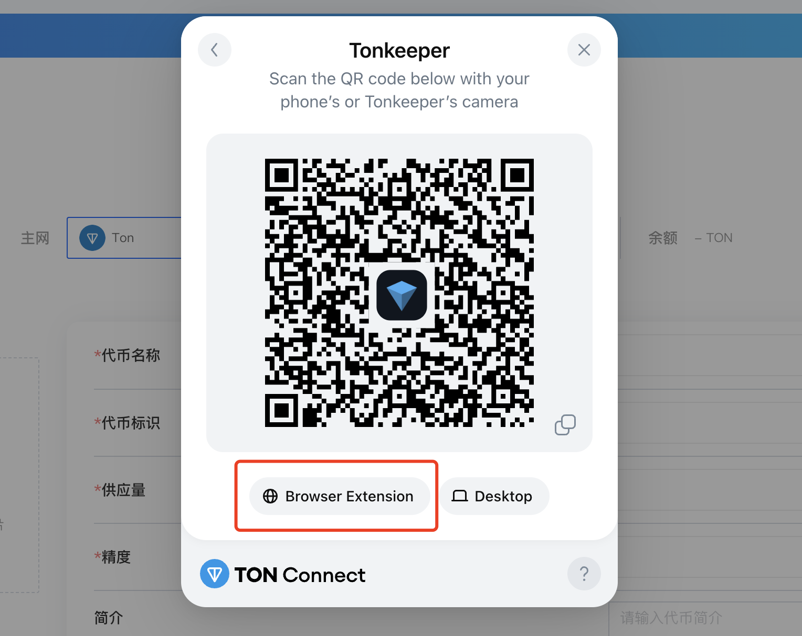
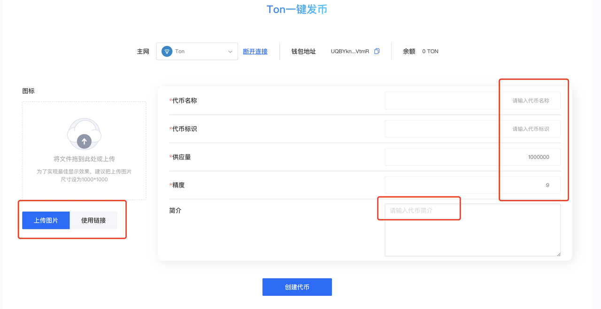
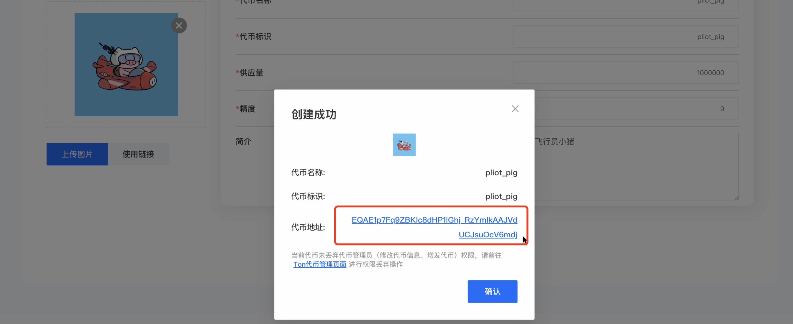
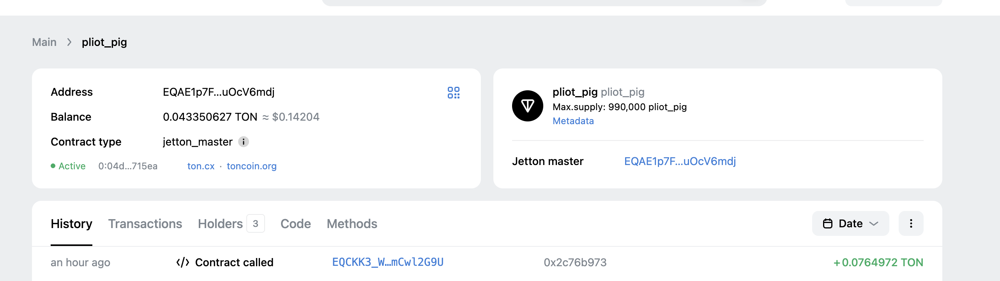

***

## description: One-click TON chain token creation

# Zero Code Launch Token on TON



### Introduction&#x20;

Over the past year, TON tokens have shown excellent performance, soaring from around $2.5 at the beginning of the year. Due to backing from the Telegram application, it has natural advantages in user ecosystem. At its peak, the token price even reached around $8. Unfortunately, with market adjustments and issues with the Telegram founder, the token trend is currently not very strong.

* **Deep Telegram Integration**: TON is tightly integrated with Telegram, allowing users to conduct on-chain transactions directly through Telegram wallet bots (such as @wallet), greatly lowering the barrier to entry.
* **Multiple Smart Contract Languages**: Supports **FunC (TON native language), Tact (simplified smart contract language), Solidity (through EVM compatibility layer)**, meeting different developer needs.
* **TON Foundation Support**: The TON Foundation continuously funds high-quality ecosystem projects, driving developer growth.

It is these advantages of TON that support the continuous development of the ecosystem.

This article will introduce how to use cpbox for **one-click token deployment on TON chain**.

### Token Creation

First, go to the cpbox official website: [https://www.cpbox.io/cn](https://www.cpbox.io/en/?_s=docs), click on Tools, TON chain, TON one-click token deployment to enter the page, then click Connect Wallet.

<figure><figcaption></figcaption></figure>

If you're using a TON wallet, you can enter by scanning the QR code.

Note that when using a TON wallet, you must use **Tonspace** within it.

<figure><figcaption></figcaption></figure>

We choose to use the Tonkeeper wallet for login.

Click on the Browser Extension plugin link below.

<figure><figcaption></figcaption></figure>

After successful connection, you can see our page is very simple - just fill in the corresponding token information. **All parameters must be filled**:

* Token Name: The name of the token
* Token Symbol: Token identifier, can be the same as the name
* **Decimals**: Default is 9, decimals are related to the maximum supply you can enter.
* **Supply Quantity**: When decimals are 9, supply cannot exceed 10 billion. When decimals are 8, it cannot exceed 100 billion, and so on.
* **Logo**: Token logo
* **Description**: Required, describe your token information

<figure><figcaption></figcaption></figure>

After entering the corresponding information, we can see there will be a confirmation popup. Click confirm.

Note: cpbox will **charge 5 TON** as a service fee for token creation.

<figure><figcaption></figcaption></figure>

After creation is complete, you will get your token's contract address.

<figure><figcaption></figcaption></figure>

Here we can go to the Tonviewer official website <https://tonviewer.com/> to view our token details.

<figure><figcaption></figcaption></figure>

At this point, the TON chain token has been successfully created.

If you want to add liquidity pools for your token later and hope to trade on DEX, you can refer to this article:


Understanding Liquidity Pools, AMMs, and Liquidity Mining


***

### Contact Us

If you want to learn more about other uses and features of CPBOX products

You can click [https://docs.cpbox.io/](https://docs.cpbox.io/en/?_s=docs) to view

Or if you have good suggestions or development assistance needs

You can find us through the contact information at the bottom of the homepage [https://www.cpbox.io/](https://www.cpbox.io/en/?_s=docs)

You can also contact us through the social media below

***

### Other Social Media

Telegram Group: <https://t.me/cpboxio>

Twitter: <https://twitter.com/Web3CryptoBox> | <https://x.com/cpboxio>

YouTube: <https://youtube.com/channel/UCDcg1zMH4CHTfuwUpGSU-wA>
