# TON Create Liquidity Pool on DeDust



Today we'll teach you how to create a liquidity pool for your token on DeDust. From the DeFiLlama platform, we can see that DeDust is the second-ranked **DEX** on the TON chain.

### **What advantages does DeDust have compared to Ston.Fi? Why choose DeDust?**

* **DeDust's v2 version** adopts an **innovative "concentrated liquidity" model** (similar to Uniswap v3), allowing liquidity providers (LPs) to customize price ranges and improve capital efficiency.
* **DeDust natively supports assets from TON and EVM-compatible chains** (such as Ethereum, BNB Chain), making it suitable for cross-chain trading needs.

Compared to Ston.Fi's traditional AMM mechanism, if you need more professional liquidity management or want to conduct cross-chain asset trading, DeDust is a better choice for you.

<figure>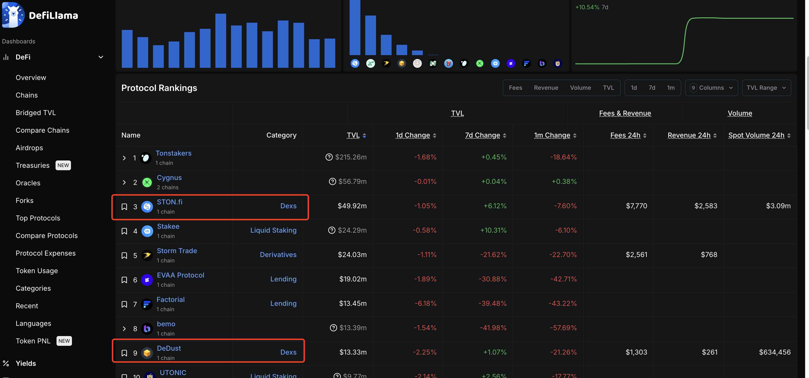<figcaption></figcaption></figure>

### Connecting Wallet

Let's get straight to today's tutorial. We can first go to [DeDust](https://dedust.io/)'s official website at https://dedust.io/.

Click on "Connect Wallet" in the upper right corner, then click the **Pool** button in the menu bar.

When connecting your wallet, we recommend using the **Tonkeeper** wallet, as other wallets may have bugs that don't display balances properly due to plugin connection issues.

<figure>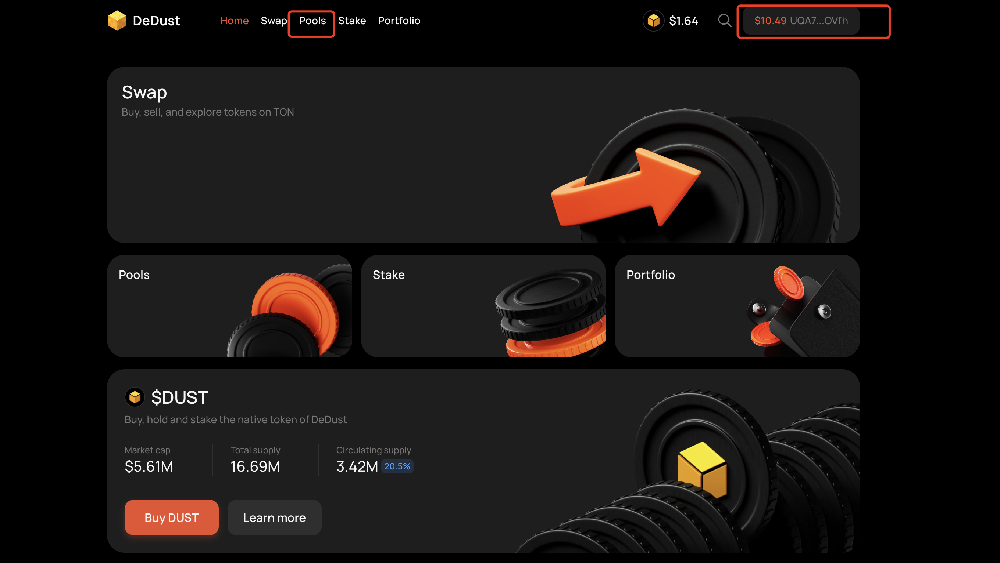<figcaption></figcaption></figure>

### Creating a Liquidity Pool

After clicking Pool to enter the pool page, we click the **Create a Pool** button at the bottom. A popup will appear asking us to configure the trading pair first.

<figure>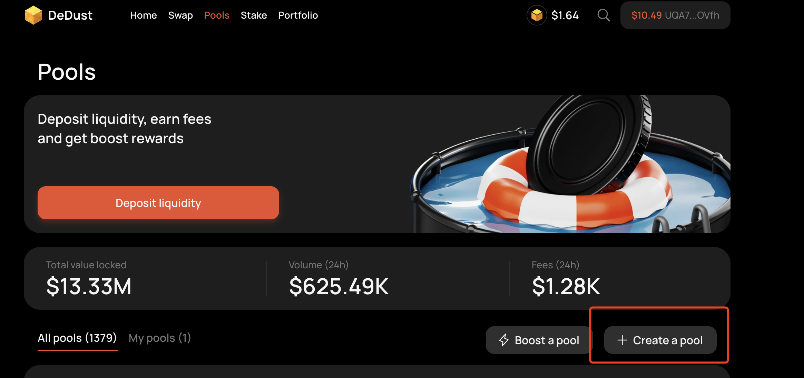<figcaption></figcaption></figure>

When setting up the trading pair, we select TON as the trading exchange token at the top. Of course, you can also choose to use other tokens. Here we use TON to demonstrate creating a pool on DeDust.

<figure>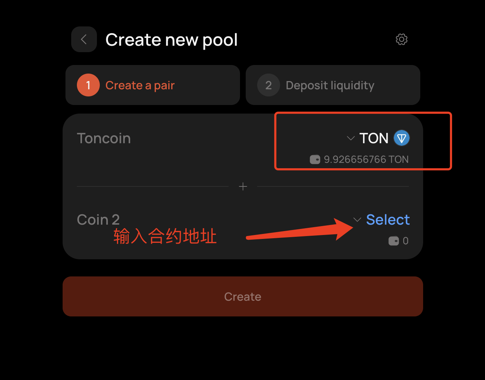<figcaption></figcaption></figure>

Authorization requires paying 0.1 TON, and creating the pool (Create Pair) costs around 0.5 TON, so you'll need to spend approximately 0.6 TON in total.

After entering the contract address below, a warning popup will appear, indicating that our token is not on the whitelist and is considered a high-risk token.

<figure>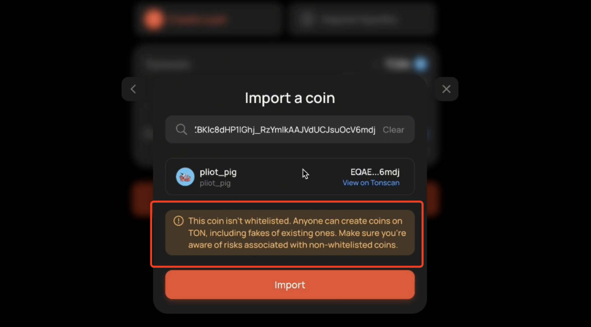<figcaption></figcaption></figure>

Here we click Import.

For our staking pool, we choose to stake 90,000 meme tokens and 1 TON in the pool.

After clicking confirm, there will be an additional **0.2 TON** fee charged for pool creation.

<figure>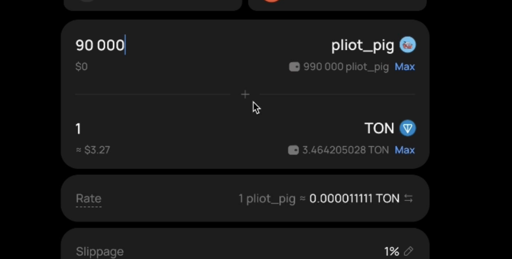<figcaption></figcaption></figure>

After wallet signature, the pool has been successfully created.

We can return to the Pool page and search in "All Pools" below. Once we can find it in the search, trading can begin.

Note: It may not appear immediately after creation. Wait a minute and refresh, then it will display successfully.

<figure>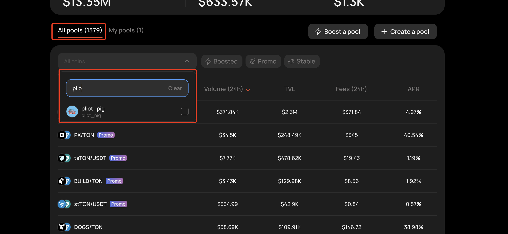<figcaption></figcaption></figure>

### Swap Trading

We go to the Swap page and search for our token name. Here we can trade.

The warning below shows that the price difference will be quite large and may cause losses.

Now we're making a buy order. Because there's not much liquidity in the pool, this single transaction buys it all out.

<figure>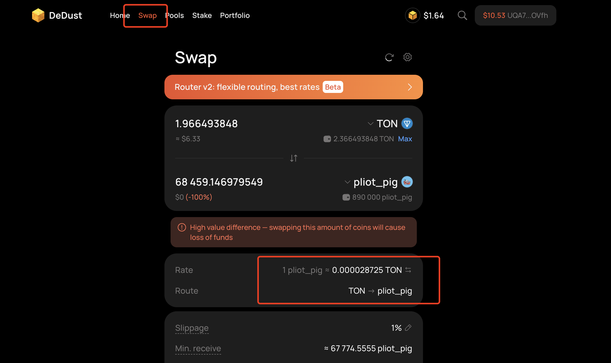<figcaption></figcaption></figure>

### Adding and Removing Liquidity

If we want to add or remove liquidity from the pool:

We click to enter the Pool page, go to "My Pools", and click on the token's pool to enter the details page.

<figure>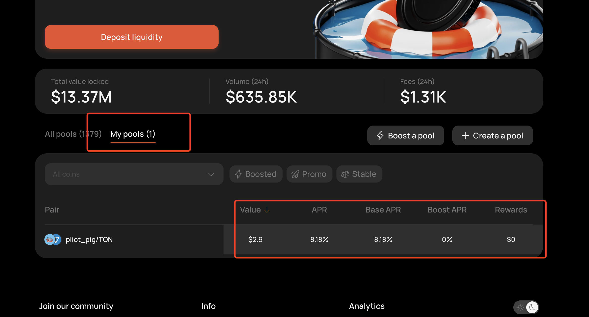<figcaption></figcaption></figure>

After entering the details page, click Deposit to add liquidity to the pool.

<figure>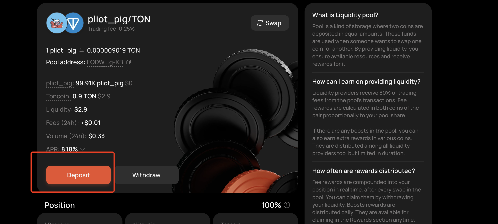<figcaption></figcaption></figure>

After clicking the Deposit button, we can see a staking interface. At this point, you can stake proportionally according to the current token price ratio in the pool. This is what's called "adding to the pool."

<figure>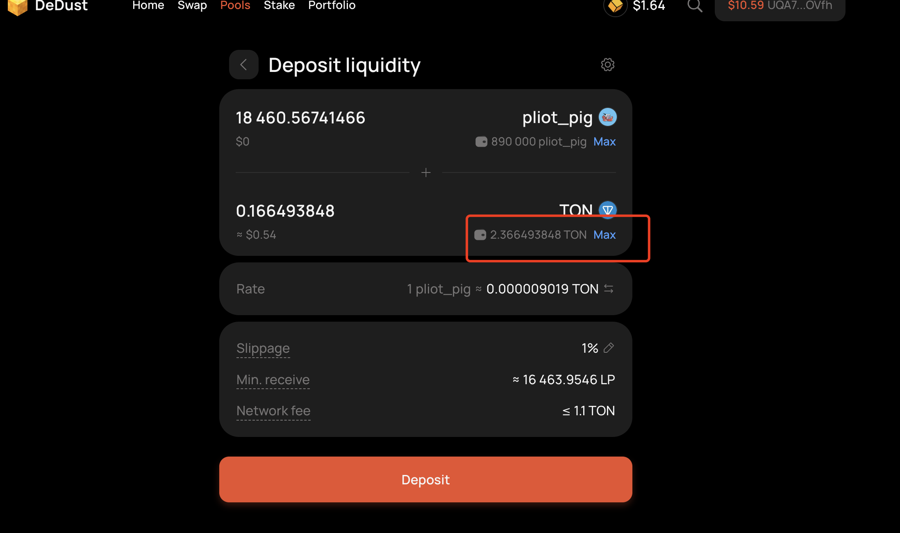<figcaption></figcaption></figure>

Removing liquidity works the same way - just click Withdraw.

However, we don't really recommend everyone use the withdraw operation. If the pool liquidity increases, it may introduce some risks.

<figure>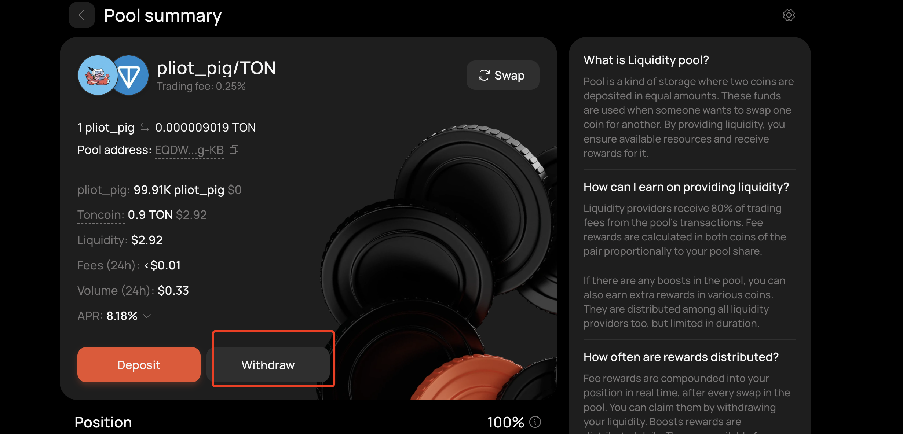<figcaption></figcaption></figure>

OK, the DeDust tutorial ends here. Everyone can also use LP for liquidity mining.

If you're not clear about the principles of liquidity pools, you can check out this article:


Understanding Liquidity Pools, AMMs, and Liquidity Mining


***

### Contact Us

If you want to learn more about other uses and features of CPBOX products

You can visit [https://docs.cpbox.io/](https://docs.cpbox.io/en/?_s=docs)

Or if you have good suggestions or development assistance needs

You can find us through the contact information at the bottom of our homepage [https://www.cpbox.io/](https://www.cpbox.io/en/?_s=docs)

You can also contact us through the social media below

***

### Other Social Media

TG Community: [https://t.me/cpboxio](https://t.me/cpboxio)

Twitter: [https://twitter.com/Web3CryptoBox](https://twitter.com/Web3CryptoBox) | [https://x.com/cpboxio](https://x.com/cpboxio)

Youtube: [https://youtube.com/channel/UCDcg1zMH4CHTfuwUpGSU-wA](https://youtube.com/channel/UCDcg1zMH4CHTfuwUpGSU-wA)
