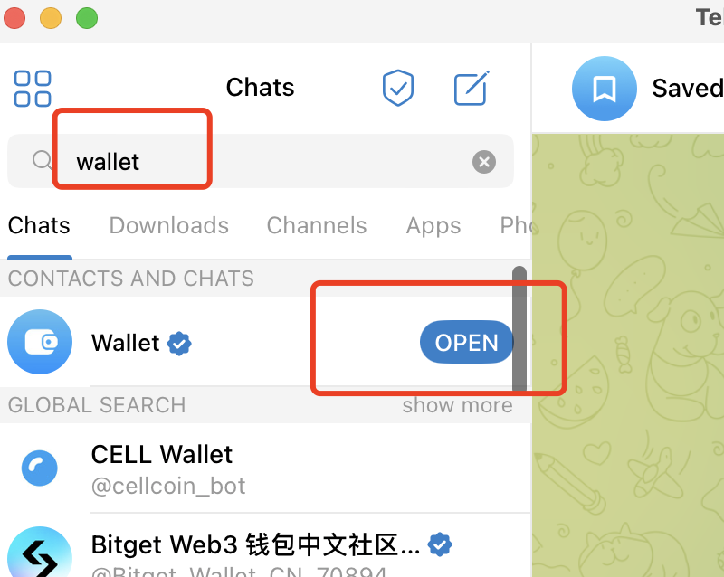
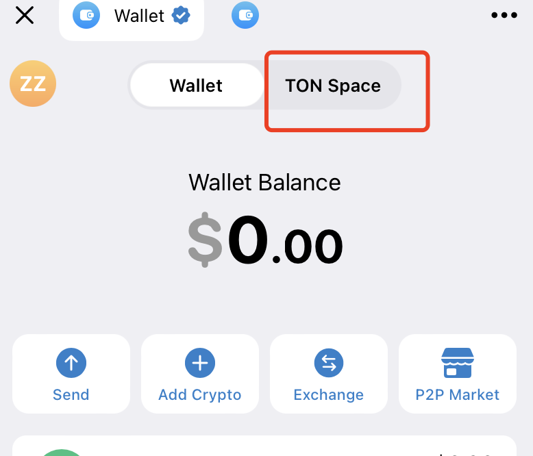
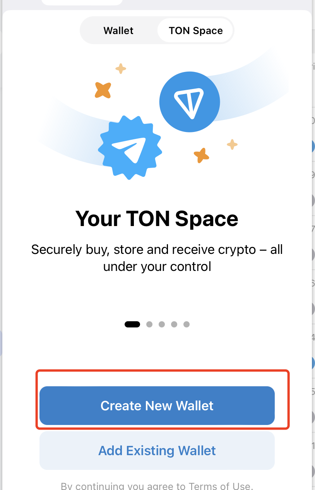
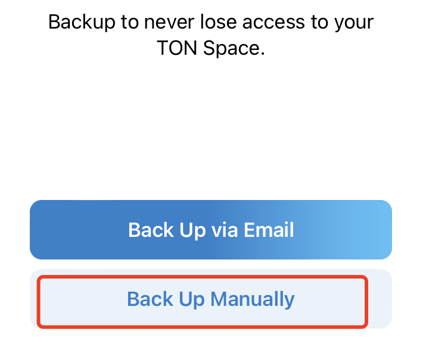
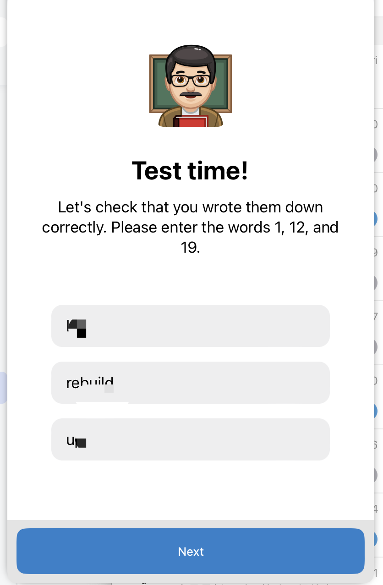
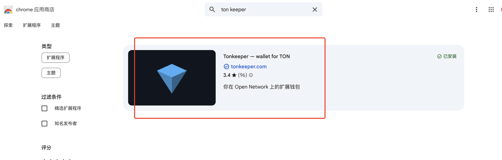
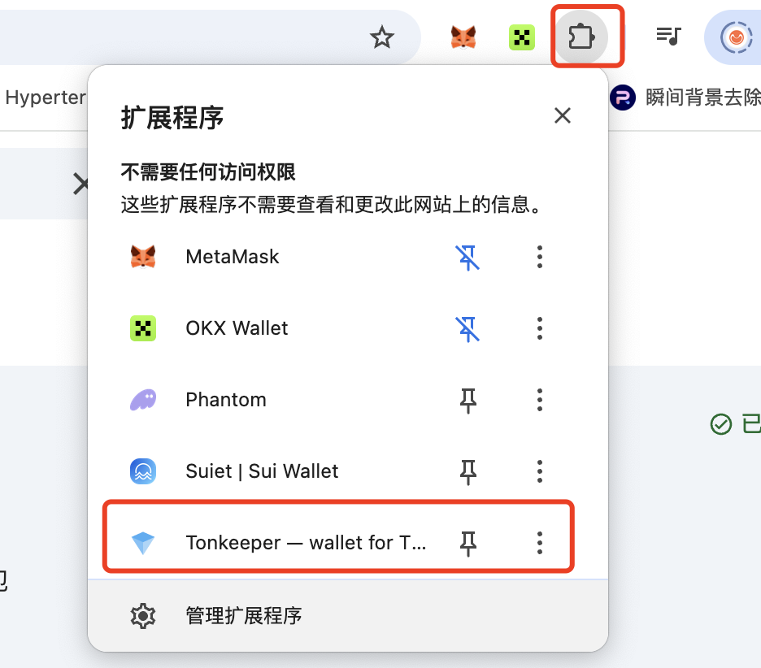
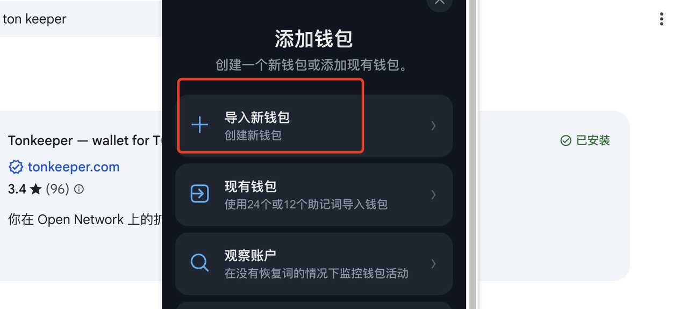
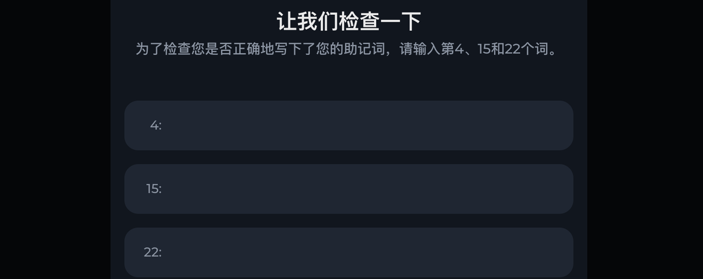

# Create TON Wallets

### Introduction

TON blockchain, with its strong integration with Telegram, holds tremendous potential for future ecosystem growth. We believe that in the coming period, the TON chain will see the emergence of many promising projects. The popularity of Telegram mini-games and airdrops reminds us of the early days of WeChat mini-programs - perhaps TON tokens will surge in value due to these innovative projects. This tutorial will guide you through creating your own TON wallet. Currently, the most popular wallets include:

* **Wallet on Telegram**: Official TON wallet
* **Tonkeeper**: Decentralized TON blockchain wallet

### Creating a Wallet on Telegram

**Key Features**

* **Built into Telegram**: Access directly within Telegram chat interface (via @Wallet bot or sidebar)
* **User-friendly**: Perfect for beginners, no additional app installation required, supports QR payments and P2P transfers
* **Supports TON and select tokens**: Store/send TON, USDT (TON chain), NFTs, and more
* **Semi-decentralized**: Private keys are partially managed by Telegram (requires trust in Telegram's security)

Since this is not a fully decentralized wallet, we recommend only storing small amounts of tokens. Search for "wallet" in the Telegram search bar, and an official mini-app will appear below. Click "Open" to launch it.

<figure><figcaption></figcaption></figure>

Once opened, you'll see a wallet interface ready to use.

**Important Note**: This wallet is **not a Web3 wallet** - it functions similarly to WeChat Pay, serving as a payment wallet **without seed phrases or private keys**.

<figure><figcaption></figcaption></figure>

If you want to claim airdrops or game rewards on Telegram, the basic wallet won't suffice. You'll need to create a TonSpace wallet, which does include seed phrases and private keys.

Click on "TonSpace" at the top to switch. Select "Create a new wallet."

<figure><figcaption></figcaption></figure>

Choose "Manual backup"

<figure><figcaption></figcaption></figure>

After manual backup, you'll receive a seed phrase that you must securely save and will need to verify later. Once you've saved it, enter the corresponding seed phrase words to complete the setup.

<figure><figcaption></figcaption></figure>

### Creating a Tonkeeper Wallet

**Key Features**
* **Fully decentralized**: Users maintain complete control over seed phrases/private keys and assets
* **Comprehensive functionality**: Supports all TON ecosystem tokens (jUSDT, STON), NFTs, and DApp connections (STON.fi, DeDust)
* **Standalone app**: Available for download (iOS/Android) with enhanced security

In simple terms, Tonkeeper offers more convenient and seamless usage with fewer bugs across various project ecosystems. It's essentially the most stable wallet on the TON chain.

First, visit the [Chrome Web Store](https://chromewebstore.google.com/category/extensions?utm_source=ext_sidebar&hl=en) and install the extension.

<figure><figcaption></figcaption></figure>

After installation, click the extension icon in the upper right corner and open the Tonkeeper wallet.

<figure><figcaption></figcaption></figure>

On the main page, click "Create new wallet"

<figure><figcaption></figcaption></figure>

You'll be prompted to backup your seed phrase and complete a verification test. Once completed, you'll see a success message confirming your wallet creation.

<figure><figcaption></figcaption></figure>

---

### Contact Us

To learn more about CPBOX's features and functionalities, visit our documentation at [https://docs.cpbox.io/](https://docs.cpbox.io/?_s=docs)

For suggestions, feedback, or development assistance, contact us through the information provided at the bottom of our homepage: [https://www.cpbox.io/](https://www.cpbox.io/en/?_s=docs)

You can also reach us through our social media channels below.

---

### Social Media

Telegram Community: [https://t.me/cpboxio](https://t.me/cpboxio)

Twitter: [https://twitter.com/Web3CryptoBox](https://twitter.com/Web3CryptoBox) | [https://x.com/cpboxio](https://x.com/cpboxio)

YouTube: [https://youtube.com/channel/UCDcg1zMH4CHTfuwUpGSU-wA](https://youtube.com/channel/UCDcg1zMH4CHTfuwUpGSU-wA)
