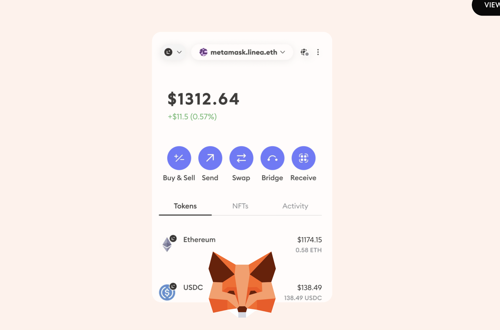
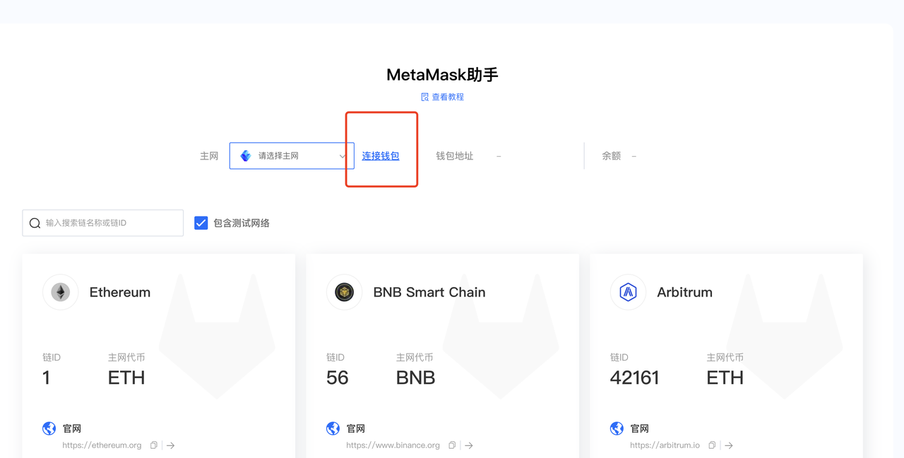
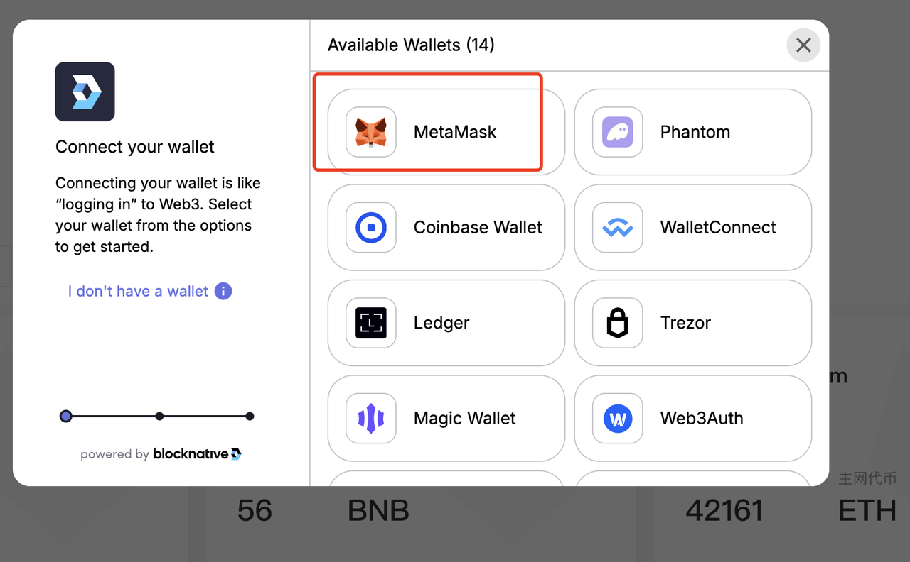
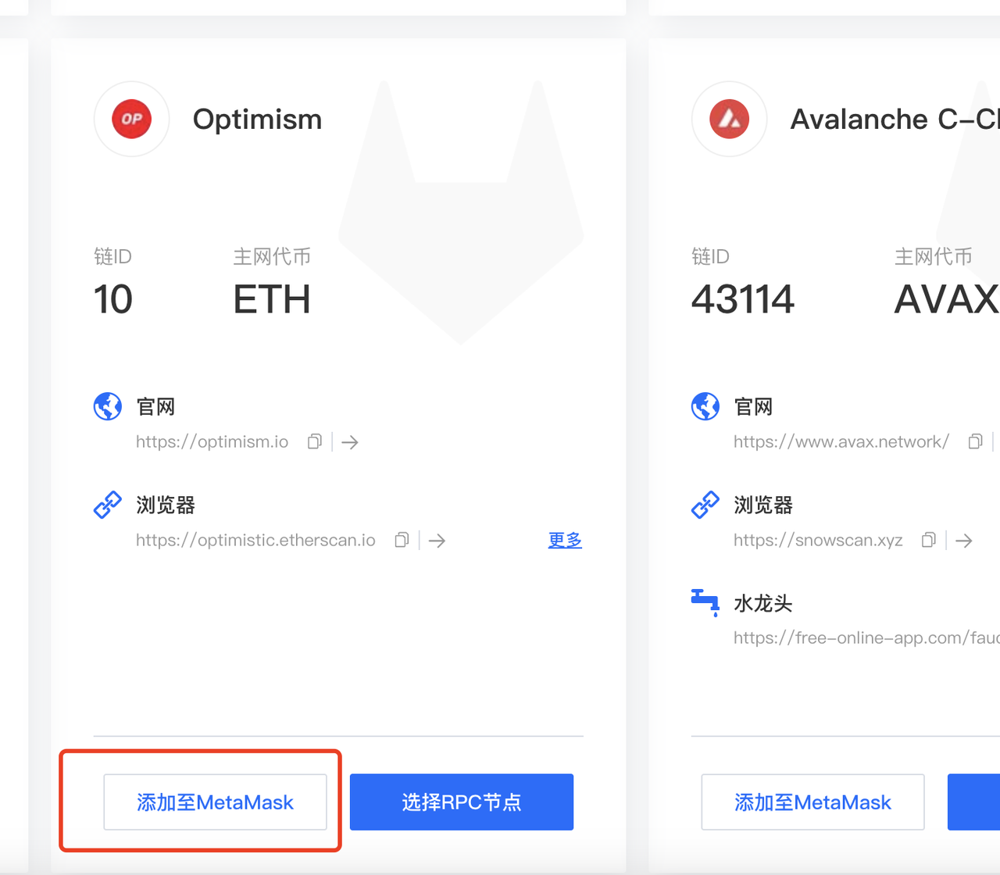
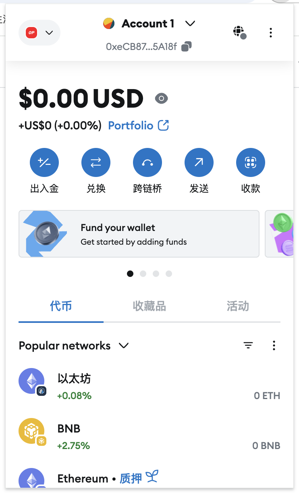

# MetaMask Setup Guide for Beginners

Today, I'll guide Web3 beginners in creating their own blockchain wallet. First, let me introduce the MetaMask wallet we'll be using.

<figure><figcaption></figcaption></figure>

#### **Product Info**

🦊 **Product Name** | MetaMask

🔗 **Supported Blockchains** | Default: Ethereum (other chains can be added by customizing mainnet settings)

🖥 **Supported Clients** | iOS, Android, Chrome Extension

**MetaMask Official Website (Always verify the domain to avoid scams):**
👉 [https://metamask.io](https://metamask.io/)

**MetaMask Twitter:**
👉 [https://twitter.com/metamask](https://twitter.com/metamask)

⚠ **Important Note:** Using MetaMask requires a VPN (this won't be covered in detail here, but it's an essential skill for exploring Web3).

## **Installation Steps**

**Step 1: Install MetaMask**

1. Go to [Metamask.io](https://metamask.io/), click **"Download now" → "Install MetaMask for Chrome"** to add it as a browser extension.
   * While MetaMask has a mobile version, we recommend installing it on **Google Chrome (desktop)** for smoother interactions with Web3 projects and fewer bugs.
   * 🔗 **MetaMask Download Link:** [https://metamask.io/download.html](https://metamask.io/download.html)

<figure><figcaption></figcaption></figure>

Once installed, open MetaMask:

* If you already have an **ERC20 wallet**, select **"Import Wallet"** and follow the steps.
* If not, choose **"Create Wallet"**, set a password, and proceed.

**⚠ Critical Security Tip:** Write down your **seed phrase on paper** and store it securely. **Never share it with anyone!** If lost or stolen, your assets cannot be recovered.

By default, MetaMask connects to the **Ethereum network**. If a project runs on a different blockchain, you'll need to manually add its mainnet settings. Below, we'll use **BSC (Binance Smart Chain)** as an example.

**Step 2: Add a Network Node**

Using **CryptoBox's tool**, you can automatically add network nodes:

Visit:👉 [https://www.cpbox.io/metamask/helper](https://www.cpbox.io/en/metamask/helper?_s=docs)

<figure><figcaption></figcaption></figure>

Click **"Connect Wallet"** and select **MetaMask**.

<figure><figcaption></figcaption></figure>

For this example, we'll configure the **OP (Optimism) chain**.

<figure><figcaption></figcaption></figure>

MetaMask will prompt you—click **"Confirm"**, and the network will be automatically configured.

**Your MetaMask wallet is now ready!**

* Click **"Receive"** to view your wallet address.
* When transferring funds from exchanges or other wallets, select the **OP chain (or your desired network)**.

 

***

### **Want to Learn More About CPBOX?**

Explore features: [https://docs.cpbox.io](https://docs.cpbox.io/)

Have suggestions or development needs? Contact us via:

[https://www.cpbox.io/](https://www.cpbox.io/en/?_s=docs) (check the footer for contact details)

***

### **Join Our Community**

**Telegram Group:** [https://t.me/cpboxio](https://t.me/cpboxio)

**Twitter:** [https://twitter.com/Web3CryptoBox](https://twitter.com/Web3CryptoBox) | [https://x.com/cpboxio](https://x.com/cpboxio)

**YouTube:** [https://youtube.com/channel/UCDcg1zMH4CHTfuwUpGSU-wA](https://youtube.com/channel/UCDcg1zMH4CHTfuwUpGSU-wA)
