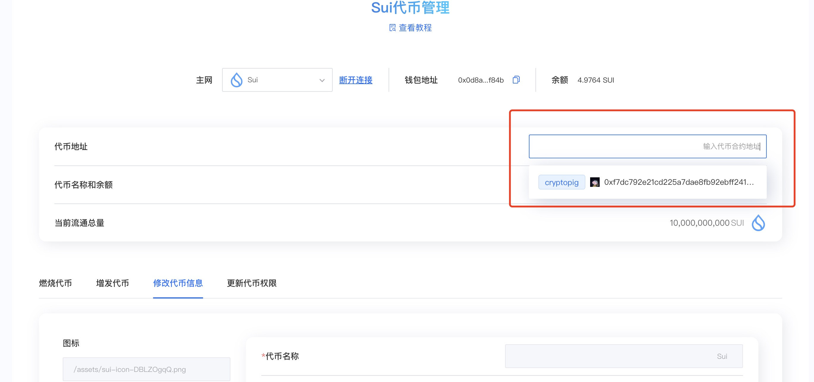
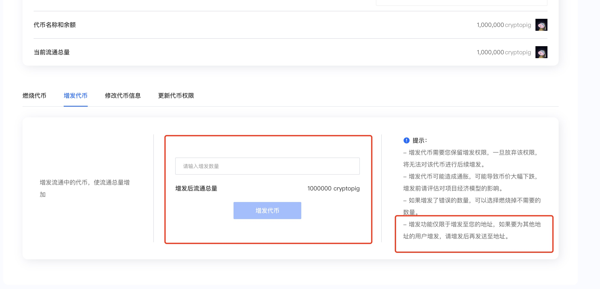
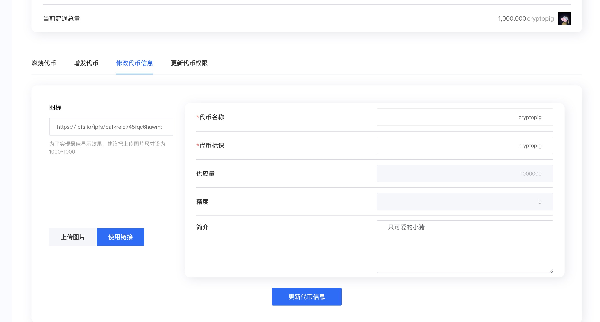
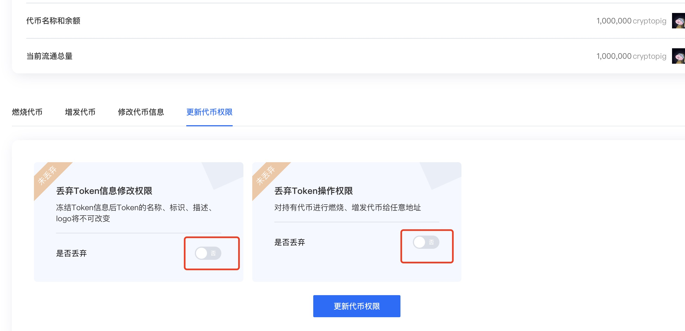

# Sui代币权限修改

Sui链的代币创建出来后，会有3个权限：增发权限（铸币权）、更新资料权限，代币燃烧权限 以及**权限丢弃**功能

* **增发权限：**&#x53EF;以增发、铸造代币，提高代币供给量
* **更新资料权限：**&#x53EF;以修改代币名称、logo等
* **代币燃烧：**&#x71C3;烧代币
* **权限丢弃：**&#x4E22;弃Token的信息修改权限和Token的操作权限

那么有的人会问，为什么要进行权限的丢弃啊。一些CEX钱包 对链上的币有一个貔貅币的判定，不然就算你有足够的流动性，平台可能也会对用户做风险提示，现在主流的平台基本上通过**代币合约代码审查**、**流动性判断**、**代币权限**

### 燃烧代币

具体该怎么使用呢？首先，我们打开控制台链接： [https://www.cpbox.io/cn/sui/token/manage#permission](https://www.cpbox.io/cn/sui/token/manage#permission)，连接钱包（这一步之大家应该很熟悉了）

再点击代币地址选择，会自动匹配到你钱包中的代币地址，你可以点击进行选择

<figure><figcaption></figcaption></figure>

输入你想要燃烧的代币数量，点击确定，进行钱包签名后就成功燃烧，过一分钟后可以刷新一下你的钱包，能看到钱包中代币余额发生变动

### 代币增发

输入要增发的数量，点击确认即可，比如选择增发1个亿，我们如何能够确认是否已经完成了代币的燃烧和增发呢？点击钱包，通过前后对比就可以看到代币是否完成了增发或者是销毁。

<figure><figcaption></figcaption></figure>

这边需要注意的是，增发的的代币是增发在你自己的钱包地址的，如果后续想要以空投的形式发送多个人，可以通过sui链中的批量发送功能进行实现。

可以参考教材[https://docs.cpbox.io/pi-liang-gong-ju/pi-liang-fa-song.html](https://docs.cpbox.io/pi-liang-gong-ju/pi-liang-fa-song.html)

***

代币增发和销毁有什么意义呢，笼统来讲是以下两点。

* **增发的核心意义**：通过可控通胀激励生态增长，为市场提供更多的流动性
* **燃烧的核心意义**：通过通缩提升稀缺性，但需结合真实需求。

代币的增发和燃烧都可能是利好或者利空，我们需要结合实际情况来进行判断。

如泰达公司又增发了多多少的usdt，此时为市场提供了更多的流动性，说明会有更多的资金注入到市场中，这就是一个利好消息，可能会造成市场短期的一个上涨或者波动。

又比如bnb，会进行定期的燃烧通过定期燃烧制造通缩预期，长期可能增强持有者信心。此时燃烧被可以解读为项目方对生态的信心，吸引投资者关注。

### 信息修改

顾名思义，对代币的一些基本信息进行修改，这里不多赘述

<figure><figcaption></figcaption></figure>

等待十分钟后，我们验证一下是否更新成功，观察钱包里的代币信息是否已经发生了变化（Suiet钱包更新比较慢，SuiWallet更新较快）

### 权限控制

这个操作非常的简单，选址丢弃权限，再次点击确认就可以操作成功

<figure><figcaption></figcaption></figure>

！！需要注意的是 ，此操作是没办法撤回的，所以是否要放弃权限 要考虑好首先恶意使用增发权限与更新资料权限，会损害项目的长期发展，这也是会有这个功能的原因如果你们是想在sui链深耕的小型项目方，并且有实际业务支持，是不用放弃，目前主流的cex对sui链的审核并没有特别的严格。

但如果你们只是想在sui链上建立一个共识非常强大的meme社群，可能就需要进行权限的放弃。虽然大家都有很强的信仰，但是保不齐群众会里面出现了坏人。

***

如果想要更多的了解并了解Cryptobox这个产品的其他用途和功能可

以点击 [https://docs.cpbox.io/](https://docs.cpbox.io/)

如果在产品功能使用中遇到了问题或者你有一些好的建议或者想要帮助开发的需求

可以通过主页[ https://www.cpbox.io/cn/ ](https://www.cpbox.io/cn/)最下方的联系方式来找到我们
