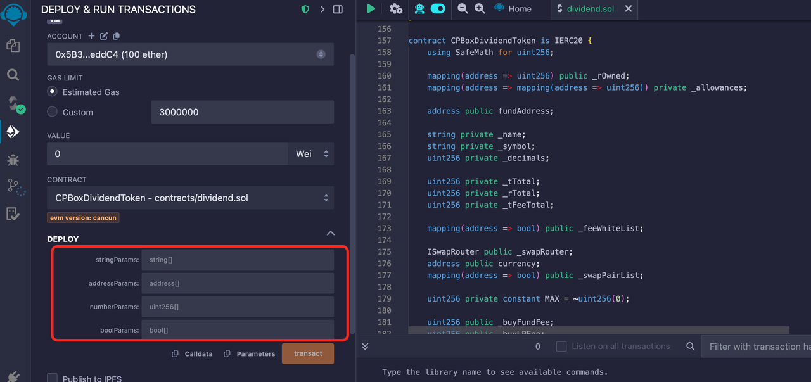

# 创建LP分红代币

#### P什么是分红代币？

LP分红指的是，用户在去中心化交易所（如Pancake）添加流动性之后，除了可以获得流动性奖励外，可以获得额外的代币分红。该代币分红，是直接分发到LP地址的。具体分红哪种币，可以在创建合约时选择，一般为主流币，如wBNB、USDT、USDC、Doge等等。

#### 合约部署

打开[remix](https://remix.ethereum.org/)，新建文件并粘贴合约源码，或者直接关联合约源码地址，操作流程参考：

合约源码：[https://github.com/cpbox/cpbox-token-contracts/blob/main/evm/lpdividend.sol](https://github.com/cpbox/cpbox-token-contracts/blob/main/evm/lpdividend.sol)

**参数说明**

<figure><figcaption><p>LP 分红代币</p></figcaption></figure>

这里给出一份示例参数，并解释如何修改适合自己的参数

* 第一个 stringParams 的参数: `["CPBoxToken", "CPB"]`
* 第二个addressParams 的参数:

`["0x1234567890123456789012345678901234567890","0x0987654321098765432109876543210987654321","0x1111111111111111111111111111111111111111","0x2222222222222222222222222222222222222222","0x3333333333333333333333333333333333333333"]`

* 第三个numberParams参数：`["18","1000000000000000000","1000000000000","200","100","100","50","200","100","100","50","10","3"]`
* 第四个boolParams 参数： `[true,true,true,true,true,true,true]`

参数说明：

```java
// 字符串参数数组
string[] memory stringParams = [
    "CPBoxToken",  // 代币name，请修改为你自己的代币符号
    "CPB"              // 代币符号，请修改为你自己的代币符合
];

// 地址参数数组
address[] memory addressParams = [
    0x1234567890123456789012345678901234567890,  // fundAddress: 营销地址
    0x0987654321098765432109876543210987654321,  // currency: 交易对代币地址
    0x1111111111111111111111111111111111111111,  // swapRouter: 交易路由合约地址
    0x2222222222222222222222222222222222222222,   // receiveAddress: 接收地址   
    0x3333333333333333333333333333333333333333,   // rewardToken:分红的代币
];

// 数值参数数组
uint256[] memory numberParams = [
    18,                    // decimals: 代币精度
    1000000000000000000,   // totalSupply: 代币总供应量
    1000000000000,         // maxWalletAmount: 单个地址最大持币量
    200,                   // buyFundFee: 买入基金费率 (2%)
    100,                   // buyLPFee: 买入LP费率 (1%)
    100,                   // buyReflectFee: 买入分红税率 (1%)
    50,                    // buyBurnFee: 买入销毁费率 (0.5%)
    200,                   // sellFundFee: 卖出基金费率 (2%)
    100,                   // sellLPFee: 卖出LP费率 (1%)
    100,                   // sellReflectFee: 卖出分红税率率 (1%)
    50,                    // sellBurnFee: 卖出销毁费率 (0.5%)
    10,                    // kb:防同步块数
    3                      // airdropNumbs: 空投数量
];

// 布尔参数数组
bool[] memory boolParams = [
    true,    // enableOffTrade: 手动开启交易
    true,    // enableKillBlock: 防同步块
    true,    // enableRewardList: 白名单
    true,    // enableWalletLimit: 开启钱包数量限制
    true,    // enableChangeTax: 允许修改税率
    true,    // currencyIsEth: 是否使用BNB作为交易对
    true     // airdropEnable: 空投开关   
];
```

（买入/卖出）费率说明：

* 基金费率：每笔买入/卖入都会扣除对应比例代币送进`合约地址`,在**触发阈值**时会自动**卖出**换成`USDT`(这取决于池子类型，底池是什么币营销钱包就进什么) 发送到你的营销钱包地址
* LP费率：每笔买入/卖入都会扣除对应比例代币送进`合约地址`,在**触发阈值**时会自动添加流动性,使池子更厚，加池子获得的LP默认给到营销钱包
* 分红费率：每笔买入/卖入都会扣除对应比例代币送进`合约地址`,在**触发阈值**时会自动**卖出**成`USDT`(取决于你的分红代币)发放给持有LP的用户
* 销毁费率：每笔买入/卖入都会扣除对应比例代币送进`黑洞地址`,达到销毁的目的

> 总的买入税率不能超过25%（ buyFundFee + buyLPFee + buyReflectFee + buyBurnFee < 2500）总的卖出税率不能超过25%（sellFundFee + sellLPFee + sellReflectFee + sellBurnFee <2500）

**注意事项**

* **他人LP的地址，必须交易才能激活**
  * 如果用户的LP不是自己加池子获得了，而是别人转账给他的。那么这个地址必须在交易一笔（买卖各一笔）之后，才能激活，获得分红。否则合约无法识别到该地址，是没有分红的
* **为什么交易了很多笔还是没有分红？**
  * 不要使用白名单地址交易，如发币地址、营销钱包地址交易都是没有用的
  * 不要只买，必须有卖单，才能分红。没有卖单，分红发不出去的
* **锁池后还有分红吗？**
  * 锁池的那个人是没有分红的，其他没锁的人依然参与分红，互不影响。此外，可以通过控制台将锁池地址排除在分红之外。
* **加/撤池子手续费问题**
  * 默认加/撤池子是不收手续费的，但是需要满足一定的前提条件才可以：
    * 如果是用USDT做底池，用户加池子的`方向`需要和初始加池子的方向保持一致。所谓"方向"，就是USDT和代币哪个在前，哪个在后的问题。如果方向不一致，加池仍然要收手续费
    * 如果是用BNB做底池，用户必须使用wBNB加池子，且方向一致，才能不收手续费

如果想要更多的了解CPBOX这个产品的其他用途和功能

可以点击[ https://docs.cpbox.io/](https://docs.cpbox.io/)

或者你有一些好的建议或者想要帮助开发的需求

可以通过主页 [https://www.cpbox.io/cn/ ](https://www.cpbox.io/cn/)最下方的联系方式来找到我们

***

【其他社媒】&#x20;

TG交流群：[https://t.me/cpboxio](chuang-jian-lp-fen-hong-dai-bi.md#shen-me-shi-fen-hong-dai-bi)

Twitter：[https://twitter.com/Web3CryptoBox](https://twitter.com/Web3CryptoBox)

Youtube：[https://youtube.com/channel/UCDcg1zMH4CHTfuwUpGSU-wA](https://youtube.com/channel/UCDcg1zMH4CHTfuwUpGSU-wA)
