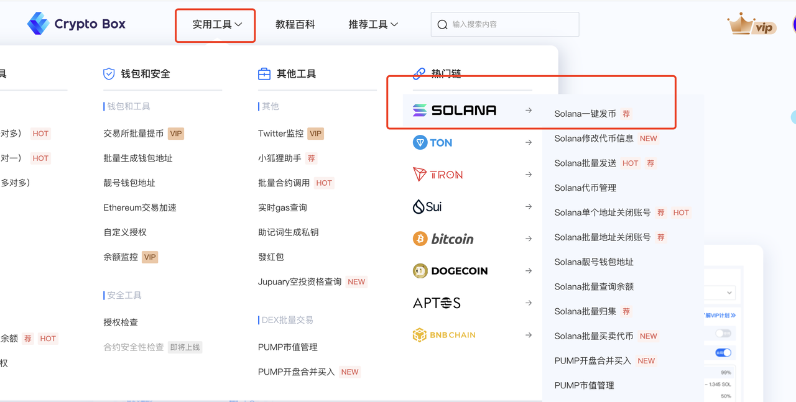
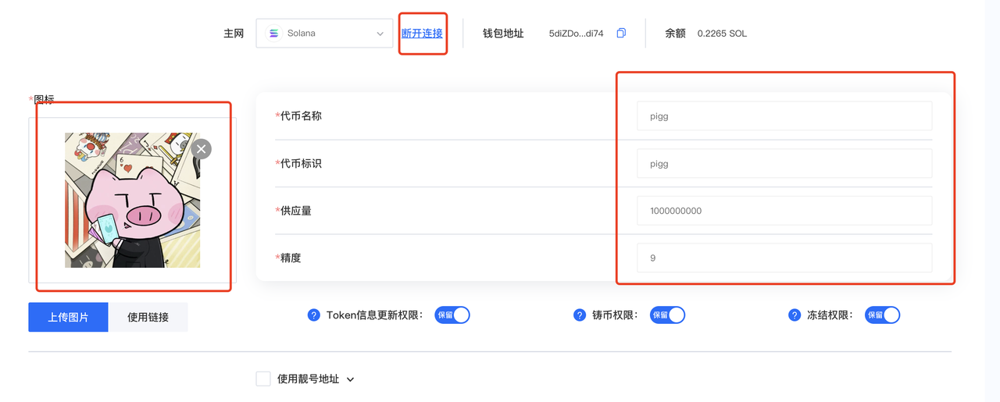
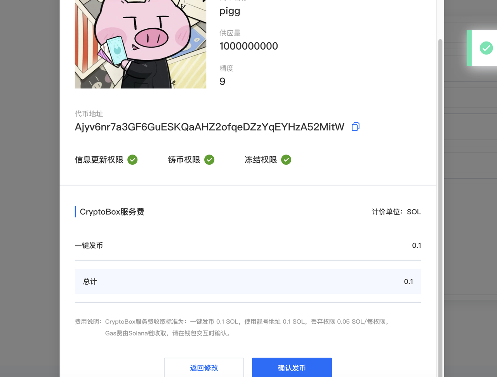
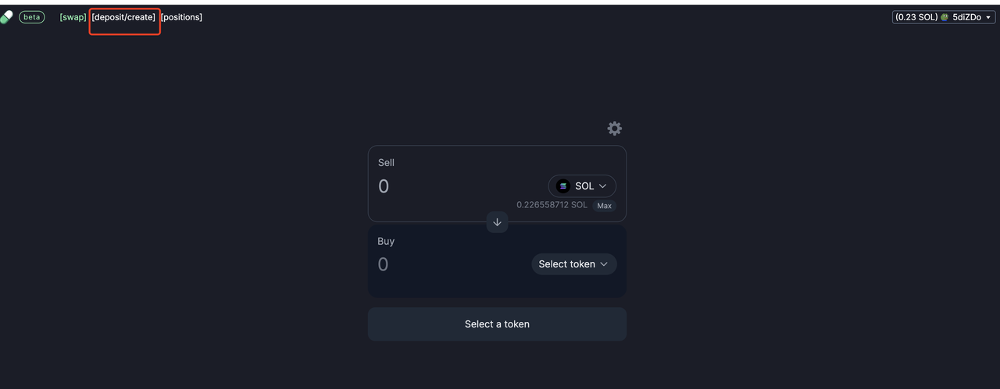
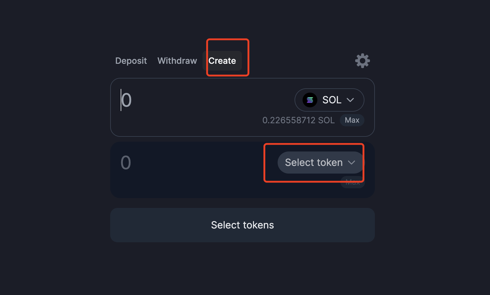
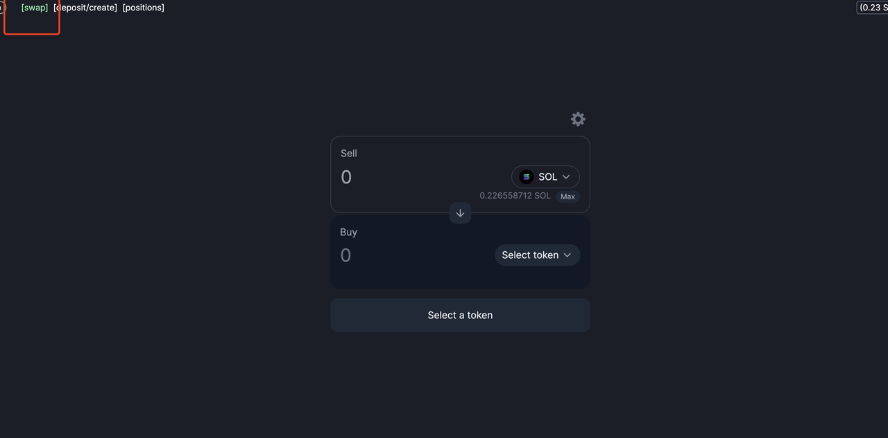

# PumpSwap流动性添加



### 前言

在Solana生态中，**Pump.fun**和**Raydium**代表了两种截然不同的交易文化——一个是土狗狂欢的赌场，另一个是正经项目的战场。它们的核心差异决定了你会成为哪种玩家

现在pumpfun团队也推出了自己的Dex，[pumpswap](https://swap.pump.fun/)。

[pumpswap](https://swap.pump.fun/)的出现，会有一些老玩家说，终于不需要再老老实实的刷粘合曲线，不用再担心被平台的机器人狙击了。想好好的做小项目也不需要raydium那么高的要求和复杂操作了。今天来带大家如何使用pumpSwap为你的sol代币创建流动性资金池了。

### 创建代币

进入CPBOX官网后，点击上方菜单实用工具，中的solana一键发币

<figure><figcaption></figcaption></figure>

进入页面后链接钱包

依次上传头像，输入相关信息。

这边我们默认代币精度为9。我这里供应量选择了一个亿

<figure><figcaption></figcaption></figure>

下方还有一个相关信息可以选填，这边不过多做演示了

点击创建代币后会弹出一个弹窗，信息二次确认

<figure><figcaption></figcaption></figure>

注意这边CPBOX会收取**0.1个sol作为服务费用**

代币创建成功之后，我们就可以看到代币的合约地址了

***

### 添加流动性

我们进入[pumpswap](https://swap.pump.fun/)的页面，点击进入中间的Deposit/create 按钮

<figure><figcaption></figcaption></figure>

deposit就是质押的意思，进来后我们能看到中间有三个选项

* deposit：质押代币，就是加池子
* withdraw：这里是撤池子
* create：创建池子，建立交易对

我们现在要创建流动性池，所以先点击create按钮下面把自己创建代币的合约地址输入进去。

<figure><figcaption></figcaption></figure>

这边选择相应质押的代币数量和Sol数量。

成功创建流动性池后，我们可以点回左上方的swap 进行交易测试了

<figure><figcaption></figcaption></figure>

回到中间的deposit页面。我们就可以根据当前的价格来同比例进行加池子，或者是撤池子了

如果你不太清楚什么是流动性池，可以阅读一下下面的文章。


    什么是流动性资金池、AMM、流动性挖矿


如果你觉的本篇的加池子不是很清楚，可以参考Sui链或者Ton链的加池子教程。



Sui流动性添加教程-cetus加池子教程


***

### 联系我们

如果想要深入了解CPBOX产品的其他用途和功能

可以点击[ https://docs.cpbox.io/](https://docs.cpbox.io/)查看

或者你有一些好的建议或者想要帮助开发的需求

可以通过主页 [https://www.cpbox.io/](https://www.cpbox.io/cn/?_s=docs)最下方的联系方式来找到我们

也可以通过下方社媒来联系我们

***

### 其他社媒

TG交流群：[https://t.me/cpboxio](https://t.me/cpboxio)

Twitter：[https://twitter.com/Web3CryptoBox](https://twitter.com/Web3CryptoBox) | [https://x.com/cpboxio](https://x.com/cpboxio)

Youtube：[https://youtube.com/channel/UCDcg1zMH4CHTfuwUpGSU-wA](https://youtube.com/channel/UCDcg1zMH4CHTfuwUpGSU-wA)
