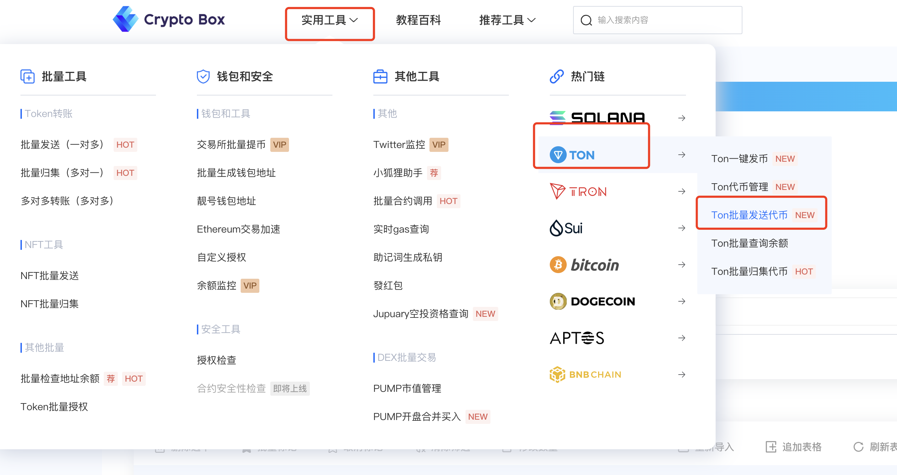
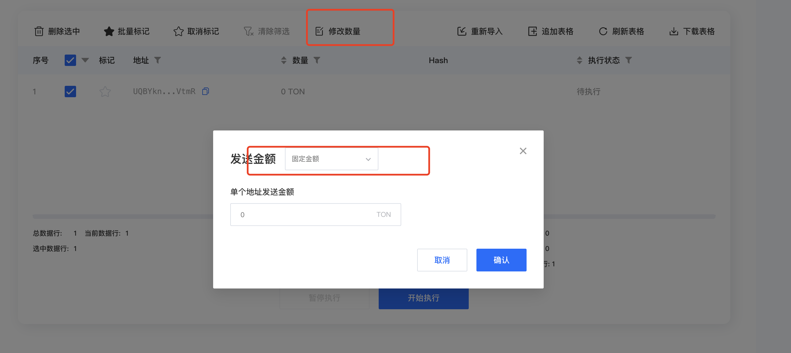
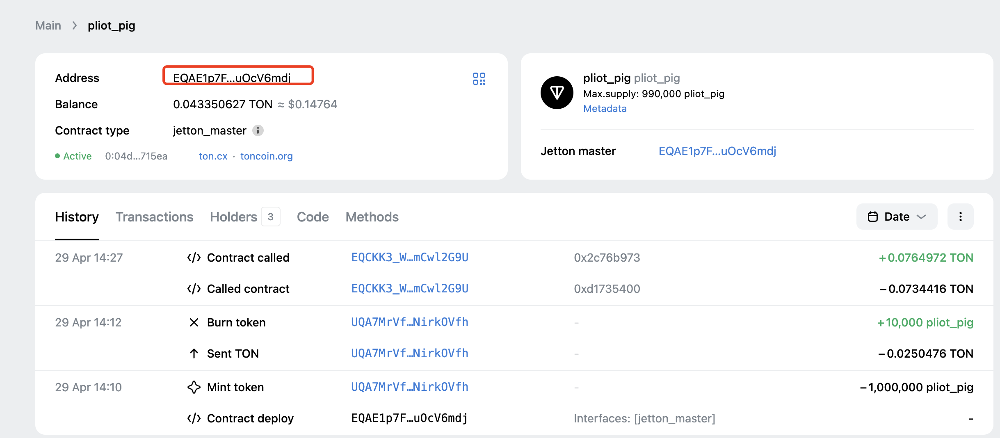
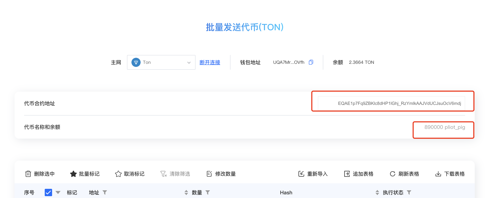

# Ton批量转账（空投发送）

### 功能概述 

CPBox提供的批量代币发送工具允许您从单个钱包向多个钱包地址批量发送指定代币。该功能支持自定义节点、自定义gas费用设置以及灵活的转账时间间隔控制，提高您的资产管理效率。所有的和EVM兼容的链我们都支持，此外，我们还支持[Solana](https://www.cpbox.io/cn/solana/batch/send?_s=docs), [SUI](https://www.cpbox.io/cn/sui/batch-send-token?_s=docs), [Tron](https://www.cpbox.io/cn/tron/batch-send-token?_s=docs), Ton, Aptos, Cosmos等非EVM链的批量发送功能。

本篇详细讲解一下如何在Ton链上批量发送Token代币适用人群：

* 链上玩家，撸毛玩家：需要通过多个钱包账户，来进行链上交互或者满足空投项目需求
* 社群运营管理者：需要发送代币空投，或者发送社群活动奖励。

### Ton批量发送演示 

进入CPBox官网后[https://www.cpbox.io](https://www.cpbox.io/)，点击实用工具，左侧批量发送。进入批量发送页面

<figure><figcaption></figcaption></figure>

链接钱包后，设置发送主网为Ton设置接收钱包您可以通过以下两种方式添加接收钱包地址：

* 手动输入：在文本框中直接输入钱包地址
* 批量导入：点击"导入文件"按钮，上传包含多个钱包地址的文件

输入钱包地址后，点击修改数量

**注意：这里一定要点击修改数量**，不然默认的发送数量为0选择固定金额，点击发送就可以发送成功

<figure><figcaption></figcaption></figure>

### MEME代币批量发送 

我们先来到Tonviewer找到自己想要发送的Token代币的ca地址

<figure><figcaption></figcaption></figure>

把刚才的ca复制到页面的代币合约地址文本框

下面会自动弹出你钱包中的MEME代币

<figure><figcaption></figcaption></figure>

回到下方点击修改数量按照上方的教程，点击修改数量后发送。

就可以完成MEME的空投发送，或者是奖励发送

***

### 联系我们

如果想要深入了解CPBOX产品的其他用途和功能

可以点击[ https://docs.cpbox.io/](https://docs.cpbox.io/?_s=docs)查看

或者你有一些好的建议或者想要帮助开发的需求

可以通过主页 [https://www.cpbox.io/ ](https://www.cpbox.io/cn/?_s=docs)最下方的联系方式来找到我们

也可以通过下方社媒来联系我们

***

### 其他社媒

TG交流群：[https://t.me/cpboxio](https://t.me/cpboxio)

Twitter：[https://twitter.com/Web3CryptoBox](https://twitter.com/Web3CryptoBox) | [https://x.com/cpboxio](https://x.com/cpboxio)

Youtube：[https://youtube.com/channel/UCDcg1zMH4CHTfuwUpGSU-wA](https://youtube.com/channel/UCDcg1zMH4CHTfuwUpGSU-wA)
