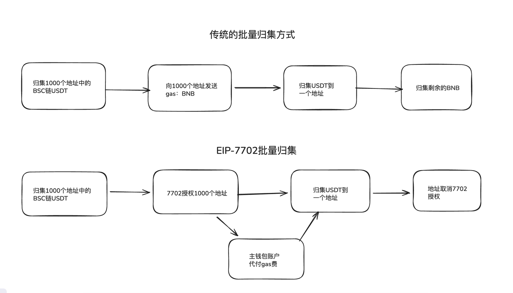

***

## description: 批量归集升级版Eip-7702协议 功能介绍

# 概述

上几期的文章CPBOX讲过，什么是EIP-7702协议；很多时候私钥泄漏后，黑客如何使用EIP-7702协议进行钓鱼。

为了能更好的理解7702协议，今天CPBOX 趁着7702批量归集功能上线，用批量归集的例子来讲讲EIP-7702，能给用户带来哪些好处。我们先来看看普通的批量归集和EIP-7702归集的过程。

<figure><figcaption></figcaption></figure>

### 7702归集

如果使用7702协议，就只需要对各个地址进行批量的合约授权，主钱包再去调用授权在各个钱包里的合约方法，把指定的代币发送到主钱包中。其中所有的gas都是由主钱包来进行支付，就形成了所谓的代付GAS费用批量归集。当归集完成后，CPBOX会主动帮你取消掉合约授权。

如果大家还觉得有点抽象，可以直接看下面的这个图。如果大家对合约授权的内容不理解，可以去看看之前的文章。

<figure><figcaption></figcaption></figure>

## 7702相比传统归集的优势

对于用户来说，如果不是某条公链的原生代币，可以省去分发gas的这一步骤。这样能够大大的减少了再Gas上的磨损费用。毕竟归集完代币后，还要把gas也归集回原来的钱包。

其次，使用EIP-7702归集能够归集的更加干净。对于大部分代币来说，转账的时候会多刨去一部分gas，来保证你交易的顺利完成。这也就导致了一个大家能进场发现的一个问题。我把A钱包里的ETH都转到B钱包里。但是A钱包里还会剩下0.2u或者多少的ETH。如果代币多了之后会发现钱包里各种小额的代币，影响美观。但如果你使用7702协议后。大部分代币都是能够转移干净的。

最后，使用7702 能够更加快速的进行归集。因为批量归集的操作行为是多个钱包对一个钱包转账，在技术层面上是循环调用，并不是批量的调用。但是7702能够一次性调用50个 或者100个。能够让交易的速度更加的快速。

## 7702的其他使用场景

EIP-7702协议其实能够给大家带来更多便捷，而且很多项目方都已经在进行使用。就比如OKX的智能钱包，如果大家有在OKX的web3平台上交易过会发现，启用智能账户后不用签名就能在bsc链上打狗，能挂单进行代币的买卖。其实就是授权了EIP-7702协议。

白帽用户也可以通过7702协议，来帮助你追回资产。如果你恰巧有需求可以来联系CPBOX。

同样7702也还有更多的玩法，比如项目方也可以通过授权进行扣款，做到订购视频网站的连续包月一样，项目方定期在你钱包里扣钱。

## 总结

只不过对于大部分正规的项目方来说，对于EIP-7702协议的使用会有明确的说明，而且合约都是开源接受审核的。虽然说大部分是安全的，但是大家还是要擦亮眼睛，小心的EVM链的签名。

需要注意的是：CPBOX的7702批量归集后是会主动帮你把合约授权取消掉的。取消授权的动作也会在区块链浏览器中查看到。

当然后续我们也会上线EVM7702合约授权的检测功能，大家可以持续关注。

***

### 联系我们

如果想要深入了解CPBOX产品的其他用途和功能

可以点击 <https://docs.cpbox.io/>查看

或者你有一些好的建议或者想要帮助开发的需求

可以通过主页 <https://www.cpbox.io/cn/> 最下方的联系方式来找到我们

也可以通过下方社媒来联系我们

***

### 其他社媒

TG交流群：<https://t.me/cpboxio>

Twitter：<https://twitter.com/Web3CryptoBox> | <https://x.com/cpboxio>

Youtube：<https://youtube.com/channel/UCDcg1zMH4CHTfuwUpGSU-wA>
