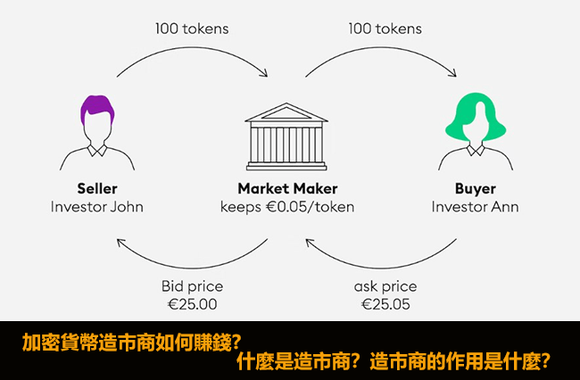
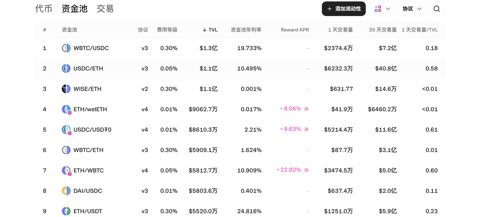

# 什么是流动性资金池、AMM、流动性挖矿

### 前言

不管是大家是新进币圈的小白，还是一二级市场的老韭菜们，应该经常在一些群里面听到加池子，撤池子这些概念，然后网络上的文章一大堆，看完还是云里雾雨里的。今天用一篇文章来给大家相信介绍一下什么是所谓的**LP（流动性资金池）。**&#x6211;赌一包辣条，看完后保证你非常的通透。

首先给大家介绍一个名次：**做市商。**

做市商最早期的概念应该是出现在**欧洲的股票和商品交易所，**&#x666E;通人是没法直接从交易所买入或者卖出自己的股票。买入和卖出的成交，是通过做市商们提供买卖报价，撮合双方的成交。因为是通过人工报价的方式，所以买入卖出会存在很大的价差。做市商们赚取的就是这一部分。

那随着计算机技术的发展，使得传统人工做市逐渐被电子化取代。但是做**市商的本质**依旧没有改变。依旧是用最优的价格**撮合用户和交易所成交。**&#x5728;市场上存在的核心意义就是**提供流动性、减少买卖价差、稳定市场价格**，尤其在合约交易不活跃或市场波动较大时尤为重要。

***

<figure><figcaption></figcaption></figure>

#### 示例

讲了那么多，不如来举个例子。

首先我们要知道。**做市商是没有办法改变一个商品的价格走势的**。正常情况下商品的价格会在一定的范围内波动。商品价格的涨跌，是需要单方面的买入和卖出进行推动的。

我们这里以黄金为例子。假设此时手黄金期货一手的价格是2600美金。此时你手上有两手美金的黄金期货，打算在2600这个价位出手。卖出成功后，此时你卖出的期货会其实是**被做市商承接，**&#x800C;不是真实的被其他的人买走。因为价格变动的比较快速。有的人可能会选择市价买入进场买入两手期货。此时黄金期货的价格在2600.05，那么做市商就会把2600成本的期货卖出给这一位用户。

做市商通过刚才的价差就赚钱到了1美金。而市场上每时每刻都有用户在进行买卖。做市商们通过这种方式来赚取自己的利润。

同样当市场波动比较小的时候，做市商们会用自己的资金，推动商品的价格进行波动变化，这就是做市商的另一个功能，**提供流动性**。如果你是二级市场的玩家，在一些波动很小的震荡行情中想做波段交易。但总是会被打止损，不用怀疑，这就是做市商来的机器人，专门来猎取你，让你进行止损为市场提供流动性。

***

<figure><figcaption></figcaption></figure>

### 什么是LP

上面讲到的这些，其实都是中心化交易所（CEX，如某安，某易）的运行方式。因为有了做市商的存在，链接了用户和交易所，让整个流程都跑通了起来。但是对于一级市场，一些DEX来讲。玩家用户只能通过链上交互实现交易。举个通俗易懂的例子。

* CEX就像是一个超市，你的所有买卖都是和超市进行的，最后统一结算。
* DEX 就像是一个菜市场。你想买菜，只能找到特定的摊位。这家摊位有你想要的菜，那你就在这买。

那么问题来了，我如果在想DEX中进行交易，我该怎么进行撮合交易？那商品的价格应该由谁来决定呢？

为了解决这个问题。**AMM（Automated Market Maker，自动做市商）** 概念随之诞生。AMM一种通过算法和智能合约自动提供交易流动性的机制。

AMM运行的核心逻辑就是用户将加密资产存入智能合约组成的资金池中，成为流动性资金池（LP，**Liquidity Pool**）。交易者直接与池中的资产进行交易，无需对手方。

到这里，就出现了我们一直想要知道的**LP流动性资金池**了。可能到现在大家对这个LP的概念还不是很清楚。不用着急，

#### 举例

什么是LP，你可以理解为，菜市场为了方便管理，像超市一样设置了一个货架，货架上面大家可以自己上架商品。同时为了商品价格合适，你需要把商品等额的钱压在菜市场这，防止你卖了假货跑路。这个货架就是一个LP。

如果我们**自己发行了一个代币**，想再DEX上进行交易。那我们就需要把我们的代币上架到货架上面。根据规则，我们上架到货架上面，就需要质押等额的钱在菜市场这里。

讲到这里。大家应该对LP，流动性池这个概念很清晰了吧。

***

### 价格涨跌逻辑

看完上面的示例，大家应该清楚了LP其实就是实现AMM的一个必要步骤。如果你希望你的token代币能够在DEX上进行交易，就必须添加流动性池，就是所谓的加池子。下面介绍一下在AMM机制下，代币价格是如何涨跌的。最常见的AMM模型是 **Uniswap** 使用的 `x * y = k` 公式：

* `x` 和 `y` 是池中两种资产的数量（如ETH和USDT），`k` 是恒定乘积。
* **价格由比率决定**：当用户用ETH购买USDT时，池中ETH增加、USDT减少，导致ETH价格下降（反之亦然）。

我们举个通俗易懂的例子如果我创建了一个代币A，我想要我的代币发售价格为1刀。

那我在加池子的时候就需要等比例的质押代币进池子里。如果我们选择质押100个A代币，就需要放入100刀此时A代币的价格就是1刀。

如果有人从池子中买走了10个A代币，那么此时流动性池中还有**90个A代币和110刀**。那么代币的价格就会自动变成1.22刀。

如果有人再买走了10个A代币，那么流动性池中就会有80个A代币和（110+1.22\*10）=122.2刀，那么代币的价格就会变成1.525刀（122.2/80 = 1.525）。

***

<figure><figcaption></figcaption></figure>

### 流动性挖矿

讲到这里，流动性池这个概念想必大家应该就很清晰了吧。那么再带大家了解一下流动性池的延伸，流动性挖矿。

回到我们上面的例子。大家可以看到我们这个我们只是买了10个代币，代币价格就已经有10%的涨幅了。这其实就是严重的流动性不足，造成交易的点差特别大，小量的买卖就可以影响到价格都走势。那么如对于项目方来说，需要代币的价格更加稳定。就会投入更多的资金质押在池子里。就像在池子里放入了100万个A代币和100万刀。

那有时项目方就会做一些质押挖矿活动。用户可以把自己手上的资产给项目方，项目方会质押到LP中。随着LP的资金量越来越小，买卖的滑点也会越来越小。此时项目方会把一些交易中获取的GAS费用，分发给前期质押资产在池中中的用户。

这就是所谓的流动性挖矿。

讲到这里，相信你对AMM，LP，流动性挖矿这三个概念有了清晰的认识了，同时对市场也有了更清晰的认识。

***

如果想要深入了解CPBOX产品的其他用途和功能

可以点击[ https://docs.cpbox.io/](https://docs.cpbox.io/)查看

或者你有一些好的建议或者想要帮助开发的需求

可以通过主页 [https://www.cpbox.io/cn/ ](https://www.cpbox.io/cn/)最下方的联系方式来找到我们

也可以通过下方社媒来联系我们

***

### 其他社媒

TG交流群：[https://t.me/cpboxio](https://t.me/cpboxio)

Twitter：[https://twitter.com/Web3CryptoBox](https://twitter.com/Web3CryptoBox) | [https://x.com/cpboxio](https://x.com/cpboxio)

Youtube：[https://youtube.com/channel/UCDcg1zMH4CHTfuwUpGSU-wA](https://youtube.com/channel/UCDcg1zMH4CHTfuwUpGSU-wA)
