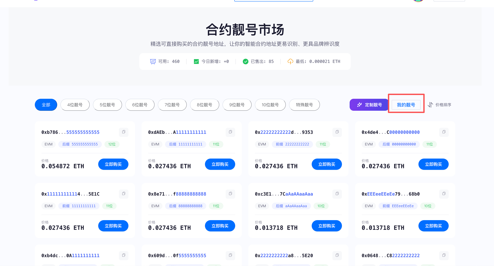
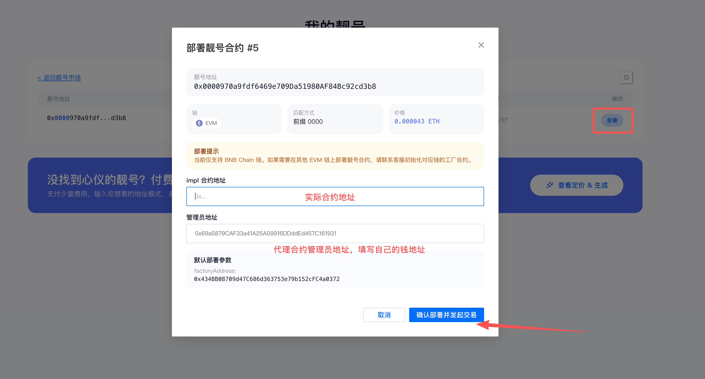

# 合约靓号地址市场

##### Web3 靓号合约地址：从「一串字符」到「链上品牌资产」

在 Web3 里，合约地址从来不只是技术产物。它是用户第一眼看到的标识，是社群传播的截图主角，也是品牌信任与身份认知的起点。

**[CPBOX 靓号合约地址市场](https://www.cpbox.io/cn/vanity-address-buy)**，依托 CPBOX 靓号挖掘与部署能力，面向项目方、创作者与高端用户，提供**现货选购**与**深度定制**的一站式服务——让每一条链上地址，都能成为可识别、可记忆、可沉淀的品牌资产。

***

#### 产品核心能力

* **现货市场**：精选靓号资源，即选即用，适合上线节奏紧张的项目。
* **深度定制**：按前缀、后缀、中间模式或语义组合（品牌名、Token 名等）定向挖掘。
* **一键部署**：在免自付部署 Gas 的前提下，尽量把「选号—部署—可用」收敛为少数步骤，降低从「好地址」到「可用合约」的操作门槛。
* **部署免 Gas（免支付链上 Gas）**：靓号合约的**部署过程**由平台完成链上发送，**用户侧无需为本次部署支付 Gas**；省去钱包里专门留 ETH、在拥堵时段反复调价等琐事，交付路径更顺滑。覆盖范围与例外情形以订单说明与用户协议为准。
* **持续算力供给**：后台依托高性能算力与优化策略，为定制订单提供稳定交付预期。

***

#### 一站式靓号市场：现货即买即用

平台预先挖掘并沉淀了大量高质量靓号资源，覆盖多种常见风格，便于快速匹配品牌调性：

|     |                         |              |
| :-- | :---------------------- | :----------- |
| 类型  | 示例方向                    | 典型感知         |
| 数字型 | 0x8888…、0x0000…、0x1111… | 幸运感、极简权威、强识别 |
| 字母型 | 0xaaaa…、0xdead…、0xbeef… | 风格化、话题性、易传播  |

无需从零开始「碰运气」，在现货市场中选中目标风格后，即可进入后续部署与交付流程；

***

#### 除了购买，还可以定制化？

当现货库中的组合仍无法满足品牌叙事时，定制能力让地址本身成为创意的一部分。你可以与平台协同定义：

* **前缀**：例如 `0xABC…`，强化品牌首字母或缩写记忆点。
* **后缀**：例如 `…8888`，与社群文化、幸运数字或活动主题对齐。
* **中间模式**：例如 `0x…AAA…`，在规则与稀缺性之间取得平衡。
* **语义组合**：将品牌名、代币名等转化为可读的十六进制片段（在密码学约束内尽可能贴近目标）。

定制需求由后台系统承接，结合分布式算力、搜索策略优化以及对可预测部署范式的运用，在可控成本下持续逼近目标形态，直至命中可交付结果。

***

#### 靓号地址为何值得被当作「资产」看待？

类比 Web2 的短域名、社交平台上的稀有 ID，或现实中的车牌靓号，链上靓号合约地址同样具备多重属性：

* **稀缺性**：符合人类审美与记忆规则的地址空间极其有限。
* **可交易性**：可作为独立标的流转（需遵守各司法辖区与平台规则）。
* **品牌溢价**：在区块浏览器、钱包展示与社媒截图中反复曝光，放大品牌记忆。
* **收藏与身份属性**：对 KOL、DAO 金库与高端用户而言，亦是链上身份的一部分。

***

#### 实际价值：靓号合约到底能干嘛

###### 1. 项目品牌升级

在 Etherscan 等浏览器上，用户往往先看到地址再看到合约名。一个干净、有辨识度的地址，相当于链上的「视觉 Logo」——降低误认仿盘合约的概率，也提升专业感。

###### 2. 信任与防伪

官方合约、金库地址若具备稳定、易核对的特征，用户在 DeFi、NFT 等场景中更容易建立「这就是官方」的心智模型，减少钓鱼与误转账带来的声誉损失。

###### 3. 社交传播

在 X（Twitter）等渠道，靓号更适合截图传播、二创与 Meme 化，天然具备话题度，有利于冷启动与活动预热。

###### 4. 转化与第一印象

地址是用户与协议交互前的「第一张名片」。在同等产品力的前提下，更「高级」的第一印象，往往与更高的点击意愿、Mint 意愿与留存探索正相关（具体数据因项目而异）。

***

#### 实际案例：项目方如何使用靓号合约

背景：

假设USD1 又推出了质押的活动，项目方使用了 靓号合约，合约地址为 0x5E7A6B...USD1

场景：

某个用户，第一次往这个协议里存 1w 个 USD1。

当他打开 钱包确认交易时，弹窗显示：

发送方：0xxxx的钱包...接收方：0x5E7A6B...USD1   整齐、有规律、一眼记住金额：10000USD1

交易完成后，他去 bscscan 查账：

* 余额页面显示：10000USD1 确实躺在了 0x5E7A6B...USD1 这个地址里。
* 内部交易里虽然有一个乱码地址在执行逻辑，但那个地址余额是 0，它只是“干活的”，不是“管钱的”。

对用户来说： 他的钱，就在那个长得像 USD1 的地址里，安全、好认、忘不掉。

***

#### 适合谁使用？

|                        |                            |
| :--------------------- | :------------------------- |
| 人群                     | 典型诉求                       |
| 项目方（Token / NFT / DAO） | 主合约、金库、工厂合约等品牌化与防伪         |
| KOL / 创作者              | 个人品牌、收款或展示用的链上身份           |
| 高端用户                   | 收藏级地址、社交展示与身份象征            |
| 开发者                    | Demo、黑客松、对外 Showcase 的快速吸睛 |

***

#### 如何使用

进入[CPBOX的靓号合约市场页面](https://www.cpbox.io/cn/vanity-address-buy)，选择你想要的购买的靓号合约或者是想要定制的靓号合约进行购买

购买完成后进入 右上角我的靓号页面进行配置

<figure><figcaption>
靓号合约
</figcaption></figure>

进入到我的靓号页面后，开始我们合约的部署

* 输入原先部署的合约地址
* 输入管理员地址：管理员地址需要填写自己能使用的钱包地址

<figure><figcaption>
合约部署
</figcaption></figure>

***

#### 结语

链上竞争已从「功能是否可用」延伸到「品牌是否被记住、信任是否被建立」。**CPBOX 靓号合约地址市场**把算力、算法与交付流程封装为可下单的产品能力，让靓号从少数团队的「工程炫技」，变成更多项目可采购、可排期的标准选项。

若你正在筹备主网上线、品牌升级或重大活动，不妨从「地址」这一环开始，把链上的第一眼，做成你的资产。

*本文所述功能与规则以 CPBOX 平台实际页面及用户协议为准。*

