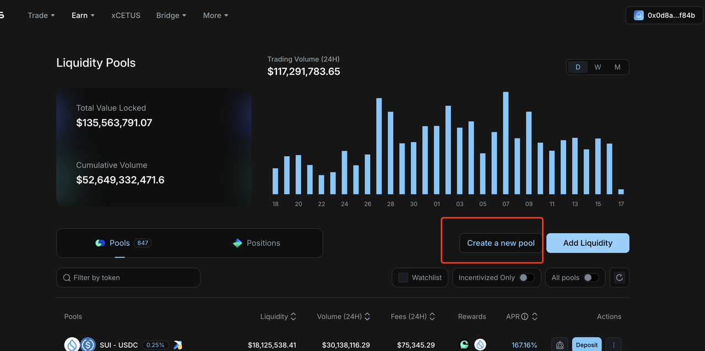

# Sui 流动性池添加



## 前言

当我们sui链上创建好自己的代币后，那么我们该如何进行交易呢。不同于大家比较熟知的pump.fun，可以在平台上面一键发币后，就可以在上面进行交易了，pumpfun是做了一个一站式服务。sui链则需要自己去dex上创建你的流动性资金池。目前sui 链上的dex有以下几个。

* **Cetus**，SUI区块链生态里最大的去中心化交易所DEX
* **Turbos**，是第一个建立在 Sui 上的去中心化零滑点永续合约交易和现货交易平台
* **BlueMove**，基于 Aptos 和 Sui 区块链构建的应用程序，为用户提供 NFT交易、DEX等功能

本文主要介绍如何在**Cetus平台**创建流动性资金池，建立交易对

### 为什么要加流动性资金池

#### **流动性池的作用**

* **让代币可交易**： 如果你发了一个代币，但没有流动性池（**Liquidity Pool**），用户无法在 DEX（如 Cetus、FlowX）买卖它，代币就只是链上的一串数据，毫无价值。 **加池子 = 让代币有真实的市场价格和交易深度。**
* **稳定价格波动**： 流动性池通过 **自动做市商（AMM）** 算法（如 Uniswap 的 x\*y=k 模型）维持交易对的平衡。池子资金越多，大额交易对价格的影响越小。

#### **谁在提供流动性？**

* **项目方**：通常需要先注入初始资金（如 10,000 SUI + 10,000,000 你的代币），吸引早期交易。
* **社区用户**：通过质押代币赚取交易手续费分红（如 0.3% 的每笔交易费按比例分配给 LP 提供者）。

***

回归正题开始我们的教程

## 设置交易对

第一步，还是我们的老规矩，先进行钱包的链接，我们这里要选择原先发币的钱包，因为创建池子，是需要把币投进池子里的。

<figure><figcaption></figcaption></figure>

第二步，点击左上方菜单的earn按钮，点击pool选项，来进入我们的创建流动性资金池的界面，进行所谓的加池子的操作

<figure><figcaption></figcaption></figure>

进入页面后我们能够看到 右下方有一个添加池子的 操作按钮 ，点击create a new pool

<figure><figcaption></figcaption></figure>

点击后弹出来一个弹窗，我们按步骤来，先点击左侧的token 选择按钮，然后把我们合约代币地址输入进来，右侧我们这边默认选择sui代币作为价格锚定代币，你也可以选择usdc或者其他代币。

<figure><figcaption></figcaption></figure>

需要注意的是，这里填写代币的合约地址是不行的，还需要把代币类型的后缀带上，我们要复制suiscan上type这一栏的代币地址

<figure><figcaption></figcaption></figure>

下面再进行交易滑点设置，这个滑点越大，意味着交易摩擦成本越高，但是也越容易成交。像稳定币，价格波动低的，可以选择0.01%、0.05%。正常的土狗币，推荐选择**0.25%和1%**。因为土狗币交易不频繁、不稳定，滑点大一点有助于交易顺利完成

<figure><figcaption></figcaption></figure>

## 设置并创建交易资金池

当我选择一个滑点（0.25%）之后，我们就可以进行下一步配置了首先需要给一个初始上线价格，这个价格是基于SUI的，即：1个土狗币=多少SUI我们这里设置的一个土狗币=**0.0001**个sui 相当于1个sui可以购买**10000**个土狗也就是上线后的初始价格

<figure><figcaption></figcaption></figure>

下方的 **set price range** 设置价格范围，我们选择**Full Range**，然后选择下一步

> Full Range：全范围的意思。代币价格波动没有上限和下限，可以根据用户需求随时交易。

之后，我们填写要加池子的金额。例如，我选择加4个SUI，交易所会自动给我配对4w个左右的Cryptopig，确认数量后，点击**continue**按钮即可

<figure><figcaption></figcaption></figure>

点击确定后，会跳出钱包签名，签名成功后资金池就创建成功了

## 交易代币

流动性池创建完成之后，就可以进行交易测试了，点击菜单栏上方的swap，我们就能够看到能够开始交易了，现在因为资金池里面sui的数量比较小，代币会有很大的价差。

<figure><figcaption></figcaption></figure>

## 增加与撤出流动性资金池

池子创建成功后，接下来我们看怎么增加流动性与撤出流动性，即所谓的：加池子与撤池子。回到pools页面，点击中间position，就可以看到我们的流行性池了。再点击最右侧进入详情页面

<figure><figcaption></figcaption></figure>

进入流动性池详情页面后，我们就能在右侧看到我们加池子和撤池子功能了，只要输入相应的sui数量，就会同比例的把token数量加入进池子，如果需要撤池子，就点击上面的额Remove

<figure><figcaption></figcaption></figure>

注意这里加池子，并不会使得代币的价格的上涨，池子里资金的增加，只会减少交易时的差价磨损，滑点越来越小代币价格的上涨是由池子里token存在的数量减少引起的。

## **为什么要"撤池子"？——流动性的风险与控制**

### **(1) 常见撤池子场景**

* **项目升级**：调整代币经济模型（如修改交易税）。
* **安全风险**：发现漏洞或遭遇恶意攻击时紧急撤池。
* **终止项目**：如果项目失败，撤池可回收剩余资金。

### **(2) 撤池子的风险**

* **价格暴跌**：突然撤池会导致代币失去流动性，价格归零。
* **信任危机**：项目方恶意撤池跑路（Rug Pull）会彻底摧毁信誉。

***

**引申概念：流动性质押（Liquidity Staking）**&#x6D41;动性池的进阶玩法是 **流动性质押**，它解决了传统质押的"资金闲置"问题：**传统质押**：你把代币锁定在合约中赚取利息，但无法交易。**流动性质押**：

* 你将代币存入流动性池（如 SUI-你的代币 交易对），获得 **LP Token**（流动性凭证）。
* 再将 LP Token 质押到矿池，同时赚取：
  * **交易手续费分红**（来自流动性池）。
  * **额外代币奖励**（项目方或协议提供的激励）。

如果你想详细了解什么是LP，可以阅读这篇文章：


什么是流动性资金池、AMM、流动性挖矿


***

### 联系我们

如果想要深入了解CPBOX产品的其他用途和功能

可以点击[ https://docs.cpbox.io/](https://docs.cpbox.io/)查看

或者你有一些好的建议或者想要帮助开发的需求

可以通过主页 [https://www.cpbox.io/cn/ ](https://www.cpbox.io/cn/)最下方的联系方式来找到我们

也可以通过下方社媒来联系我们

***

### 其他社媒

TG交流群：[https://t.me/cpboxio](https://t.me/cpboxio)

Twitter：[https://twitter.com/Web3CryptoBox](https://twitter.com/Web3CryptoBox) | [https://x.com/cpboxio](https://x.com/cpboxio)

Youtube：[https://youtube.com/channel/UCDcg1zMH4CHTfuwUpGSU-wA](https://youtube.com/channel/UCDcg1zMH4CHTfuwUpGSU-wA)
