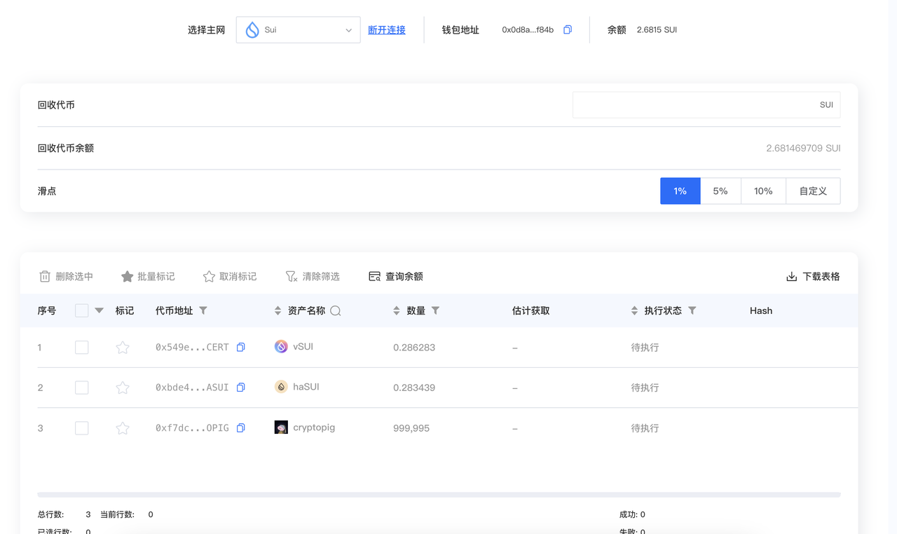
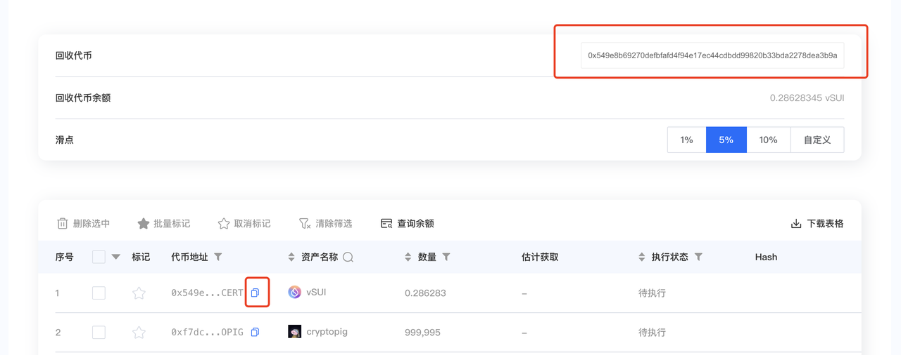
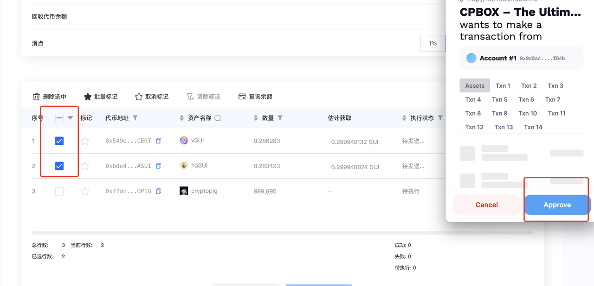
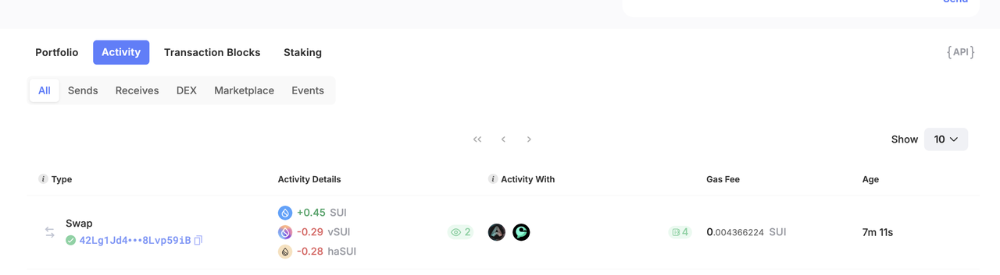

# sui批量兑换（批量swap）

## 前言

sui基金会每年都会对sui生态上的一些项目进行补贴。这也导致了sui链上的defi协议收入是远远高于其他公链的。而且sui代币的价格相对来比较稳定，这样让sui链有着非常多的玩家。

那作为sui链的defi玩家，就经常会遇到领取到的奖励代币种类太多，全部转换成sui，或者是其他某一个代币就显得非常麻烦。每次swap就进行一次签名

针对上述这个问题，cpbox为sui链玩家推出了批量swap功能。

## 功能演示

首先进入sui批量兑换页面

点击链接钱包后，会自动帮你查询钱包中的sui链代币。

<figure><figcaption></figcaption></figure>

回收代币：目标兑换的代币，进入页面后默认是转换为sui代币

如果想要更换，可以通过下方列表找到，需要兑换的代币地址选择复制，再粘贴如文本框内

回收代币余额：显示兑换目标代币在钱包中的当前余额

<figure><figcaption></figcaption></figure>

点击查询余额：可以看到预计兑换的代币数量

**注意**：此步骤为非必要操作。也可以直接点击执行。交易前也会显示预估数量。

框选需要兑换的代币后

点击开始执行，开始钱包签名后就可以执行成功。

<figure><figcaption></figcaption></figure>

我们可以去区块链浏览器上查看当前兑换是否成功

也可以回到钱包进行查看

<figure><figcaption></figcaption></figure>

## 费用明细

Sui链批量swap功能当前收费为一次交易收取0.5个sui。如果兑换代币种类大于5个，每多一个加收0.1个sui。

因功能新上线。限时三折，实际收取0.15+0.03\*n（如兑换代币种类数量为8，n的数量为8-5=3 ）的费用

## 总结

**感谢各位用户对CPBOX的信任与支持**

如果你在使用Sui批量转账功能或者其他功能时，遇到问题

可以通过主页 <https://www.cpbox.io/cn/> 最下方的联系方式来找到我们

也可以通过下方社媒来联系我们

***

### 其他社媒

TG交流群：<https://t.me/cpboxio>

Discord：<https://discord.com/invite/XMwMMfHufN>

Twitter：<https://twitter.com/Web3CryptoBox>

Youtube：youtube.com/channel/UCDcg1zMH4CHTfuwUpGSU-wA
