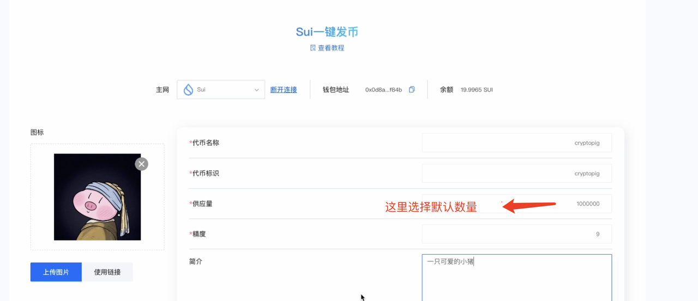
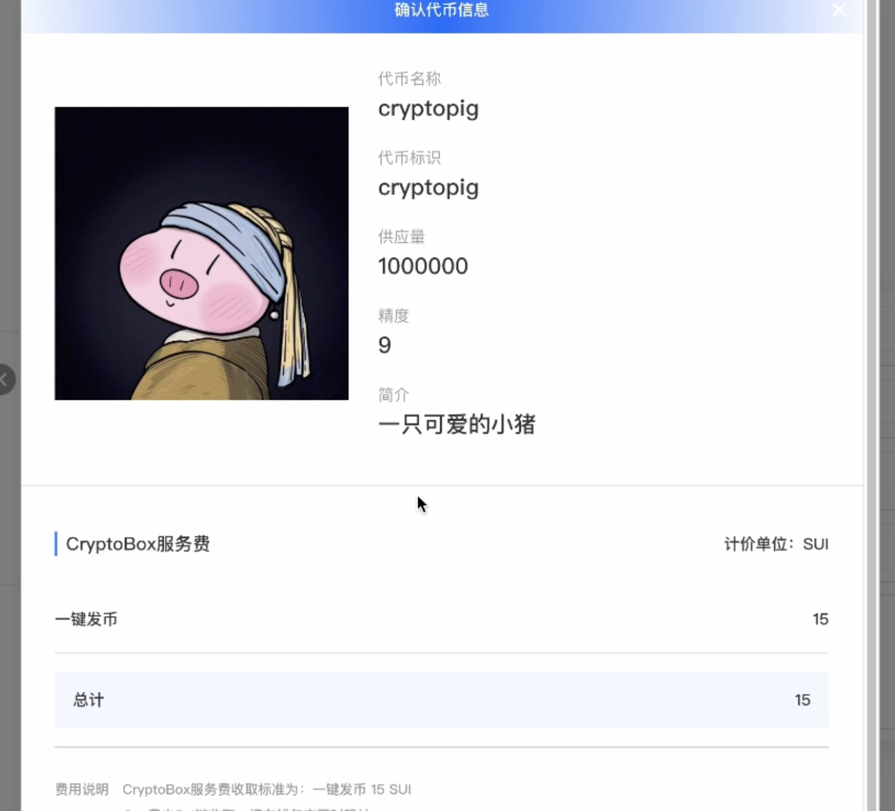
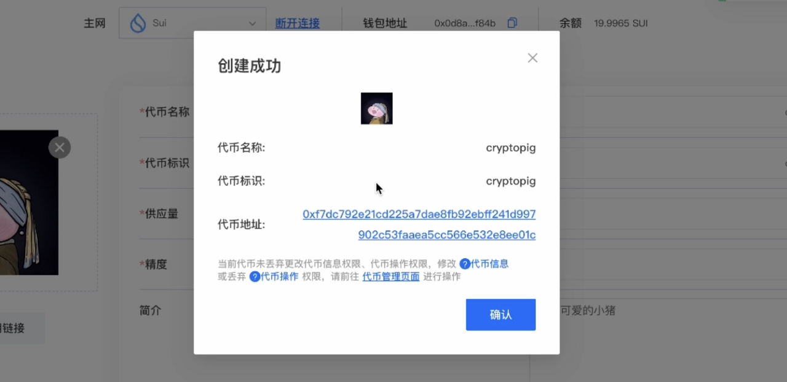
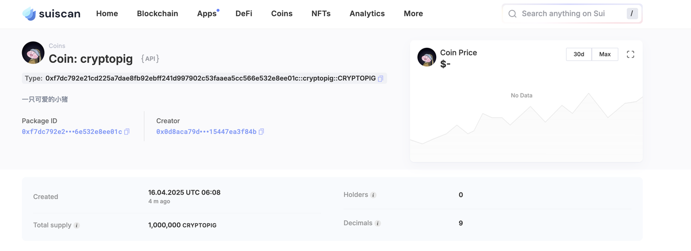

# Sui一键发币



## 前言

随着区块链技术的快速发展，Sui作为新一代高性能Layer1公链，凭借其基于Move语言的高安全性和水平可扩展性，成为数字资产发行的理想平台。但也是因为基于Move语言的开发，很多人对其代码结构不是很了解，想要参与却不知道如何进行。为降低用户门槛并提升开发效率，我们推出「一键发Token」功能，帮助开发者、项目方及普通用户快速在Sui网络上创建和管理自定义Token。

## Sui公链优势

Sui较于其他区块链（如以太坊、Solana、BNB Chain等）具有独特的优势，主要得益于 Sui 的高性能、低gas费和 Move 语言的安全性，OK讲了一堆废话，有的人就会问，那我为什么不在pump.fun上面发token，而是选择sui链上发token呢？

用简单的语言来说就是

Sui适合认真做项目、需要自定义功能、重视安全性和低成本的团队。基于Move 语言，漏洞会少很多，而且LP 由自己控制，拥有的代币权限也更高，独立性更高，不依赖不平台

sol链 适合快速发 meme 币、蹭热点、短期投机炒作 sol因为meme的热度。反觉meme已经成为了sol的标签。如果说到meme，可能你的第一反应就是sol。

如果你的目标是 **长期价值** 或 **复杂经济模型**，Sui 是更好的选择。

同时不同公链给人的第一印象不同，如果提到sol链，大家的第一反应可能是meme，来割韭菜的sui链因为背后有a16z、Coinbase这些顶级投资机构做背书，再加上经常开展一些黑客松活动。如果你的项目是在sui链上，会显得更高大上一点，更加的有技术向。

## Sui发币教程

### 链接钱包

首先，我们需要确保自己已经在浏览器里下载安装了Sui钱包，并在钱包内存储了超过20个SUI代币。如果还没有安装钱包，请大家通过谷歌应用商店自行安装：[https://chromewebstore.google.com/search/sui?hl=zh-CN\&utm\_source=ext\_sidebar](https://chromewebstore.google.com/search/sui?hl=zh-CN\&utm_source=ext_sidebar)

如果大家是crypto 老玩家可以自动略过这一part，直接快进到下一环节。

* Suiwallet钱包
* Suiet钱包

钱包安装完成后，打开发币链接：[https://www.cpbox.io/cn/sui/token/publish](https://www.cpbox.io/cn/sui/token/publish) 点击中间“连接钱包”

<figure><figcaption></figcaption></figure>

### 代币信息

按照图片信息依次把相关信息填入这边代币初始供应量为：1000000，你也可以根据自己的需求输入想要的代币数量**参数都要填**

<figure><figcaption></figcaption></figure>

* **精度：**&#x9ED8;认填9，精度与你能填写的最大供应量有关。
* **供应数量：**&#x5F53;精度为9时，供应量最大不能超过100亿。当精度为8时，不能超过1000亿，以此类推
* **logo：**&#x4EE3;币标识
* **简介：**&#x5FC5;填，介绍你的代币信息

最后只要点击创建代币， 会有一个创建代币的明细弹窗，里面会详细介绍费用，再次确认会进行钱包签名。代币创建成功后会出现一串合约地址。**这里cpbox收取代币创建费用是15个sui（市面上同类工具收取20个sui），算比较有性价比的。**

<figure><figcaption></figcaption></figure>

创建成功后会弹出一个提示窗口，点击代币合约地址后，可以进入到sui代币信息页面。

<figure><figcaption></figcaption></figure>

我们可以在suiscan上查看到我们代币信息，同时钱包里面也能看到我们创建的代币

<figure><figcaption></figcaption></figure>

到此，整个发币工作就算是完成了。

***

当代币创建成功后，是不是就可以进行交易了？当然不是，我们还要再进行后续的步骤创建流动性资金池，设置交易对。参考教程：


[sui-liu-dong-xing-chi-tian-jia.md](sui-liu-dong-xing-chi-tian-jia.md)


如果想要更多的了解并了解Cryptobox这个产品的其他用途和功能

可以点击[ https://docs.cpbox.io/](https://docs.cpbox.io/)

如果在产品功能使用中遇到了问题

或者你有一些好的建议或者想要帮助开发的需求

可以通过主页 [https://www.cpbox.io/cn/ ](https://www.cpbox.io/cn/)最下方的联系方式来找到我们
