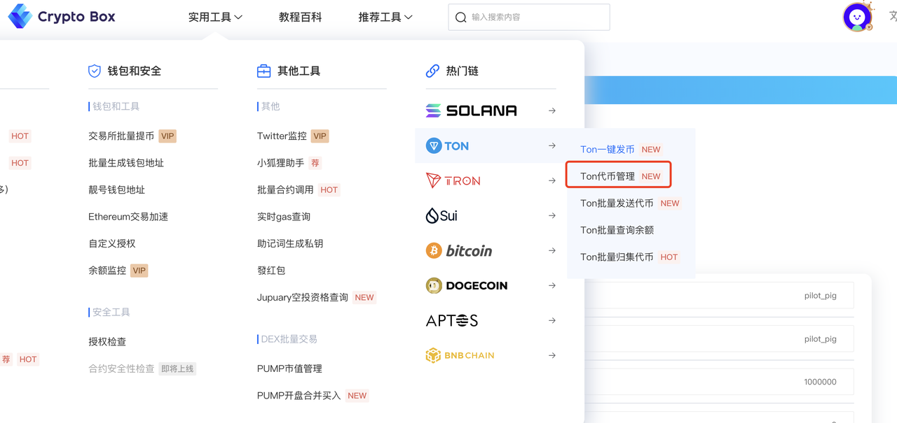
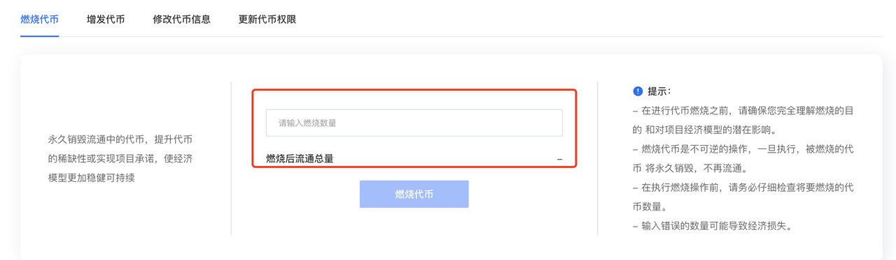

# Ton代币管理

### 前言

Ton链的代币创建出来后，会有3个权限：增发权限（铸币权）、更新资料权限，代币燃烧权限 以及**权限丢弃**功能

* **增发权限：**&#x53EF;以增发、铸造代币，提高代币供给量
* **更新资料权限：**&#x53EF;以修改代币名称、logo等
* **代币燃烧：**&#x71C3;烧代币
* **权限丢弃：**&#x4E22;弃Token的信息修改权限和Token的操作权限

下面我来演示一下如何对对我们的代币进行管理

首先进入我们的CPBOX官网，菜单点击使用工具，Ton链中的代币管理

<figure><figcaption></figcaption></figure>

进入页面后，把我们刚刚创建的代币合约地址输入进去。输入合约地址后，下方信息自动显示出来。

<figure><figcaption></figcaption></figure>

### 燃烧代币

在下方点击输入需要燃烧的代币数量后，点击燃烧代币即可完成等待五分钟后可以在钱包中通过代币数量变化确认

<figure><figcaption></figcaption></figure>

我们这里作为演示，燃烧了10000枚代币，点击燃烧完成后可以在钱包中看到

<figure><figcaption></figcaption></figure>

### 代币增发

输入需要增发的代币数量，点击确定等待五分钟后可以在钱包中通过代币数量变化确认，是否操作成功

<figure><figcaption></figcaption></figure>

### 代币信息修改

代币信息修改和发币差不多，只需要把相应的代币信息填写上去即可等待五分钟后，可以进入tonviewer进行查看，代币信息是否变化成功

<figure><figcaption></figcaption></figure>

### 权限丢弃

直接点击确定后就可以进行权限丢弃！！需要注意的是 ，此操作是没办法撤回的，所以是否要放弃权限 要考虑好首先恶意使用增发权限与更新资料权限，会损害项目的长期发展，这也是会有这个功能的原因

***

如果想要深入了解CPBOX产品的其他用途和功能

可以点击[ https://docs.cpbox.io/](https://docs.cpbox.io/)查看

或者你有一些好的建议或者想要帮助开发的需求

可以通过主页 [https://www.cpbox.io/cn/ ](https://www.cpbox.io/cn/)最下方的联系方式来找到我们

也可以通过下方社媒来联系我们

***

### 其他社媒

TG交流群：[https://t.me/cpboxio](https://t.me/cpboxio)

Discord：[https://discord.com/invite/XMwMMfHufN](https://discord.com/invite/XMwMMfHufN)

Twitter：[https://twitter.com/Web3CryptoBox](https://twitter.com/Web3CryptoBox)

Youtube：[youtube.com/channel/UCDcg1zMH4CHTfuwUpGSU-wA](../solana-gong-ju/solana-yi-jian-fa-bi.md)
