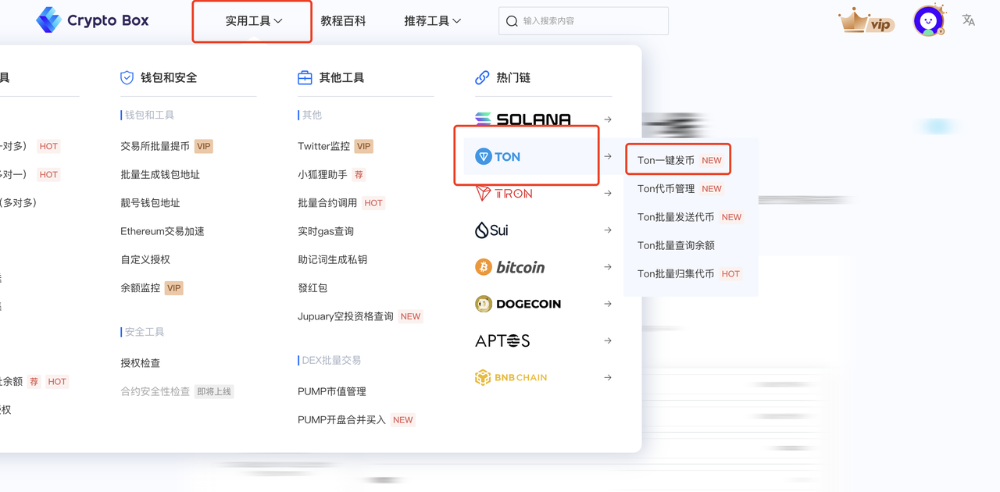
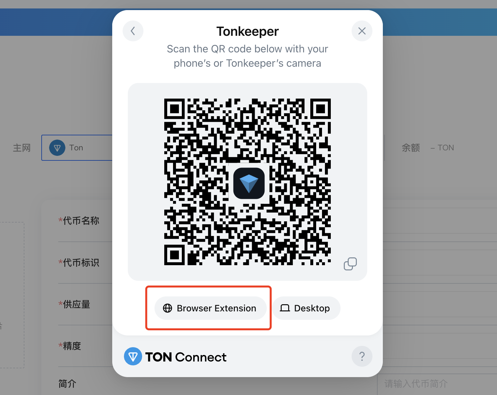
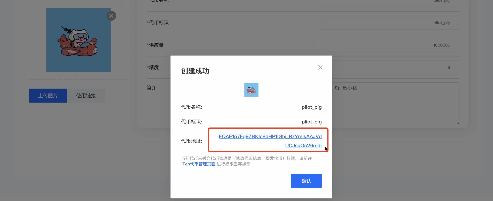

# Ton 一键发币



### 前言

过去的一年中Ton代币的走势非常的优异，从年初2.5刀左右一路飞升。因为和Telegram应用做背书，在用户生态上有着天然的优势。最火热的时候，代币价格甚至来到了8刀左右。可惜随着市场的调整，以及tg创始人问题，代币走势在目前来看不是非常的强势。

* **Telegram 深度集成**：TON 与 Telegram 紧密结合，用户可通过 Telegram 钱包机器人（如 @wallet）直接进行链上交易，极大降低使用门槛。
* **多种智能合约语言**：支持 **FunC（TON 原生语言）、Tact（简化版智能合约语言）、Solidity（通过 EVM 兼容层）**，满足不同开发者需求。
* **TON Foundation 支持**：TON 基金会持续资助优质生态项目，推动开发者增长。

正是ton以上的的优势，支持着生态不断的发展。

本篇文章将介绍如何使用cpbox来进行**Ton链的一键发币**

### 代币创建

首先进入cpbox官网：[https://www.cpbox.io/cn](https://www.cpbox.io/cn)，点击实用工具，ton链，ton一键发币进入页面后，点击链接钱包。

<figure><figcaption></figcaption></figure>

如果你使用ton钱包，可以通过二维码扫描进入

这边需要注意的是使用ton钱包，必须得使用里面的**Tonspace**

<figure><figcaption></figcaption></figure>

我们这边选择使用Tonkeeper钱包来进行登陆

点击下方Browser Extension 插件链接

<figure><figcaption></figcaption></figure>

链接成功后可以看到我们的页面非常的简单填写相应的的代币信息即可**参数都要填**

* 代币名称：token的名称
* 代币标识：Token的标识，可与名称相同
* **精度：**&#x9ED8;认填9，精度与你能填写的最大供应量有关。
* **供应数量：**&#x5F53;精度为9时，供应量最大不能超过100亿。当精度为8时，不能超过1000亿，以此类推
* **logo：**&#x4EE3;币标识
* **简介：**&#x5FC5;填，介绍你的代币信息

<figure><figcaption></figcaption></figure>

输入完相应的信息后，我们能够看到会有一个提示弹窗。点击确认即可

注意：cpbox会**收取5个Ton**作为代币创建的服务费。

<figure><figcaption></figcaption></figure>

创建完成之后就会拿到自己的代币的合约地址了

<figure><figcaption></figcaption></figure>

这边我们可以进入Tonviewer官网[https://tonviewer.com/](https://tonviewer.com/)来查看我们的代币详情信息

<figure><figcaption></figcaption></figure>

到这里Ton链代币就已经创建完毕了。

后续想要为代币添加流动性池，并希望dex上交易可以参考这篇文章：


[shen-me-shi-liu-dong-xing-zi-jin-chi-amm-liu-dong-xing-wa-kuang.md](../qi-bu-yin-dao/xiao-bai-ru-men/shen-me-shi-liu-dong-xing-zi-jin-chi-amm-liu-dong-xing-wa-kuang.md)


***

### 联系我们

如果想要深入了解CPBOX产品的其他用途和功能

可以点击[ https://docs.cpbox.io/](https://docs.cpbox.io/)查看

或者你有一些好的建议或者想要帮助开发的需求

可以通过主页 [https://www.cpbox.io/cn/ ](https://www.cpbox.io/cn/)最下方的联系方式来找到我们

也可以通过下方社媒来联系我们

***

### 其他社媒

TG交流群：[https://t.me/cpboxio](https://t.me/cpboxio)

Twitter：[https://twitter.com/Web3CryptoBox](https://twitter.com/Web3CryptoBox) | [https://x.com/cpboxio](https://x.com/cpboxio)

Youtube：[youtube.com/channel/UCDcg1zMH4CHTfuwUpGSU-wA](../solana-gong-ju/solana-yi-jian-fa-bi.md)\

