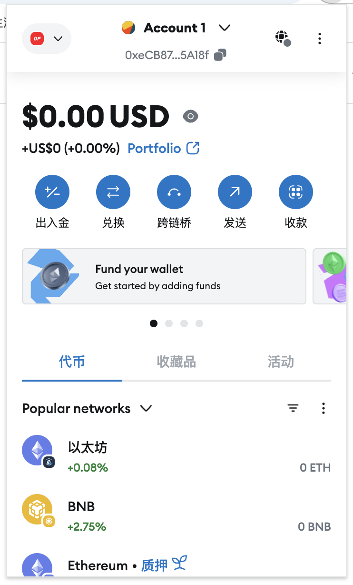
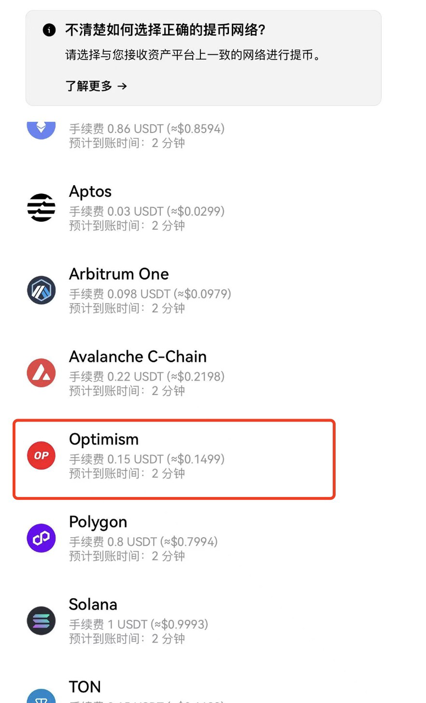

# MetaMask小白快速配置

今天带web3小白创建属于自己的区块链钱包，首先介绍一下我们要使用的小狐狸钱包

<figure><figcaption></figcaption></figure>

#### 产品信息

🦊产品名称｜MetaMask🔗支持的区块链｜默认以太坊，其余链自定义添加主网信息即可支持🖥支持的客户端｜IOS、安卓、谷歌插件MetaMask官网（请认准域名，谨防假冒）：[https://metamask.io](https://metamask.io/)

MetaMask推特：[https://twitter.com/metamask](https://twitter.com/metamask)

一个知识点：使用小狐狸钱包需要科学上网，这里不展开介绍，请大家自行解决，这个是探索web3世界的必备技能

## 安装步骤

**第一步：安装小狐狸钱包**进入Metamask.io 官网，点击 “Download now”—— “ Install MetaMask for Chrome ” 可将小狐狸钱包添加到浏览器插件。\*虽然说小狐狸钱包也有手机版，但建议大家在【谷歌浏览器】安装，用电脑端操作，因为很多项目需要链接钱包才能使用，电脑端会方便很多，也不会出现很多bug问题。🦊MetaMask下载链接：[https://metamask.io/download.html](https://metamask.io/download.html)

<figure><figcaption></figcaption></figure>

安装好之后点击进入并开始使用：

* 如果已经有ERC20地址的钱包，可以选择【导入钱包】按步骤操作。
* 如果没有钱包的话，选择【创建钱包】按步骤设置密码后创建即可。（温馨提示：第一次创建钱包时建议使用纸质方式抄写并保存好助记词，不要向任何人提供你的助记词，一旦助记词丢失或被盗，是无法追回钱包内资产的哦！）

小狐狸钱包安装好打开之后默认以太坊网络，如果项目是在不同的区块链上，我们需要添加其主网信息才可以使用，下面以 BSC 网络为例。

**第二步：添加网络节点**使用cryptobox的工具，自动添加想要的网络节点进入https://www.cpbox.io/cn/metamask/helper?\_\_t\_\_=1742881783332

<figure><figcaption></figcaption></figure>

点击链接钱包，选择链接metamask钱包

<figure><figcaption></figcaption></figure>

这里以op链为例子进行自动配置

<figure><figcaption></figcaption></figure>

小狐狸钱包会自动跳出提示，点击确定，就自动配置好了

&#x20;.png>)

这样小狐狸钱包就创建完成了，点击收款，会显示出自己的账号地址，然后在交易所或者其他钱包转账的时候就可以选择op链了。

***

如果想要深入了解CPBOX产品的其他用途和功能

可以点击[ https://docs.cpbox.io/](https://docs.cpbox.io/)查看

或者你有一些好的建议或者想要帮助开发的需求

可以通过主页 [https://www.cpbox.io/cn/ ](https://www.cpbox.io/cn/)最下方的联系方式来找到我们

也可以通过下方社媒来联系我们

***

### 其他社媒

TG交流群：[https://t.me/cpboxio](https://t.me/cpboxio)

Twitter：[https://twitter.com/Web3CryptoBox](https://twitter.com/Web3CryptoBox)

Youtube：[youtube.com/channel/UCDcg1zMH4CHTfuwUpGSU-wA](../solana-gong-ju/solana-yi-jian-fa-bi.md)
